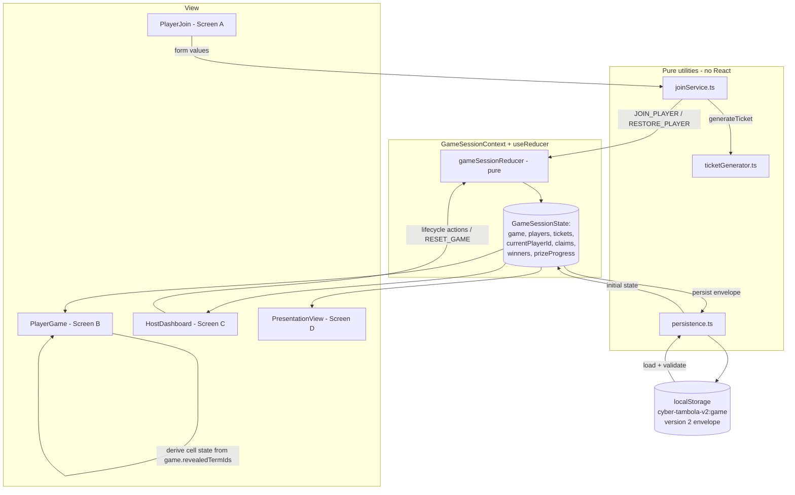
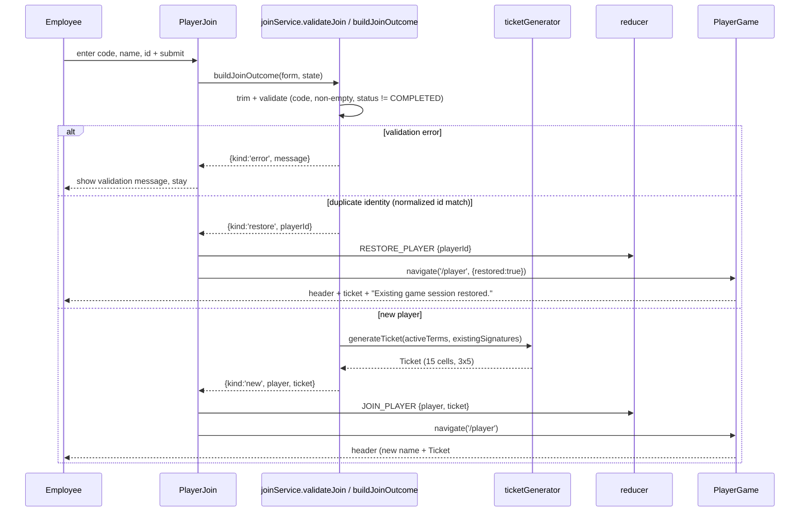

# Design Document

## Overview

Module 3 upgrades the Cyber Tambola V2 prototype from a single hard-coded demo player into a working local player-joining and dynamic-ticket-generation experience, while folding in two Module 2 corrections (responsive long answers and claim/progress consistency).

The design keeps the existing architecture intact: functional React components, a single central `useReducer` store behind `GameSessionContext`, pure helpers in `src/utils`, and `localStorage` persistence under one key. It adds three focused pieces of pure logic — a **ticket generator**, a **join service**, and an extended **reducer** — plus a versioned persistence envelope. No backend, network, auth, or database is introduced (Requirement 20).

The core design tensions and how they are resolved:

- **Where does randomness live?** The reducer must stay pure (Req 14.4). So all random ticket generation happens in the join service *before* dispatch; the reducer only receives fully-built Player and Ticket objects.
- **Where does ticket cell state come from?** Today `PlayerGame` mutates a local copy of the ticket. Module 3 makes cell state a *pure derivation* from `game.revealedTermIds` (Req 12), so the stored ticket is immutable for the session (Req 8) and never drifts from the reveal history.
- **How do long answers stay readable?** Pure CSS using `clamp()` fluid typography plus wrapping rules (Req 1) — no JS measurement.

This design is grounded in the actual Module 2 code that was read during design:
`src/state/{GameSessionContext.tsx, gameSessionReducer.ts, gameSessionInitialState.ts}`, `src/types/{player.ts, ticket.ts, game.ts, prize.ts, cyberTerm.ts}`, `src/data/{cyberTerms.ts, mockPlayers.ts, mockTickets.ts}`, `src/pages/**`, and `src/components/**`.

### Research notes

- **Fluid typography with `clamp()`**: `clamp(MIN, PREFERRED, MAX)` lets font-size grow with the viewport but never below `MIN` or above `MAX`. Using a viewport-relative `PREFERRED` (e.g. `vw`-based) satisfies Req 1.4–1.6: short terms like `MFA` clamp to `MAX`, long terms like `Suspicious Attachment` clamp toward `MIN` and wrap. Wrapping is handled with `overflow-wrap: anywhere` / `word-break: break-word` plus `hyphens: auto`, so no single word overflows the card at 320px. `clamp()` is fully supported by all current evergreen browsers, so it is safe for this prototype. (Content rephrased from CSS specification behavior; compliance note: standard platform behavior, no external source reproduced.)
- **`crypto.randomUUID()`**: available in secure contexts (https/localhost) in modern browsers. Req 4.4 mandates a fallback, so `localId()` checks for availability and degrades to a timestamp+random token.
- **Longest active terms in the bank** (from `cyberTerms.ts`): `Suspicious Attachment` (20 chars), `Data Classification` (19), `Social Engineering` (18), `Strong Passphrase` (17), `Password Manager` (16). Shortest: `MFA`, `OTP`, `VPN` (3). These drive the AnswerReveal test fixtures and the ticket-cell wrapping already present in `Ticket.css`.
- **Term bank size**: 30 terms, all `active: true`. A 15-term ticket therefore has ample headroom for randomization (Req 7.6) and uniqueness across the ~3 players in a demo (Req 19.4).

## Architecture

### Component and data-flow overview



### Join flow



### Key architectural decisions

| Decision | Rationale |
| --- | --- |
| Ticket generation happens in `joinService`, not the reducer | Keeps the reducer pure and deterministic (Req 14.4); randomness and `crypto` access are side-effectful. |
| Cell state derived from `game.revealedTermIds`, never stored/mutated | Single source of truth (Req 12, 13); the stored ticket is immutable for the session (Req 8), removing the Module 2 local-mutation bug. |
| `participantCount` field removed; count derived from `players.length` | Removes the fixed `47` (Req 6); no denormalized value to keep in sync. |
| Versioned persistence envelope `{version:2,...}` | Lets load reject old Module 2 shape and fall back to seed cleanly (Req 16.4). |
| Persistence extracted to `src/state/persistence.ts` | Isolates serialization/validation so it is unit- and property-testable independent of React. |

## Components and Interfaces

### 1. `src/utils/ticketGenerator.ts` (new, pure)

```ts
import type { CyberTerm } from '../types/cyberTerm'
import type { Ticket, TicketCell } from '../types/ticket'

export const TICKET_ROWS = 3
export const TICKET_COLS = 5
export const TICKET_SIZE = TICKET_ROWS * TICKET_COLS // 15
export const MAX_UNIQUE_ATTEMPTS = 50

/** Metadata needed to build the Ticket record around the generated cells. */
export interface TicketGenOptions {
  id: string
  playerId: string
  gameId: string
  createdAt: string      // ISO string, supplied by caller
  ref: string            // human-friendly ref, supplied by caller
  /** Injectable RNG in [0,1) for deterministic tests; defaults to Math.random. */
  rng?: () => number
}

/** Only terms with active === true (strict boolean) are eligible (Req 7.2). */
export function getActiveTerms(terms: CyberTerm[]): CyberTerm[]

/**
 * Canonical Ticket_Signature: the 15 termIds sorted ascending, joined by '|'.
 * Deterministic and order-independent (Req 7.7).
 */
export function computeSignature(termIds: string[]): string

/**
 * Build a new Ticket with 15 distinct active terms arranged 3x5 whose
 * signature is not present in `existingSignatures` (Req 7).
 * Throws when fewer than 15 active terms (Req 7.10) or when 50 attempts
 * fail to find a unique signature (Req 7.9). Inputs are never mutated.
 */
export function generateTicket(
  terms: CyberTerm[],
  existingSignatures: readonly string[],
  options: TicketGenOptions,
): Ticket
```

Internal algorithm:

1. `active = getActiveTerms(terms)`. If `active.length < 15` throw `Error('ticketGenerator: insufficient active terms (need 15).')` — inputs untouched (Req 7.10).
2. Build `existing = new Set(existingSignatures)` (a local copy; input array not mutated).
3. For `attempt` in `0..MAX_UNIQUE_ATTEMPTS-1`:
   - Copy `active` into a scratch array and run **Fisher-Yates** shuffle using `rng`, then take the first 15 terms.
   - `signature = computeSignature(chosen termIds)`.
   - If `!existing.has(signature)`, arrange the 15 terms into `rows: TicketCell[][]` with `row = floor(i/5)`, `col = i%5`, `cell = { termId, term, state: 'LOCKED', row, col }`, and return the `Ticket`.
4. If no unique signature found after 50 attempts, throw `Error('ticketGenerator: could not generate a unique ticket after 50 attempts.')` — inputs untouched (Req 7.9).

> Note: `state` is set to `LOCKED` at build time only to satisfy the existing `TicketCell` shape used by the current `Ticket`/`TicketCell` UI. The *rendered* state is always re-derived from `revealedTermIds` (see `PlayerGame`), so the stored value is never authoritative and never mutated after creation.

### 2. `src/state/joinService.ts` (new, mostly pure)

```ts
import type { Game } from '../types/game'
import type { JoinFormValues, Player } from '../types/player'
import type { Ticket } from '../types/ticket'
import type { CyberTerm } from '../types/cyberTerm'

export type JoinOutcome =
  | { kind: 'new'; player: Player; ticket: Ticket }
  | { kind: 'restore'; playerId: string }
  | { kind: 'error'; message: string }

/** Statuses that permit joining (Req 3.7). */
export const JOINABLE_STATUSES = ['LOBBY', 'CLUE_ACTIVE', 'ANSWER_REVEALED', 'PAUSED'] as const

export const MESSAGES = {
  requiredFields: 'Please fill in the game code, your name, and your ID to join.',
  gameNotFound: 'Game not found or no longer available.',
  gameCompleted: 'This game has ended and is no longer available.',
} as const

/** Trim + lowercase for identity comparison (Req 5.1). */
export function normalizeId(raw: string): string

/** crypto.randomUUID() with a local fallback (Req 4.4). */
export function localId(): string

/** Short header ref derived from a ticket id, e.g. "Ticket #A72F" (Req 10.2). */
export function shortTicketRef(ticketId: string): string

/** Find an existing player in the current game by normalized employeeDemoId (Req 5.2). */
export function findExistingPlayer(players: Player[], employeeDemoId: string): Player | undefined

/**
 * Pure validation + routing decision. Does NOT generate a ticket.
 * Returns 'error' | 'restore' | a signal that a new player should be built.
 */
export function validateJoin(
  form: JoinFormValues,
  game: Game,
  players: Player[],
): { kind: 'error'; message: string }
 | { kind: 'restore'; playerId: string }
 | { kind: 'new'; trimmed: { gameCode: string; displayName: string; employeeDemoId: string } }

/**
 * Orchestrates validation + (for new players) ticket generation.
 * `terms` and `existingSignatures` are passed in so the function stays testable.
 */
export function buildJoinOutcome(args: {
  form: JoinFormValues
  game: Game
  players: Player[]
  tickets: Ticket[]
  terms: CyberTerm[]
}): JoinOutcome
```

`buildJoinOutcome` behavior:

1. `const decision = validateJoin(form, game, players)`.
2. If `decision.kind !== 'new'` return it unchanged (error/restore).
3. Otherwise build IDs and objects:
   - `playerId = localId()`, `ticketId = localId()`, `now = new Date().toISOString()`.
   - `existingSignatures = tickets.map(t => computeSignature(t.rows.flat().map(c => c.termId)))`.
   - `ticket = generateTicket(terms, existingSignatures, { id: ticketId, playerId, gameId: game.id, createdAt: now, ref: shortTicketRef(ticketId) })`.
   - `player: Player` with `{ id: playerId, gameId: game.id, displayName, employeeDemoId, ticketId, joinedAt: now, name: displayName, employeeId: employeeDemoId, ticketRef: ticket.ref }` (aliases kept for existing UI, Req 4.1–4.3).
4. Return `{ kind: 'new', player, ticket }`.

`validateJoin` rules (all on trimmed values, Req 3.3):
- Any of code/name/id empty after trim → `error(requiredFields)` (Req 3.4).
- `normalizeGameCode(code) !== 'cyber24'` → `error(gameNotFound)` (Req 3.5, 3.6).
- `game.status === 'COMPLETED'` → `error(gameCompleted)` (Req 3.8).
- Existing player with matching normalized id → `restore(existing.id)` (Req 5.2).
- Else → `new` with trimmed fields.

### 3. `src/state/persistence.ts` (new, pure)

```ts
import type { Game } from '../types/game'
import type { Player } from '../types/player'
import type { Ticket } from '../types/ticket'

export const STORAGE_KEY = 'cyber-tambola-v2:game'
export const PERSIST_VERSION = 2 as const

/** The persisted slice of session state (Req 16.1, 16.3). */
export interface PersistedEnvelope {
  version: 2
  game: Game
  players: Player[]
  tickets: Ticket[]
  currentPlayerId?: string
}

/** Build the envelope from the live slice. */
export function toEnvelope(slice: {
  game: Game; players: Player[]; tickets: Ticket[]; currentPlayerId?: string
}): PersistedEnvelope

/**
 * Parse + validate a raw string. Returns a reconciled slice or null.
 * Never throws (Req 16.4). Clears dangling currentPlayerId (Req 16.5).
 */
export function parseEnvelope(raw: string | null): {
  game: Game; players: Player[]; tickets: Ticket[]; currentPlayerId?: string
} | null

/** Best-effort write to localStorage (Req 16.1). Swallows quota errors. */
export function writeEnvelope(slice: {
  game: Game; players: Player[]; tickets: Ticket[]; currentPlayerId?: string
}): void

/** Read + parse from localStorage. */
export function readEnvelope(): ReturnType<typeof parseEnvelope>
```

`parseEnvelope` validation:
- `null`/empty → `null`.
- `JSON.parse` in try/catch; any throw → `null`.
- Require `version === 2`; else `null` (rejects old Module 2 shape without a version, Req 16.4).
- Validate shapes: `game` has string `id`, string `status`, array `revealedTermIds`; `players` is an array; `tickets` is an array. Any failure → `null`.
- Reconcile: if `currentPlayerId` is set but no player in `players` has that id, drop it to `undefined` (Req 16.5).

### 4. State layer changes

`gameSessionInitialState.ts`:

```ts
export interface GameSessionState {
  game: Game
  players: Player[]        // seed: [] (no mock player in live state)
  tickets: Ticket[]        // NEW, seed: []
  currentPlayerId?: string // NEW, seed: undefined
  claims: PrizeClaim[]
  winners: Winner[]
  prizeProgress: PrizeProgress[]  // seed: zeroed values (Req 18.2)
}
```

- Remove `participantCount` and the single `ticket` field.
- `players` seeds to `[]` (no live `mockPlayer`).
- `prizeProgress` seeds to zeroed values (Req 18.2): Cyber Five 0/5, Firewall Line 0/5, Security Line 0/5, Data Defender Line 0/5, Cyber Full House 0/15. This replaces `mockPrizeProgress` for live state (a labelled dev fixture may remain).
- `claims`/`winners` remain as clearly-labelled host **demo** data (Req 18.5), still sourced from `mockClaims`.

`gameSessionReducer.ts` — extended action union:

```ts
export type GameSessionAction =
  | { type: 'START_GAME' }
  | { type: 'REVEAL_ANSWER' }
  | { type: 'LOAD_NEXT_CLUE' }
  | { type: 'PAUSE_GAME' }
  | { type: 'RESUME_GAME' }
  | { type: 'END_GAME' }
  | { type: 'RESET_GAME' }
  | { type: 'JOIN_PLAYER'; player: Player; ticket: Ticket }   // NEW
  | { type: 'RESTORE_PLAYER'; playerId: string }              // NEW
```

- `JOIN_PLAYER`: append `player` to `players`, append `ticket` to `tickets`, set `currentPlayerId = player.id`. Pure — no generation (Req 14.2, 14.4).
- `RESTORE_PLAYER`: set `currentPlayerId = playerId`; do not touch `players`/`tickets` (Req 14.3). If no such player exists, ignore safely (return state) — consistent with the existing "ignore invalid actions" convention.
- `RESET_GAME`: return `{ ...gameSessionInitialState, game: createSeedGame() }`, which now clears `players`, `tickets`, and `currentPlayerId` and returns the game to LOBBY (Req 15).

`GameSessionContext.tsx`:
- `initState()` uses `readEnvelope()`; if it returns a slice, merge over `gameSessionInitialState` (game + players + tickets + currentPlayerId), else use seed. Reconciliation of dangling `currentPlayerId` is done in `parseEnvelope`.
- `useEffect` persists the whole envelope via `writeEnvelope({ game, players, tickets, currentPlayerId })`, keyed on `[state.game, state.players, state.tickets, state.currentPlayerId]` (Req 16.1).
- Add derived selectors to the context value: `currentPlayer?: Player`, `currentTicket?: Ticket`, and keep existing `currentTerm`, `revealHistory`, `hasRemainingTerms`.

### 5. Screen changes

**`PlayerJoin.tsx`** (Req 3, 4, 5, 9):
- Remove prefilled `Divyansh`/`DEMO-021`. Game code may remain prefilled with `SEED_GAME_CODE` for demo convenience; name/id start empty.
- Add `maxLength={64}` to all three inputs (Req 3.2).
- On submit: `buildJoinOutcome({ form, game, players, tickets, terms: cyberTerms })`.
  - `error` → set error message, do not navigate.
  - `restore` → `dispatch(RESTORE_PLAYER)`, `navigate('/player', { state: { restored: true } })`.
  - `new` → `dispatch(JOIN_PLAYER)`, `navigate('/player')`.

**`PlayerGame.tsx`** (Req 2, 8, 9, 10, 11, 12, 18):
- Resolve `currentPlayer` and `currentTicket` from context. If none → `<Navigate to="/" replace />` (or render `Join a game first.`) (Req 9.4).
- Header shows `currentPlayer.displayName` and `shortTicketRef(currentTicket.id)` (Req 10). No `mockPlayer`.
- Remove local ticket `useState` and the reveal `useEffect` mutation. Instead, render each cell through a pure `deriveCellState(termId, revealedTermIds, marked)` where marked is tracked in a local `Set<string>` for tap interaction only:
  - If `termId ∉ revealedTermIds` → `LOCKED`.
  - Else if marked → `MARKED`, else `AVAILABLE`.
- Cell label resolved via `findCyberTerm(termId)?.term ?? termId` (Req 11.2).
- Prize progress from `state.prizeProgress` (zeroed). Claim control disabled derives from the same gating value: `const gate = state.prizeProgress.find(p => p.id === 'CYBER_FIVE'); const eligible = revealed && gate.current >= gate.target;`. While at initial values, show exact text `Mark revealed terms to become eligible for prizes.` and keep Claim disabled (Req 2, 18.3).

**`HostDashboard.tsx`** (Req 6, 17, 18):
- Participants value = `state.players.length` (Req 6.1); remove `state.participantCount`.
- Optional compact participant list rendering `player.displayName` only (Req 17.2); never `employeeDemoId` (Req 17.4).
- Sample claims/winners remain clearly labelled demo data.

**`PresentationView.tsx`** (Req 17.3): unchanged behavior; confirm it renders no `employeeDemoId` (it already does not).

### 6. Type changes

`src/types/player.ts` — add `gameId`:
```ts
export interface Player {
  id: string
  gameId: string        // NEW (Req 4.1)
  displayName: string
  employeeDemoId: string
  ticketId: string
  joinedAt: string
  // UI-facing aliases retained from Module 1
  name: string
  employeeId: string
  ticketRef: string
}
```

`src/types/ticket.ts` — add `row`/`col` to `TicketCell`:
```ts
export interface TicketCell {
  termId: string
  term: string          // display label kept for existing Ticket UI
  state: TicketCellState // build-time only; rendered state is derived
  row: number           // NEW 0..2 (Req 7.5)
  col: number           // NEW 0..4 (Req 7.5)
}
```

## Data Models

### Persisted envelope (localStorage, key `cyber-tambola-v2:game`)

```jsonc
{
  "version": 2,
  "game": { "id": "GAME_001", "code": "CYBER24", "status": "CLUE_ACTIVE",
            "createdAt": "…", "currentRound": 1, "currentTermId": "TERM_006",
            "revealedTermIds": ["TERM_001"] },
  "players": [
    { "id": "p-a1", "gameId": "GAME_001", "displayName": "Asha",
      "employeeDemoId": "EMP-1001", "ticketId": "t-a1", "joinedAt": "…",
      "name": "Asha", "employeeId": "EMP-1001", "ticketRef": "Ticket #A1B2" }
  ],
  "tickets": [
    { "id": "t-a1", "playerId": "p-a1", "gameId": "GAME_001", "createdAt": "…",
      "ref": "Ticket #A1B2",
      "rows": [[{ "termId": "TERM_001", "term": "Phishing", "state": "LOCKED", "row": 0, "col": 0 }, /* …4 more */]] }
  ],
  "currentPlayerId": "p-a1"
}
```

### In-memory state (`GameSessionState`)

Same as the envelope minus `version`, plus `claims`, `winners`, and `prizeProgress` (not persisted; they reset from seed on load, matching Module 2's approach for demo data).

### Ticket signature

`computeSignature([...15 termIds])` → sort ascending → join with `|`. Example: `TERM_001|TERM_006|TERM_011|…`. Exactly 14 separators, no leading/trailing separator.

## Correctness Properties

*A property is a characteristic or behavior that should hold true across all valid executions of a system — essentially, a formal statement about what the system should do. Properties serve as the bridge between human-readable specifications and machine-verifiable correctness guarantees.*

These properties are testable because the ticket generator, join validator, persistence codec, cell-state derivation, and reducer are pure functions with large input spaces and clear universal invariants. UI/CSS behavior (Requirement 1, navigation, exact on-screen text) is validated with example/component tests instead (see Testing Strategy).

### Property 1: Ticket has 15 distinct active terms in a 3x5 grid

*For any* term bank containing at least 15 active terms and any RNG, `generateTicket` returns a ticket with exactly 15 cells whose `termId` values are all distinct, all reference terms whose `active` flag is exactly `true`, arranged in exactly 3 rows of exactly 5 cells.

**Validates: Requirements 7.2, 7.3, 7.4**

### Property 2: Cell row/column indices match grid position

*For any* generated ticket, every cell at row index `r` and column position `c` has `cell.row === r` and `cell.col === c`, with `0 ≤ row ≤ 2` and `0 ≤ col ≤ 4`, and the cell stores no cyber-term fields other than `termId` (plus the retained display `term`), `state`, `row`, and `col`.

**Validates: Requirements 7.5**

### Property 3: Signature is deterministic and order-independent

*For any* set of 15 termIds and any permutation of that set, `computeSignature` returns the same string, that string equals the termIds sorted ascending and joined with a single `|`, and it contains no leading, trailing, or repeated `|` separators.

**Validates: Requirements 7.7**

### Property 4: Generated signature is absent from the existing set

*For any* term bank of at least 16 active terms and any collection of existing signatures that does not saturate the reachable signature space, the signature of the ticket returned by `generateTicket` is not a member of the existing collection.

**Validates: Requirements 7.8**

### Property 5: Generator does not mutate its inputs

*For any* inputs, whether `generateTicket` succeeds or throws, the passed term bank array and the existing-signatures collection are structurally unchanged afterward.

**Validates: Requirements 7.1, 7.9, 7.10**

### Property 6: Error conditions throw without producing a ticket

*For any* term bank with fewer than 15 active terms, `generateTicket` throws and returns no ticket; and for any existing-signature set that already contains every reachable signature (e.g. a bank of exactly 15 active terms whose only signature is present), `generateTicket` throws after exhausting attempts rather than returning a duplicate.

**Validates: Requirements 7.9, 7.10**

### Property 7: Randomized selection produces variety

Across 100 consecutive `generateTicket` calls using the default RNG against an active bank of at least 16 terms, at least 2 distinct signatures are produced.

**Validates: Requirements 7.6**

### Property 8: Join validation normalizes and trims correctly

*For any* base valid game code (any case variant of `CYBER24`), name, and id, surrounding whitespace on any field does not change the outcome versus the trimmed values; the resulting new-player fields equal the trimmed inputs; and `normalizeId` is idempotent and equal across case and whitespace variants of the same id.

**Validates: Requirements 3.3, 3.5, 4.2, 5.1**

### Property 9: Unknown or empty inputs are rejected

*For any* required field that is empty after trimming, `validateJoin` returns an error; and *for any* game code whose normalized form is not `cyber24`, `validateJoin` returns an error with message `Game not found or no longer available.` — in both cases yielding no new player.

**Validates: Requirements 3.4, 3.6**

### Property 10: Joinability depends only on status

*For any* game whose status is one of `LOBBY`, `CLUE_ACTIVE`, `ANSWER_REVEALED`, or `PAUSED`, a fully valid submission is not rejected on status grounds; and for status `COMPLETED`, any submission is rejected.

**Validates: Requirements 3.7, 3.8**

### Property 11: Duplicate identity restores the existing player

*For any* players collection containing a player whose `employeeDemoId` normalizes to the same value as a submitted id (in any case/whitespace variant), `buildJoinOutcome` returns `{ kind: 'restore', playerId }` for that existing player and creates neither a new player nor a new ticket.

**Validates: Requirements 5.2, 5.3**

### Property 12: A built player is well-formed

*For any* valid submission for a new participant, `buildJoinOutcome` returns a player with non-empty `id`, `gameId`, `displayName`, `employeeDemoId`, and `ticketId`; `ticketId === ticket.id`; `displayName`/`employeeDemoId` equal the trimmed inputs; and `joinedAt` is a valid ISO timestamp.

**Validates: Requirements 4.1, 4.2, 4.3**

### Property 13: Short ticket ref hides the full id

*For any* ticket id, `shortTicketRef(id)` begins with `Ticket #`, its token is strictly shorter than the full id, and the full id is not a substring of the ref; and it is deterministic (same id yields the same ref).

**Validates: Requirements 10.2, 10.3**

### Property 14: Cell state is derived solely from reveal history

*For any* termId and any `revealedTermIds` list, `deriveCellState` yields `AVAILABLE` when the termId is present and the cell is not locally marked, `LOCKED` when it is absent, and `MARKED` only when present and locally marked — so changing `revealedTermIds` flips exactly the affected cells and never mutates the stored ticket.

**Validates: Requirements 8.2, 12.1, 12.2, 12.4**

### Property 15: Reducer is pure across all actions

*For any* frozen input state and any action, `gameSessionReducer` does not mutate the input state object and returns the same output for the same input (determinism), and never performs random ticket generation.

**Validates: Requirements 14.4**

### Property 16: JOIN_PLAYER appends and sets current player

*For any* state, `player`, and `ticket`, dispatching `JOIN_PLAYER` yields a state whose `players` contains that player with length increased by one, whose `tickets` contains that ticket with length increased by one, and whose `currentPlayerId === player.id`.

**Validates: Requirements 4.5, 6.3, 14.2**

### Property 17: RESTORE_PLAYER sets current without creating records

*For any* state and any existing player id, dispatching `RESTORE_PLAYER` sets `currentPlayerId` to that id and leaves `players` and `tickets` unchanged in length and contents.

**Validates: Requirements 5.2, 14.3**

### Property 18: RESET_GAME clears session and returns to lobby

*For any* state, dispatching `RESET_GAME` yields `players === []`, `tickets === []`, `currentPlayerId === undefined`, `game.status === 'LOBBY'`, `game.currentRound === 0`, no `currentTermId`, and `revealedTermIds === []`.

**Validates: Requirements 15.1, 15.2**

### Property 19: Participant count equals players length

*For any* players array, the participant count derived by the host equals `players.length`.

**Validates: Requirements 6.1, 6.3**

### Property 20: Persistence round-trips valid envelopes

*For any* valid slice `{ game, players, tickets, currentPlayerId }` where `currentPlayerId` (if set) references an existing player, `parseEnvelope(JSON.stringify(toEnvelope(slice)))` deep-equals the original slice.

**Validates: Requirements 16.1, 16.2, 16.3**

### Property 21: Malformed persistence never throws and falls back

*For any* arbitrary string — including malformed JSON and the old Module 2 shape that lacks a `version` marker — `parseEnvelope` returns `null` (triggering seed fallback) and never throws.

**Validates: Requirements 16.4**

### Property 22: Dangling current player is reconciled away

*For any* valid envelope whose `currentPlayerId` does not match any player in `players`, `parseEnvelope` returns a slice with `currentPlayerId === undefined`; when it does match, the id is preserved.

**Validates: Requirements 16.5**

## Error Handling

| Condition | Handling | Requirement |
| --- | --- | --- |
| Empty/whitespace field | `validateJoin` returns `error(requiredFields)`; PlayerJoin shows message, no navigation | 3.4 |
| Wrong game code | `error(gameNotFound)` with exact text `Game not found or no longer available.` | 3.6 |
| Game `COMPLETED` | `error(gameCompleted)` visible message, no player created | 3.8 |
| Duplicate identity | `restore` path — reuse player + ticket, no generation | 5.2, 5.3 |
| Fewer than 15 active terms | `generateTicket` throws developer-facing error; inputs untouched | 7.10 |
| 50 unique attempts exhausted | `generateTicket` throws developer-facing error; inputs untouched | 7.9 |
| `crypto.randomUUID` unavailable | `localId()` falls back to timestamp + random token | 4.4 |
| No current player on PlayerGame | Redirect to `/` (or show `Join a game first.`) | 9.4 |
| Malformed/old/absent persisted data | `parseEnvelope` returns `null`; store falls back to seed without throwing | 16.4 |
| Dangling `currentPlayerId` on load | Reconciled to `undefined` in `parseEnvelope` | 16.5 |
| `localStorage` write quota/availability error | `writeEnvelope` swallows the error (best-effort persistence) | 16.1 |

The join service throws only for developer-facing generator failures (insufficient terms / exhaustion). In practice these cannot occur in the demo (30 active terms, ≤3 players), but `PlayerJoin` wraps `buildJoinOutcome` in a try/catch that surfaces a generic "Unable to create a ticket right now." message rather than crashing the screen.

## Testing Strategy

### Tooling (setup step — not yet installed)

The project currently has **no test runner**. Recommend adding, as a one-time setup step:

- **Vitest** — test runner aligned with Vite; add `"test": "vitest run"` and `"test:watch": "vitest"` scripts.
- **@testing-library/react** + **@testing-library/jest-dom** + **jsdom** — component tests for the screens.
- **fast-check** — property-based testing for the pure logic.

Suggested devDependencies: `vitest`, `@testing-library/react`, `@testing-library/user-event`, `@testing-library/jest-dom`, `jsdom`, `fast-check`, and a minimal `vitest.config.ts` with `environment: 'jsdom'`.

### Property-based tests (fast-check, ≥100 iterations each)

Each property test runs a minimum of 100 iterations and is tagged with a comment referencing the design property, in the format `// Feature: module-3-player-joining-tickets, property {n} — {property text}` (referencing property number `{n}` and its text).

| File | Properties |
| --- | --- |
| `ticketGenerator.test.ts` | P1–P7 (structure, active-only, distinctness, row/col, signature determinism/order-independence, uniqueness-vs-existing, no-mutation, error conditions, randomness) |
| `joinService.test.ts` | P8–P13 (trim/normalize, reject empty/unknown, joinable statuses, duplicate restore, well-formed player, short ref) |
| `cellState.test.ts` | P14 (reveal-driven derivation, metamorphic over changing `revealedTermIds`) |
| `gameSessionReducer.test.ts` | P15–P19 (purity/determinism, JOIN/RESTORE/RESET behavior, derived count) |
| `persistence.test.ts` | P20–P22 (round-trip, malformed fallback, dangling-id reconciliation) |

Generators of note:
- Term-bank generator that mixes `active: true/false/undefined/null` to exercise strict-`true` selection (P1).
- Signature-space-saturation fixture (exactly 15 active terms) to force the exhaustion throw (P6).
- Deep-freeze of generator/reducer inputs to enforce no-mutation/purity (P5, P15).

### Unit / example tests

- `localId()` with and without `crypto.randomUUID` (Req 4.4).
- Initial `prizeProgress` values are zeroed with correct targets (Req 18.2).
- `validateJoin` `COMPLETED` branch and exact error messages (Req 3.6, 3.8).

### Component tests (React Testing Library)

- **PlayerJoin**: three labelled inputs present with `maxLength=64` (Req 3.1, 3.2); empty-field submit shows message and does not navigate (Req 3.4); valid new join dispatches `JOIN_PLAYER` and navigates to `/player` (Req 3.9, 4.5); duplicate id dispatches `RESTORE_PLAYER` and navigates (Req 5.4).
- **PlayerGame**: no current player redirects / shows `Join a game first.` (Req 9.4); header shows `displayName` + `Ticket #XXXX`, not a long id and not `Divyansh` (Req 9.3, 10); ticket renders 15 cells from real data (Req 11); revealing a term on the ticket flips its cell `LOCKED → AVAILABLE` (Req 12, Test E); at initial progress the Claim button is disabled and the hint reads `Mark revealed terms to become eligible for prizes.` (Req 2, 18.3); restored session shows `Existing game session restored.` (Req 5.5).
- **HostDashboard**: participants value equals `players.length` and is not `47` (Req 6); optional name list shows display names only, never `employeeDemoId` (Req 17.2, 17.4).
- **PresentationView**: rendered output contains no `employeeDemoId` (Req 17.3).
- **AnswerReveal**: full long term text (`Suspicious Attachment`) is present in the DOM and the wrapping class is applied (Req 1.1, 1.2). Font-size clamp bounds and zero-overflow across 320–1920px are verified by the manual responsive scenario, since jsdom does not compute layout.

### Integration tests

- **Persistence round-trip through the provider**: mount provider, dispatch `JOIN_PLAYER`, read `localStorage`, remount, assert players/tickets/currentPlayerId/game restored identically (Req 16.2, Test B).
- **Stale-data fallback**: seed `localStorage` with an old Module 2 game shape (no `version`) and with garbage; assert the provider initializes to seed without throwing (Req 16.4).
- **Three distinct players**: join three distinct ids; assert participant count `3` and three distinct ticket signatures (Test D, Req 19.4).
- **Reset**: dispatch `RESET_GAME`; assert players/tickets/currentPlayerId cleared, game LOBBY, and persisted storage overwritten with the v2 seed envelope (Req 15, 16.6, Test F).

### Manual test scenarios (Req 19, single browser)

Tests A–F run end to end: new join, refresh persistence, duplicate restore, three distinct tickets, reveal-driven unlock, and reset. These also cover the layout-only Requirement 1 checks (MFA at max size; long terms wrapping with no horizontal scroll at 320px and 1920px).
