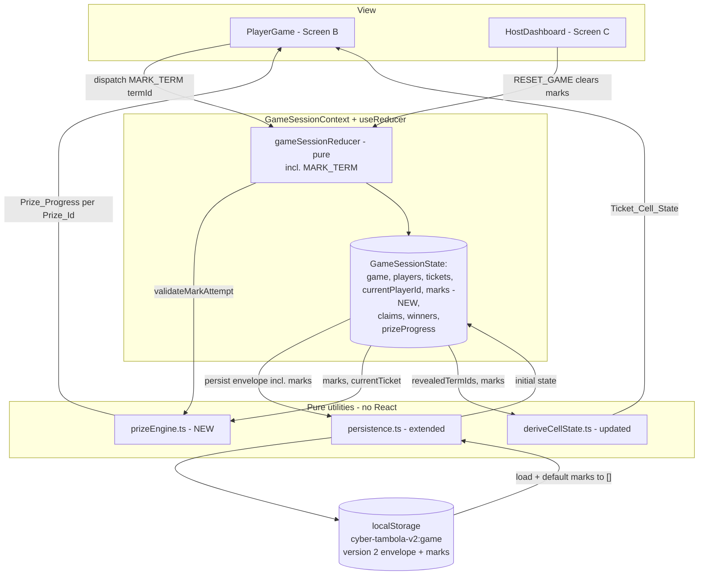
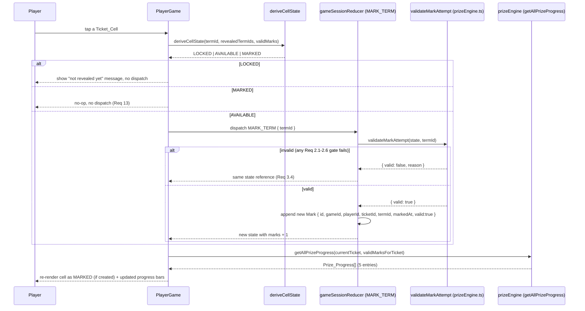

# Design Document

## Overview

Module 4 replaces two things that are currently faked in the Cyber Tambola V2 prototype: (1) `PlayerGame.tsx`'s component-local `Set<string>` of "tapped" term ids, which resets on every refresh and never reaches the store, and (2) `state.prizeProgress`, a static seeded array that never changes no matter what a player does. In their place, Module 4 introduces a real `Mark` domain record that lives in the central `GameSessionState` next to `game`, `players`, and `tickets`, plus a pure `Prize_Engine` at `src/utils/prizeEngine.ts` that derives every prize's progress from a Ticket and its Valid_Marks.

The design keeps Module 3's architecture untouched: functional React components, one central `useReducer` store behind `GameSessionContext`, pure helpers in `src/utils`, one versioned `localStorage` envelope, and one `BroadcastChannel` for cross-tab sync. Module 4 only adds to that architecture — a new action (`MARK_TERM`), a new collection (`marks`), and a new pure module (`prizeEngine.ts`) — it does not restructure it.

The core design tensions and how they are resolved:

- **Where does mark validation live?** All six validation gates in Requirement 2 must run identically whether the UI is deciding whether to grey out a cell or the reducer is deciding whether to create a Mark. So validation is written once as a pure predicate (`validateMarkAttempt` / `canMarkTerm`) that both the `MARK_TERM` reducer case and `PlayerGame`'s tap handler call — never duplicated.
- **What does "marking is allowed" mean across game states (Req 2.5)?** Requirement 2.5's own wording is ambiguous about which specific statuses permit marking. This design resolves it explicitly: **marking a term is allowed whenever `game.status !== 'COMPLETED'` and that term is present in `revealedTermIds`.** A term, once revealed, stays markable even after the host loads the next clue, pauses, or reveals a different term — only reaching `COMPLETED` blocks marking. This matches the domain intent: `revealedTermIds` is already the authoritative "this term is legitimately in play" list; gating on game *status* on top of that would let a host's pause or clue-advance silently erase a player's ability to mark something already revealed, which the requirements never ask for.
- **Where does cell state come from now?** Module 3's `deriveCellState(termId, revealedTermIds, marked: boolean)` took a boolean sourced from local UI state. Module 4 replaces the boolean's source — a term is `MARKED` when a `Valid_Mark` exists for it, not when a local `Set` says so — while keeping the same three-state derivation shape and the same "pure function of its inputs, never mutates the stored ticket" guarantee.
- **Does `PrizeProgress` need an `eligible` field?** No. `Prize_Eligible` is fully determined by `current >= target` (this holds exactly for `CYBER_FIVE` and `CYBER_FULL_HOUSE`, and for the Line prizes it collapses to the same test because "all 5 cells in the row are marked" and "`current` (row-marked-count) `>= target` (5)" are equivalent once `current` cannot exceed 5). Storing a separate boolean would create a second value that must always agree with `current`/`target`, which is a needless invariant to maintain. Instead, a single pure helper `isPrizeEligible(progress: PrizeProgress): boolean` is the one place that answers "is this prize eligible."
- **Does persistence need a version bump?** No. Adding `marks` to the envelope is purely additive. `PERSIST_VERSION` stays `2`. `marks` is treated as optional-with-default at parse time: absent, `null`, or non-array `marks` defaults to `[]` rather than failing the whole envelope. This means a browser with real Module 3 session data (no `marks` field at all) keeps its `game`/`players`/`tickets` on upgrade instead of being wiped back to seed — which a version-mismatch rejection would otherwise do.

This design is grounded in the actual Module 3 code read during design: `src/state/{GameSessionContext.tsx, gameSessionReducer.ts, gameSessionInitialState.ts, persistence.ts, syncChannel.ts}`, `src/types/{player.ts, ticket.ts, game.ts, prize.ts, claim.ts}`, `src/utils/deriveCellState.ts`, `src/pages/{PlayerGame/PlayerGame.tsx, HostDashboard/HostDashboard.tsx}`, and `src/components/player/{Ticket.tsx, TicketCell.tsx, PrizeProgressList.tsx}`.

### Research notes

- No external research was required for this module. Every open question (mark validation gates, eligibility representation, persistence versioning) is resolved by reading the existing Module 3 code and this module's approved requirements, not by external library or API research. The one ambiguity in the requirements (Req 2.5's exact allowed-status set) is resolved above as a design decision rather than deferred to research.

## Architecture

### Component and data-flow overview



### Mark validation + creation flow (tap on an AVAILABLE cell)



### Key architectural decisions

| Decision | Rationale |
| --- | --- |
| Mark validation is one pure predicate shared by reducer and UI | Requirement 2's six gates must never drift between "should I disable this tap" and "should I create this Mark" (Req 2.1–2.7, 14.1–14.3). |
| `marks` lives in `GameSessionState`, not component state | Requirement 1.3 forbids component-local marked state; a single source of truth is required for persistence (Req 5) and sync (Req 6). |
| Marking allowed whenever `game.status !== 'COMPLETED'` and term is revealed | Resolves Req 2.5's ambiguity; `revealedTermIds` already gates legitimacy, so gating again on transient statuses (`PAUSED`, having moved to a later clue) would regress previously-earned progress for no requirement-stated reason. |
| No stored `eligible` boolean on `PrizeProgress` | `current >= target` always answers eligibility; a stored flag would be a second value that could drift from `current`/`target` (Req 8.3, 9.5, 10.3, 16.1–16.2). |
| `PERSIST_VERSION` stays `2`; `marks` defaults to `[]` when absent/invalid | Additive field, backward compatible with real Module 3 envelopes already in players' browsers (Req 5.4, 5.5). |
| `Prize_Engine` functions take `(ticket, validMarks)` as plain arguments, no Session_Store access | Keeps the engine pure and independently testable (Req 7.1); the same functions run identically in the UI and in tests. |

## Components and Interfaces

### 1. `src/types/mark.ts` (new)

```ts
/** One player's authoritative, validated act of marking one term on one ticket. */
export interface Mark {
  id: string
  gameId: string
  playerId: string
  ticketId: string
  termId: string
  /** ISO timestamp of when the mark was created. */
  markedAt: string
  /** Always true for marks created by MARK_TERM (Req 2.8); reserved for future invalidation. */
  valid: boolean
}
```

`valid` is always `true` for every Mark the reducer creates (Req 2.8) — there is no code path that creates an invalid Mark or flips `valid` to `false` in this module. The field exists so a Mark's "is this currently authoritative" status is explicit and future work (e.g. host-side dispute resolution) has a place to write `false` without changing the record shape.

### 2. `src/utils/prizeEngine.ts` (new, pure)

```ts
import type { Mark } from '../types/mark'
import type { Ticket } from '../types/ticket'
import type { Prize, PrizeId, PrizeProgress } from '../types/prize'
import type { Game } from '../types/game'

/** The five prizes and their fixed targets/labels (Req 7.4, 8, 9, 10). */
export const PRIZES: readonly Prize[] = [
  { id: 'CYBER_FIVE', label: 'Cyber Five', target: 5 },
  { id: 'FIREWALL_LINE', label: 'Firewall Line', target: 5 },
  { id: 'SECURITY_LINE', label: 'Security Line', target: 5 },
  { id: 'DATA_DEFENDER_LINE', label: 'Data Defender Line', target: 5 },
  { id: 'CYBER_FULL_HOUSE', label: 'Cyber Full House', target: 15 },
]

/** Row index (0-2) backing each Line_Prize; used by getLineProgress. */
const LINE_PRIZE_ROWS: Record<'FIREWALL_LINE' | 'SECURITY_LINE' | 'DATA_DEFENDER_LINE', number> = {
  FIREWALL_LINE: 0,
  SECURITY_LINE: 1,
  DATA_DEFENDER_LINE: 2,
}

/**
 * Filter the full `marks` collection down to one player's Valid_Marks for one
 * ticket (Req 7.2). Never mutates `marks`.
 */
export function getPlayerTicketMarks(
  marks: readonly Mark[],
  playerId: string,
  ticketId: string,
): Mark[]

/**
 * The distinct set of Marked_Term_Ids present across a collection of
 * Valid_Marks (Req 7.3). Marks not belonging to `valid: true` are excluded
 * by the caller having already filtered via getPlayerTicketMarks, but this
 * function additionally guards by checking `valid` itself so callers cannot
 * accidentally count an invalid mark.
 */
export function getMarkedTermIds(validMarks: readonly Mark[]): Set<string>

/** Cyber Five progress: any 5 marked terms regardless of row (Req 8). */
export function getCyberFiveProgress(
  ticket: Ticket,
  validMarks: readonly Mark[],
): PrizeProgress

/**
 * One Line_Prize's progress: only marks whose Ticket_Cell is in `row` count
 * (Req 9). `prizeId`/`label` select which of the three line prizes this is.
 */
export function getLineProgress(
  ticket: Ticket,
  validMarks: readonly Mark[],
  row: number,
  prizeId: 'FIREWALL_LINE' | 'SECURITY_LINE' | 'DATA_DEFENDER_LINE',
  label: string,
): PrizeProgress

/** Cyber Full House progress: every one of the ticket's 15 terms (Req 10). */
export function getFullHouseProgress(
  ticket: Ticket,
  validMarks: readonly Mark[],
): PrizeProgress

/**
 * All 5 Prize_Progress entries for a ticket, in PRIZES order (Req 7.4, 11).
 * A single marked term contributes to every prize whose criteria it
 * satisfies simultaneously — none of the per-prize functions above remove or
 * consume a Marked_Term_Id, so calling them all against the same
 * `validMarks` naturally yields non-exclusive counting (Req 11.1, 11.2).
 */
export function getAllPrizeProgress(
  ticket: Ticket,
  validMarks: readonly Mark[],
): PrizeProgress[]

/** True when a prize's current progress has reached its target (Req 8.3, 9.5, 10.3). */
export function isPrizeEligible(progress: PrizeProgress): boolean

/** Reason a mark attempt was rejected, or 'ok' when it may proceed. */
export type MarkValidationResult =
  | { valid: true }
  | {
      valid: false
      reason:
        | 'NO_CURRENT_PLAYER'
        | 'TICKET_NOT_FOUND'
        | 'TERM_NOT_ON_TICKET'
        | 'TERM_NOT_REVEALED'
        | 'GAME_COMPLETED'
        | 'DUPLICATE_MARK'
    }

/**
 * The single validation pipeline for Requirement 2, shared by the reducer's
 * MARK_TERM case and by PlayerGame (to decide whether a tap should dispatch
 * and what feedback to show). Never mutates its inputs.
 *
 * Gates, in order (Req 2.1-2.6):
 *  1. NO_CURRENT_PLAYER   - no player has id === currentPlayerId
 *  2. TICKET_NOT_FOUND    - current player's ticketId has no matching Ticket
 *  3. TERM_NOT_ON_TICKET  - termId does not belong to any cell on that Ticket
 *  4. TERM_NOT_REVEALED   - termId is not in game.revealedTermIds
 *  5. GAME_COMPLETED      - game.status === 'COMPLETED'
 *  6. DUPLICATE_MARK      - a Valid_Mark already exists for
 *                           (currentPlayerId, ticketId, termId)
 */
export function validateMarkAttempt(
  state: {
    game: Game
    players: { id: string; ticketId: string }[]
    tickets: Ticket[]
    marks: Mark[]
    currentPlayerId?: string
  },
  termId: string,
): MarkValidationResult

/** Convenience boolean wrapper over validateMarkAttempt, for UI tap gating. */
export function canMarkTerm(
  state: Parameters<typeof validateMarkAttempt>[0],
  termId: string,
): boolean
```

Notes on gate order and the Req 2.5 resolution: gate 5 (`GAME_COMPLETED`) checks only `game.status === 'COMPLETED'` — no other status blocks marking. Gate 4 (`TERM_NOT_REVEALED`) is what actually restricts *which* terms are eligible at any moment; together these two gates implement the "marking allowed whenever the game isn't COMPLETED and the term has been revealed" rule from the Overview. `PlayerGame` never needs to check `game.status` separately from `revealedTermIds` — `canMarkTerm` is the single source of truth.

`getLineProgress` is one parameterized function rather than three near-identical ones (`getFirewallLineProgress`, `getSecurityLineProgress`, `getDataDefenderLineProgress`) because Requirement 9's three line prizes are structurally identical modulo which row and label they use — `getAllPrizeProgress` calls it three times with `LINE_PRIZE_ROWS` entries.

### 3. `src/utils/deriveCellState.ts` (updated)

```ts
import type { TicketCellState } from '../types/ticket'

/**
 * Derive a ticket cell's visual state purely from the game's reveal history
 * and the player's Valid_Marks for this term (Req 4.1-4.3).
 *
 * Rules:
 * - termId NOT in revealedTermIds -> LOCKED (Req 4.1)
 * - present AND no Valid_Mark for this termId -> AVAILABLE (Req 4.2)
 * - present AND a Valid_Mark exists for this termId -> MARKED (Req 4.3)
 *
 * `markedTermIds` is the caller's precomputed Marked_Term_Ids for the
 * Current_Player + Current_Ticket (via getMarkedTermIds(getPlayerTicketMarks(...))),
 * so this function stays a pure lookup with no Session_Store access.
 */
export function deriveCellState(
  termId: string,
  revealedTermIds: readonly string[],
  markedTermIds: ReadonlySet<string>,
): TicketCellState {
  if (!revealedTermIds.includes(termId)) {
    return 'LOCKED'
  }
  return markedTermIds.has(termId) ? 'MARKED' : 'AVAILABLE'
}
```

This is a signature change from Module 3 (`marked: boolean` → `markedTermIds: ReadonlySet<string>`), since cell state now depends on the shared `marks` collection rather than a single boolean captured by the caller per cell. `PlayerGame` computes `markedTermIds` once per render (via the prize-engine helpers) and passes it to every cell's `deriveCellState` call.

### 4. State layer changes

`src/state/gameSessionInitialState.ts`:

```ts
export interface GameSessionState {
  game: Game
  players: Player[]
  tickets: Ticket[]
  currentPlayerId?: string
  marks: Mark[]            // NEW, seed: []
  claims: PrizeClaim[]
  winners: Winner[]
  prizeProgress: PrizeProgress[]
}
```

- `marks` seeds to `[]` (Req 1.4). `seedPrizeProgress` remains as-is — it is still the *pre-join* zeroed display fallback used before a `currentTicket` exists; once a player has joined, `PlayerGame` computes real progress via `prizeEngine` instead of reading `state.prizeProgress` (see Screen changes below). `state.prizeProgress` itself is not removed in this module because `HostDashboard`/other screens do not depend on it changing, and removing it is out of scope for Module 4's requirements.

`src/state/gameSessionReducer.ts` — extended action union and new case:

```ts
export type GameSessionAction =
  | { type: 'START_GAME' }
  | { type: 'REVEAL_ANSWER' }
  | { type: 'LOAD_NEXT_CLUE' }
  | { type: 'PAUSE_GAME' }
  | { type: 'RESUME_GAME' }
  | { type: 'END_GAME' }
  | { type: 'RESET_GAME' }
  | { type: 'JOIN_PLAYER'; player: Player; ticket: Ticket }
  | { type: 'RESTORE_PLAYER'; playerId: string }
  | { type: 'SYNC_STATE'; payload: SyncPayload }
  | { type: 'MARK_TERM'; termId: string }   // NEW (Req 3.1)
```

`MARK_TERM` case:

```ts
case 'MARK_TERM': {
  const result = validateMarkAttempt(state, action.termId)
  if (!result.valid) return state // Req 2.7, 3.4 — same reference, no side effects

  const player = state.players.find((p) => p.id === state.currentPlayerId)!
  const newMark: Mark = {
    id: localId(),                 // reuse the same local-id generator as joinService
    gameId: state.game.id,
    playerId: player.id,
    ticketId: player.ticketId,
    termId: action.termId,
    markedAt: now(),
    valid: true,
  }
  return { ...state, marks: [...state.marks, newMark] } // Req 2.8, 3.3
}
```

This mirrors the existing case style exactly: a single early-return guard for the invalid path (same pattern as `START_GAME`'s `if (game.status !== 'LOBBY') return state`), and a pure, side-effect-free state transition on the valid path (no `localStorage`/`BroadcastChannel` calls inside the reducer — those remain `GameSessionContext`'s job, Req 3.2). `localId()` is imported from `joinService.ts` (already used there for player/ticket ids) rather than duplicated.

`SyncPayload` extended (Req 6.1):

```ts
export interface SyncPayload {
  game: Game
  players: Player[]
  tickets: Ticket[]
  currentPlayerId?: string
  marks: Mark[]   // NEW
}
```

`isValidSyncPayload` extended (Req 6.2, 6.3):

```ts
export function isValidSyncPayload(value: unknown): value is SyncPayload {
  if (typeof value !== 'object' || value === null) return false
  const v = value as Record<string, unknown>
  const game = v.game as Record<string, unknown> | undefined
  return (
    typeof game === 'object' &&
    game !== null &&
    typeof game.id === 'string' &&
    typeof game.status === 'string' &&
    Array.isArray(game.revealedTermIds) &&
    Array.isArray(v.players) &&
    Array.isArray(v.tickets)
    // marks is intentionally NOT required here — see SYNC_STATE below.
  )
}
```

The overall payload shape check does not require `marks` to exist, so a payload from an unpatched-but-still-Module-3-shaped tab (unlikely in practice, since both tabs share the same build, but consistent with fail-safe conventions) is not rejected outright. Instead, `SYNC_STATE` normalizes `marks` itself:

```ts
case 'SYNC_STATE': {
  if (!isValidSyncPayload(action.payload)) return state
  const { game, players, tickets } = action.payload
  const marks = Array.isArray(action.payload.marks) ? action.payload.marks : [] // Req 6.3
  // ...existing currentPlayerId reconciliation unchanged...
  return { ...state, game, players, tickets, marks, currentPlayerId }
}
```

`RESET_GAME` needs no code change beyond the seed update below — it already returns `{ ...gameSessionInitialState, game: createSeedGame() }`, and `gameSessionInitialState.marks` is now `[]` (Req 17.1), so `marks` is cleared for free by the existing spread.

### 5. `src/state/persistence.ts` (extended)

```ts
export interface PersistedEnvelope {
  version: 2
  game: Game
  players: Player[]
  tickets: Ticket[]
  currentPlayerId?: string
  marks: Mark[]   // NEW — always written, defaulted to [] on read
}

export interface PersistedSlice {
  game: Game
  players: Player[]
  tickets: Ticket[]
  currentPlayerId?: string
  marks: Mark[]   // NEW
}

export function toEnvelope(slice: PersistedSlice): PersistedEnvelope {
  return {
    version: PERSIST_VERSION,
    game: slice.game,
    players: slice.players,
    tickets: slice.tickets,
    currentPlayerId: slice.currentPlayerId,
    marks: slice.marks,
  }
}
```

`parseEnvelope` change (Req 5.2, 5.4, 5.5) — the version, `game`, `players`, and `tickets` checks are unchanged; only the handling of `marks` is new and is deliberately lenient:

```ts
export function parseEnvelope(raw: string | null): PersistedSlice | null {
  // ...unchanged JSON.parse, version check, isGameShape, players/tickets array checks...

  const marks = Array.isArray(envelope.marks) ? (envelope.marks as Mark[]) : []
  // Req 5.4: absent / null / non-array `marks` silently defaults to [] rather
  // than failing the whole envelope — this is what makes a real Module 3
  // envelope (predating `marks` entirely) still load successfully.

  // ...unchanged currentPlayerId reconciliation...

  return { game, players, tickets, currentPlayerId, marks }
}
```

No other validation is added for individual Mark shapes (e.g. checking each entry has a string `id`) — a malformed *entry* inside an otherwise-array `marks` field is out of scope for Req 5's shape validation, which is stated at the field level ("missing, `null`, or not an array"), consistent with how `players`/`tickets` are validated only as arrays, not element-by-element, in the existing code.

`writeEnvelope`/`readEnvelope` are otherwise unchanged; they already operate on whatever shape `PersistedSlice`/`PersistedEnvelope` describe.

### 6. `src/state/GameSessionContext.tsx` (updated)

- `initState()`'s restored-slice merge adds `marks: restored.marks`.
- The persistence `useEffect`'s `slice` object adds `marks: state.marks`, and its dependency array adds `state.marks`.
- The sync `useEffect`'s broadcast `slice`/`channel.post(slice)` payload adds `marks: state.marks`.
- New derived selectors added to `GameSessionContextValue`:

```ts
export interface GameSessionContextValue {
  state: GameSessionState
  dispatch: React.Dispatch<GameSessionAction>
  currentTerm?: CyberTerm
  revealHistory: CyberTerm[]
  hasRemainingTerms: boolean
  currentPlayer?: Player
  currentTicket?: Ticket
  /** Current_Player's Valid_Marks for Current_Ticket (Req 7.2), memoized per render. */
  currentPlayerMarks: Mark[]
  /** All 5 Prize_Progress entries for Current_Ticket, or [] with no ticket (Req 7.4, 15.1). */
  currentPrizeProgress: PrizeProgress[]
}
```

Computed inside the existing `useMemo`:

```ts
const currentPlayerMarks =
  currentPlayer && currentTicket
    ? getPlayerTicketMarks(state.marks, currentPlayer.id, currentTicket.id)
    : []

const currentPrizeProgress = currentTicket
  ? getAllPrizeProgress(currentTicket, currentPlayerMarks)
  : []
```

Centralizing this in the context (rather than recomputing inside `PlayerGame`) means any future screen that needs a player's live progress can read it the same way, and `PlayerGame` never touches `prizeEngine` functions except through these two values plus `deriveCellState`.

### 7. Screen changes

**`PlayerGame.tsx`** (Req 4, 12, 13, 14, 15, 16):
- Remove the local `marked` `useState<Set<string>>` entirely — cell state no longer has a component-local source (Req 1.3, 4.4).
- Keep `lockedHint` local state (it is transient UI feedback text, not marking state) but drive its content from `validateMarkAttempt`'s rejection reason rather than a hand-rolled check.
- Compute `markedTermIds = getMarkedTermIds(currentPlayerMarks)` from context once per render; pass it into every cell's `deriveCellState(cell.termId, game.revealedTermIds, markedTermIds)` inside the existing `renderedTicket` `useMemo`.
- Replace `toggleCell` with a handler that reads the derived state of the tapped cell and:
  - `LOCKED` → do not dispatch; set `lockedHint` to a message such as `"{term} has not been revealed yet."` (Req 14.1). Progress and `marks` are untouched because nothing was dispatched (Req 14.2).
  - `MARKED` → do not dispatch anything (Req 13.1, 13.2, 14.3) — an explicit no-op branch, not merely "let the reducer reject it," so the UI never even attempts a redundant action.
  - `AVAILABLE` → `dispatch({ type: 'MARK_TERM', termId })` (Req 12.1). Because the reducer either appends a Mark or returns unchanged state, and `renderedTicket`/`currentPrizeProgress` are derived from `state` on every render, a successful mark is reflected immediately without any additional local state (Req 12.2, 12.3).
- Replace the `Card title="Prize Progress"` body's data source: `<PrizeProgressList items={currentPrizeProgress} />` instead of `state.prizeProgress` (Req 15.1, 15.2). When there is no current ticket the component already redirects via `<Navigate>` before reaching this markup, so `currentPrizeProgress` is always the real, non-mock array by the time it renders (Req 15.2).
- Replace the Cyber Five gating logic. Instead of reading `state.prizeProgress`, find the entry in `currentPrizeProgress` and use `isPrizeEligible`:

```ts
const cyberFive = currentPrizeProgress.find((p) => p.id === 'CYBER_FIVE')
const eligible = !!cyberFive && isPrizeEligible(cyberFive)
```

- Replace the single generic claim hint with the exact messaging table from Requirement 16:

```ts
function cyberFiveMessage(progress: PrizeProgress | undefined): string {
  if (!progress) return 'Mark revealed terms to become eligible for prizes.'
  const remaining = progress.target - progress.current
  if (remaining <= 0) return '🎉 Cyber Five Ready!'
  if (remaining === 1) return 'Mark 1 more valid term to become eligible for Cyber Five.'
  if (remaining === 2) return 'Mark 2 more valid terms to become eligible for Cyber Five.'
  return `Mark ${remaining} more valid terms to become eligible for Cyber Five.`
}
```

  (Req 16.3, 16.4, 16.5 give the exact strings for `remaining === 2` and `remaining === 1`; the general `remaining` branch extrapolates the same pluralization pattern for `current` values below 3, which the requirements do not pin to specific text.)
- Claim control label/enablement: when `isPrizeEligible(cyberFive)`, enable the button and show `"Prize ready — claim available"` per-prize semantics generalize to the existing single "Claim Prize" button by keying its enabled state and label off Cyber Five specifically, matching Req 16.5's `"🎉 Cyber Five Ready!"` + `"Claim Cyber Five"` wording. No claim/winner record is written anywhere in this flow (Req 16.6) — `claimConfirmed` remains component-local UI-only state, exactly as in Module 3.

**`HostDashboard.tsx`** (Req 17):
- No new code is required beyond what `RESET_GAME` already does once `gameSessionInitialState.marks` is `[]` — `resetGame()`'s existing `dispatch({ type: 'RESET_GAME' })` call clears `marks` as part of the same spread that already clears `players`/`tickets`/`currentPlayerId` (Req 17.1). The persisted envelope is overwritten by `GameSessionContext`'s existing persistence effect reacting to the new (reset) state, now including `marks: []` (Req 17.2).

**`PrizeProgressList.tsx`, `Ticket.tsx`, `TicketCell.tsx`**: no changes. They already render whatever `PrizeProgress[]` / `TicketCellState` they are given; Module 4 changes only *what* feeds them, not their own logic. `TicketCell.tsx`'s existing `STATE_META` already renders a checkmark icon + "Marked" text for the `MARKED` state (Req 12.4 is already satisfied by Module 3's implementation).

### 8. Type changes

`src/types/prize.ts` — unchanged. `Prize` (used by `PRIZES` above) and `PrizeProgress` already have exactly the fields this module needs (`id`, `label`, `target` / `id`, `label`, `current`, `target`); no `eligible` field is added, per the design decision above.

## Data Models

### Persisted envelope (localStorage, key `cyber-tambola-v2:game`, version stays `2`)

```jsonc
{
  "version": 2,
  "game": { "id": "GAME_001", "code": "CYBER24", "status": "ANSWER_REVEALED",
            "createdAt": "…", "currentRound": 2, "currentTermId": "TERM_006",
            "revealedTermIds": ["TERM_001", "TERM_006"] },
  "players": [ /* unchanged shape from Module 3 */ ],
  "tickets": [ /* unchanged shape from Module 3 */ ],
  "currentPlayerId": "p-a1",
  "marks": [
    {
      "id": "m-x1", "gameId": "GAME_001", "playerId": "p-a1", "ticketId": "t-a1",
      "termId": "TERM_001", "markedAt": "2025-01-01T10:00:00.000Z", "valid": true
    }
  ]
}
```

A legacy Module 3 envelope on disk (no `marks` key at all) still has `version: 2`, so it passes the version check; `parseEnvelope` defaults its restored `marks` to `[]` (Req 5.4).

### In-memory state (`GameSessionState`)

Same as the envelope minus `version`, plus `claims`, `winners`, `prizeProgress` (unchanged host-demo/seed data, not persisted, exactly as in Module 3).

### Sync payload (BroadcastChannel message body)

Identical shape to the persisted slice minus `version`: `{ game, players, tickets, currentPlayerId, marks }`.

### Prize progress (computed, not stored per-player)

`getAllPrizeProgress` always returns exactly 5 entries in this fixed order and shape:

```jsonc
[
  { "id": "CYBER_FIVE", "label": "Cyber Five", "current": 3, "target": 5 },
  { "id": "FIREWALL_LINE", "label": "Firewall Line", "current": 2, "target": 5 },
  { "id": "SECURITY_LINE", "label": "Security Line", "current": 1, "target": 5 },
  { "id": "DATA_DEFENDER_LINE", "label": "Data Defender Line", "current": 0, "target": 5 },
  { "id": "CYBER_FULL_HOUSE", "label": "Cyber Full House", "current": 3, "target": 15 }
]
```

## Correctness Properties

*A property is a characteristic or behavior that should hold true across all valid executions of a system — essentially, a formal statement about what the system should do. Properties serve as the bridge between human-readable specifications and machine-verifiable correctness guarantees.*

The mark-validation pipeline, the derived cell-state function, the prize-engine formulas, and the persistence/sync codecs are all pure functions over large input spaces with clear universal invariants, making them well suited to property-based testing. UI wiring (whether a tap dispatches, exact displayed strings, whether a component re-renders) is validated with component/integration tests instead (see Testing Strategy) — those behaviors don't vary meaningfully with input in a way 100 iterations would exercise better than 1-3 targeted examples.

#### Property Reflection

Before finalizing the list below, several prework-identified properties were merged to avoid redundancy:
- The six rejection gates (Req 2.1–2.6) plus the "state unchanged on failure" clause (Req 2.7) plus the reducer-level "same reference on failure" clause (Req 3.4) are one property (Property 1): each gate is just a different reason `validateMarkAttempt` returns invalid, and all of them lead to the same observable outcome (no Mark, no state change).
- The "exactly one Mark created, well-formed" clause (Req 2.8) and the reducer-level "only `marks` changes, `players`/`tickets`/`game` untouched" clause (Req 3.3) are one property (Property 2), since both describe the same accepted-branch state transition.
- The three Line_Prize formulas (Req 9.1–9.3, 9.5) collapse into one property (Property 5) parameterized by row, since Firewall/Security/Data Defender Line are structurally identical rules over different rows — writing three near-duplicate properties would add no additional verification value.
- Requirement 5's "persist on change" (5.1) and "restore on load" (5.3) clauses are one round-trip property (Property 8), since persisting and then restoring is exactly what a round-trip property tests.
- Requirement 5's "default to `[]` when absent/invalid" (5.4) and "fall back to seed on other shape failures" (5.5) are one fail-safe property (Property 9), since both describe `parseEnvelope` never throwing and always producing a safe `marks` value.
- Requirement 6's "include marks in broadcast" (6.1), "apply incoming marks" (6.2), and "default invalid incoming marks safely" (6.3) are one property (Property 10), mirroring how Property 8/9 treat persistence — sync is the same round-trip-plus-fail-safe shape applied to `SyncPayload` instead of `PersistedEnvelope`.

### Property 1: Invalid mark attempts are always rejected without side effects

*For any* session state and any `termId`, if any of the six conditions holds — no player matches `currentPlayerId`; the current player's `ticketId` matches no Ticket; `termId` does not belong to any cell on that Ticket; `termId` is not in `game.revealedTermIds`; `game.status === 'COMPLETED'`; or a Valid_Mark already exists for the same player, ticket, and `termId` — then `validateMarkAttempt` returns an invalid result, and dispatching `MARK_TERM` with that `termId` returns a state with `marks`, `tickets`, `players`, and `game` all unchanged (by reference or deep equality).

**Validates: Requirements 2.1, 2.2, 2.3, 2.4, 2.5, 2.6, 2.7, 3.4, 13.1, 13.2, 14.1, 14.2, 14.3**

### Property 2: A valid mark attempt creates exactly one well-formed Mark

*For any* session state where `validateMarkAttempt` returns valid for a given `termId`, dispatching `MARK_TERM` with that `termId` yields a state whose `marks` collection has exactly one more entry than before; that new entry has `valid === true`, `gameId` equal to `state.game.id`, `playerId` equal to `currentPlayerId`, `ticketId` equal to the current player's `ticketId`, `termId` equal to the dispatched value, and `markedAt` a valid ISO timestamp; and `players`, `tickets`, and `game` are unchanged.

**Validates: Requirements 2.8, 3.3**

### Property 3: The reducer's MARK_TERM handling is pure

*For any* state and any `termId`, dispatching `MARK_TERM` does not mutate the input state object, produces the same output for the same input (determinism), and performs no reads or writes to `localStorage` or `BroadcastChannel` — those effects belong exclusively to `GameSessionContext`.

**Validates: Requirements 3.2**

### Property 4: Cell state is derived solely from reveal history and valid marks

*For any* `termId`, `revealedTermIds` list, and set of Marked_Term_Ids, `deriveCellState` returns `LOCKED` when the term id is absent from `revealedTermIds`; `AVAILABLE` when present and absent from the marked set; and `MARKED` when present and present in the marked set — covering all three cases exhaustively, so changing either input flips exactly the affected cells without ever consulting any other state.

**Validates: Requirements 4.1, 4.2, 4.3**

### Property 5: Cyber Five progress counts any 5 marked terms regardless of row

*For any* Ticket and any subset of its 15 termIds treated as Marked_Term_Ids, `getCyberFiveProgress` returns `target === 5` and `current` equal to the smaller of the marked-subset's size and 5, is `Prize_Eligible` exactly when the marked-subset's size is at least 5, and this count does not change when the same marked termIds are redistributed across different rows of an equivalent ticket layout.

**Validates: Requirements 8.1, 8.2, 8.3, 8.4**

### Property 6: Each Line_Prize counts only its own row

*For any* Ticket, any row index `r` in `{0, 1, 2}` with its corresponding Prize_Id (`FIREWALL_LINE`, `SECURITY_LINE`, `DATA_DEFENDER_LINE`), and any subset of Marked_Term_Ids, `getLineProgress(ticket, marks, r, prizeId, label)` returns `target === 5` and `current` equal to the count of the ticket's row-`r` cells whose `termId` is in the marked subset, and is `Prize_Eligible` exactly when all 5 of that row's cells are in the marked subset — and marks on any other row never affect this count.

**Validates: Requirements 9.1, 9.2, 9.3, 9.4, 9.5**

### Property 7: Cyber Full House tracks every marked term on the ticket

*For any* Ticket and any subset of its 15 termIds treated as Marked_Term_Ids, `getFullHouseProgress` returns `target === 15` and `current` equal to the marked subset's size, and is `Prize_Eligible` exactly when all 15 of the ticket's termIds are marked.

**Validates: Requirements 10.1, 10.2, 10.3**

### Property 8: A single marked term contributes to every prize it qualifies for, without exclusion

*For any* Ticket and any Marked_Term_Ids set, adding one more valid mark for a termId not yet in that set never decreases the `current` value of `CYBER_FIVE`, the marked term's row's Line_Prize, or `CYBER_FULL_HOUSE` in `getAllPrizeProgress`'s output, and strictly increases the `current` value of every one of those prizes whose count that termId is eligible to contribute to (i.e. it increases `CYBER_FIVE` and `CYBER_FULL_HOUSE` unconditionally, and increases its row's Line_Prize).

**Validates: Requirements 11.1, 11.2**

### Property 9: Persistence round-trips marks and defaults missing/invalid marks safely

*For any* valid slice `{ game, players, tickets, currentPlayerId, marks }`, `parseEnvelope(JSON.stringify(toEnvelope(slice)))` deep-equals the original slice including `marks`; and *for any* otherwise-valid envelope object whose `marks` field is absent, `null`, or not an array (including a legacy Module 3 envelope with no `marks` key at all), `parseEnvelope` returns a slice whose `marks` is `[]` rather than rejecting the envelope, and never throws.

**Validates: Requirements 5.1, 5.2, 5.3, 5.4, 5.5**

### Property 10: Cross-tab sync includes, applies, and safely defaults marks

*For any* state and any valid `SyncPayload` whose `marks` is an array, dispatching `SYNC_STATE` with that payload yields a state whose `marks` equals the payload's `marks`; and *for any* payload that is otherwise a valid `SyncPayload` shape but whose `marks` is missing or not an array, dispatching `SYNC_STATE` yields a state whose `marks` is `[]` rather than throwing or crashing; and every broadcast produced by the session provider includes the current `marks` collection in its payload.

**Validates: Requirements 6.1, 6.2, 6.3**

### Property 11: RESET_GAME clears marks along with the rest of the session

*For any* state, including one with a non-empty `marks` collection, dispatching `RESET_GAME` yields `marks === []`, `players === []`, `tickets === []`, `currentPlayerId === undefined`, and `game.revealedTermIds === []` — extending the existing Module 3 reset guarantee to cover marks.

**Validates: Requirements 17.1, 17.2, 17.3**

## Error Handling

| Condition | Handling | Requirement |
| --- | --- | --- |
| No player matches `currentPlayerId` | `validateMarkAttempt` returns `NO_CURRENT_PLAYER`; `MARK_TERM` is a no-op | 2.1 |
| Current player's ticket not found in `tickets` | `validateMarkAttempt` returns `TICKET_NOT_FOUND`; `MARK_TERM` is a no-op | 2.2 |
| `termId` does not belong to any cell on the current ticket | `validateMarkAttempt` returns `TERM_NOT_ON_TICKET`; `MARK_TERM` is a no-op | 2.3 |
| `termId` not yet revealed (tap on a `LOCKED` cell) | `validateMarkAttempt` returns `TERM_NOT_REVEALED`; PlayerGame does not dispatch and shows `"{term} has not been revealed yet."`; every Prize_Progress value stays unchanged | 2.4, 14.1, 14.2 |
| Game is `COMPLETED` | `validateMarkAttempt` returns `GAME_COMPLETED`; `MARK_TERM` is a no-op regardless of reveal state | 2.5 |
| Duplicate mark attempt (tap on an already-`MARKED` cell) | PlayerGame's tap handler does not dispatch at all for `MARKED` cells; if dispatched anyway, `validateMarkAttempt` returns `DUPLICATE_MARK` and `MARK_TERM` is a no-op | 2.6, 13.1, 13.2, 14.3 |
| Malformed JSON in persisted envelope | `parseEnvelope` catches the parse error and returns `null`; store falls back to seed (including empty `marks`) | 5.5 |
| Persisted `marks` field missing, `null`, or not an array | `parseEnvelope` defaults restored `marks` to `[]`; the rest of the envelope (`game`/`players`/`tickets`/`currentPlayerId`) still loads normally if otherwise valid | 5.4 |
| Persisted envelope otherwise fails shape validation (bad `game`/`players`/`tickets`) | `parseEnvelope` returns `null`; store falls back to full seed state, including empty `marks` | 5.5 |
| Incoming `SyncPayload` missing `marks` or `marks` not an array | `SYNC_STATE` defaults the applied `marks` to `[]`; `game`/`players`/`tickets` still apply normally if otherwise valid | 6.3 |
| Incoming `SyncPayload` fails overall shape validation | `isValidSyncPayload` returns `false`; `SYNC_STATE` is a no-op, existing state (including `marks`) is retained | 6.3 |
| `localStorage` write quota/availability error | `writeEnvelope` swallows the error (best-effort persistence), unchanged from Module 3 | 5.1 |

## Testing Strategy

### Tooling

No new tooling is required. Module 3 already established **Vitest**, **@testing-library/react**, and **fast-check** for this project; Module 4 uses the same stack.

### Property-based tests (fast-check, ≥100 iterations each)

Each property test runs a minimum of 100 iterations and is tagged with a comment referencing the design property, in the format `// Feature: module-4-term-marking-prize-engine, Property {n}: {property text}`.

| File | Properties |
| --- | --- |
| `prizeEngine.validateMarkAttempt.test.ts` | P1, P2 (all six rejection gates + the accepted-branch well-formed Mark) |
| `gameSessionReducer.markTerm.test.ts` | P3 (reducer purity/determinism for `MARK_TERM`, extending Module 3's existing reducer-purity property) |
| `deriveCellState.test.ts` | P4 (three-way derivation, metamorphic over changing `revealedTermIds`/marked set) |
| `prizeEngine.cyberFive.test.ts` | P5 |
| `prizeEngine.lineProgress.test.ts` | P6 (parameterized over the 3 rows/Prize_Ids) |
| `prizeEngine.fullHouse.test.ts` | P7 |
| `prizeEngine.nonExclusivity.test.ts` | P8 |
| `persistence.marks.test.ts` | P9 (extends Module 3's `persistence.test.ts` round-trip/fallback properties) |
| `gameSessionReducer.syncState.marks.test.ts` | P10 (extends Module 3's sync-payload fail-safe convention) |
| `gameSessionReducer.reset.test.ts` | P11 (extends Module 3's `RESET_GAME` property) |

Generators of note:
- A ticket generator that builds valid 3×5 `Ticket` fixtures with distinct termIds (reusing Module 3's `generateTicket`/shape conventions) so prize-engine properties run against realistic tickets.
- A marks generator that produces random subsets of a given ticket's 15 termIds as "marked," used across P5–P8 to vary how much of the ticket is marked and in which rows.
- A state-fixture generator for P1/P2 that independently toggles each of the six validation gates (missing player, missing ticket, off-ticket term, unrevealed term, `COMPLETED` status, pre-existing duplicate mark) to exercise every rejection reason, plus a fully-valid baseline fixture for the accepted branch.
- Reuse of Module 3's malformed-envelope and malformed-sync-payload generators (garbage JSON, wrong types, legacy shapes), extended with variants that omit `marks`, set it to `null`, or set it to a non-array value, for P9/P10.

### Unit / example tests

- `cyberFiveMessage` returns the exact strings for `current`/`target` = `3/5`, `4/5`, and `5/5` (Req 16.3, 16.4, 16.5).
- Claim control label/enablement: disabled with no text change when not eligible (Req 16.1); enabled with `"🎉 Cyber Five Ready!"` / `"Claim Cyber Five"` when eligible (Req 16.2, 16.5).
- Initial `gameSessionInitialState.marks` is `[]` (Req 1.4).
- `PRIZES` contains exactly the 5 expected `{id, label, target}` entries in the documented order (Req 7.4).

### Component tests (React Testing Library)

- **PlayerGame**: tapping an `AVAILABLE` cell dispatches `MARK_TERM` and the cell re-renders as `MARKED` with its checkmark/"Marked" label, without a page reload (Req 12.1, 12.2, 12.4); tapping a `LOCKED` cell does not dispatch and shows the "not revealed yet" message while progress values stay the same (Req 14.1, 14.2); tapping a `MARKED` cell does not dispatch and leaves the cell `MARKED` (Req 13.1, 13.2); Prize Progress panel reflects `currentPrizeProgress`, not `state.prizeProgress`, after a mark is created (Req 15.1, 15.2, 15.3); Claim control becomes enabled only once Cyber Five reaches `5/5` (Req 16.1, 16.2, Test C).
- **HostDashboard**: triggering Reset Demo Game followed by a fresh join shows every prize at its zeroed value (`0/5`, `0/5`, `0/5`, `0/5`, `0/15`) on the Player Game screen (Req 17.3, Test H).

### Integration tests

- **Mark persistence across refresh**: dispatch `MARK_TERM` for a revealed term, read `localStorage`, remount the provider, assert the same Mark is restored and the corresponding cell renders `MARKED` with matching progress values (Req 5.3, Test B).
- **Legacy envelope upgrade**: seed `localStorage` with a Module-3-shaped envelope (`version: 2`, no `marks` key), mount the provider, assert it initializes with `game`/`players`/`tickets` restored and `marks === []` without throwing (Req 5.4).
- **Cross-tab mark sync**: simulate two tabs sharing a `BroadcastChannel`; dispatch `MARK_TERM` in one, assert the other tab's `state.marks` and derived cell state update to match (Req 6.1, 6.2).
- **Five distinct terms → Cyber Five eligible**: mark 5 distinct revealed terms on a ticket; assert `5/5`, `Prize_Eligible` true, and the Claim control enabled (Req 8.3, Test C).
- **Full row → Line prize eligible**: mark all 5 cells in row 0; assert Firewall Line `5/5` and eligible; repeat for rows 1/2 (Req 9.5, Test D).
- **Full ticket → Full House eligible**: reveal and mark all 15 terms; assert Cyber Full House `15/15` and eligible (Req 10.3, Test E).

### Manual test scenarios (Req 18, single browser)

Tests A–H from Requirement 18 are exercised end to end by the integration tests above (mark-then-refresh, five-term eligibility, row eligibility, full-house eligibility, locked-tap rejection, duplicate-tap rejection, and reset) and require no additional manual-only verification beyond what those automated tests already assert.
