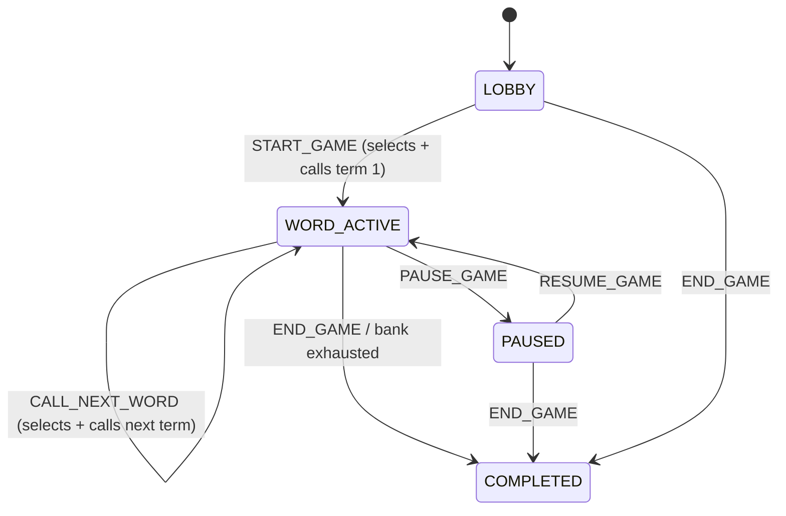

# Design Document

## Overview

This module replaces the Cyber Tambola V2 prototype's two-phase "show hidden clue → host reveals answer" round mechanic with a single-phase "host calls a Cyber Word → word, definition, and safe-practice tip all display at once" mechanic. The change is deliberately narrow: it collapses `CLUE_ACTIVE`/`ANSWER_REVEALED` into one `WORD_ACTIVE` status, merges the two reducer actions that used to represent "show" and "reveal" into one "call" action per round, renames the `CyberTerm` content fields to match the new semantics, and reshapes the three screens' current-round panels. It deliberately does **not** touch `revealedTermIds`, the Mark model, the Prize_Engine, ticket generation, join validation, or the client-local `Current_Player_Id`/`rev`-counter fixes — those subsystems already only depend on "has this term been called" (a boolean membership test) and valid Marks, which is exactly the same shape of fact the new model needs, so they are reused untouched.

The core design decision, repeated throughout: **keep `revealedTermIds` as the name and the mechanism**, and treat "called" as its new English meaning. Every consumer of that field (`deriveCellState`, `prizeEngine.validateMarkAttempt`, `GameSessionContext`'s `revealHistory` selector) already just checks membership in that array; nothing about "revealed" vs. "called" changes their code. Renaming it would touch ~8 production files and ~15 test files for zero behavioral gain and real regression risk, which Requirement 10 explicitly rules out.

### Research notes

No external research was required. Every design decision follows directly from reading the current implementation (see the context-gathering summary that preceded this document) and the requirements' explicit non-regression list. The one non-trivial judgment call — how to safely discard old `CLUE_ACTIVE`/`ANSWER_REVEALED` persisted envelopes — reuses the prototype's own established fail-safe pattern (reject on version mismatch, fall back to seed) rather than attempting field-level status migration, per Requirement 9.3's explicit preference.

## Architecture

### Status and action collapse



Before this module, `START_GAME` moved `LOBBY → CLUE_ACTIVE` (term selected, clue shown, answer hidden) and a separate `REVEAL_ANSWER` moved `CLUE_ACTIVE → ANSWER_REVEALED` (same term, answer now shown, `revealedTermIds` gains the term). `LOAD_NEXT_CLUE` then moved `ANSWER_REVEALED → CLUE_ACTIVE` for the next term, requiring another `REVEAL_ANSWER` before that term became markable.

After this module: `START_GAME` moves `LOBBY → WORD_ACTIVE` and, in the same action, selects the first term, sets it `currentTermId`, and appends it to `revealedTermIds` — the "reveal" side effect that `REVEAL_ANSWER` used to own is folded directly into the action that shows the term. The renamed `CALL_NEXT_WORD` action (replacing `LOAD_NEXT_CLUE`) does the same thing for subsequent rounds while staying in `WORD_ACTIVE`. `REVEAL_ANSWER` is deleted entirely — there is no state transition left for it to perform.

### Component and data-flow overview

```mermaid
flowchart TD
    subgraph View
        HD[HostDashboard]
        PG[PlayerGame]
        PV[PresentationView]
    end

    subgraph State [GameSessionContext + useReducer]
        R[gameSessionReducer]
        S[(GameSessionState:\n game.status: WORD_ACTIVE|...,\n game.revealedTermIds - unchanged meaning,\n marks, rev - unchanged)]
    end

    subgraph Content [src/data/cyberTerms.ts]
        CT[CyberTerm: term, definition, awarenessTip]
    end

    HD -- START_GAME / CALL_NEXT_WORD / PAUSE_GAME / RESUME_GAME / END_GAME --> R
    R --> S
    S -- currentTerm, revealHistory (unchanged selectors) --> HD
    S -- currentTerm, game.revealedTermIds, marks (unchanged) --> PG
    S -- currentTerm, game.status --> PV
    CT -. term/definition/awarenessTip .-> HD
    CT -. term/definition/awarenessTip .-> PG
    CT -. term/definition/awarenessTip .-> PV
    PG -- deriveCellState(termId, revealedTermIds, markedTermIds) - UNCHANGED --> PG
```

Nothing in the shaded "unchanged" boxes above is modified: `GameSessionContext`'s `currentTerm`/`revealHistory`/`currentPlayerMarks`/`currentPrizeProgress`/`isHydrated` selectors, `deriveCellState`, `prizeEngine.ts`, `ticketGenerator.ts`, `joinService.ts`, the client-local `Current_Player_Id` persistence, and the `rev` cross-tab staleness gate all continue exactly as implemented in Module 4 and its bugfixes.

### Key architectural decisions

| Decision | Rationale |
| --- | --- |
| Keep `revealedTermIds` as the field name and mechanism | It is already exactly "the set of terms that are markable." Renaming it ripples through `deriveCellState`, `prizeEngine`, `GameSessionContext`, and ~10 test files for no behavioral change — directly contrary to Requirement 10 and the "controlled refactor" framing. |
| Collapse `CLUE_ACTIVE`/`ANSWER_REVEALED` into `WORD_ACTIVE` | There is no longer a hidden-answer phase to distinguish; a single status matches the single-phase round model and removes an entire class of "impossible state" from the type system (Requirement 1.1). |
| Delete `REVEAL_ANSWER`; fold its `revealedTermIds` side effect into `START_GAME`/`CALL_NEXT_WORD` | The two actions used to jointly own "select a term" and "make it markable." One action now owns both, matching "calling a word already makes it markable" (Requirement 2). |
| Rename `LOAD_NEXT_CLUE` → `CALL_NEXT_WORD` at the type/action level, but only where cheap | The action's *type name* is user-invisible; renaming it costs one clean rename across reducer + dispatch call sites and materially improves readability given the new semantics. This is different from renaming `revealedTermIds`, which has far more call sites and zero readability payoff internally (it's already accessed through named selectors like `revealHistory`, not raw everywhere). |
| Merge `ClueCard` + `AnswerReveal` into one `CyberWordCard` component | The two components existed specifically to represent the hidden-vs-revealed dichotomy (`ClueCard`'s `waiting` prop, `AnswerReveal`'s `revealed` prop and hidden-state branch). With one always-fully-shown state, one component naturally replaces both, and can reuse both components' CSS scale conventions (`player`/`stage`) and the fluid `clamp()` typography already tuned for the term/word display. |
| Bump `PERSIST_VERSION` to `3`; do not field-migrate old `game.status` values | `isGameShape` never validated the status enum, so an old `CLUE_ACTIVE`/`ANSWER_REVEALED` envelope would load untouched and silently confuse the new status-driven UI. The prototype already has a proven, tested fail-safe path for "envelope version doesn't match → fall back to seed" (Requirement 9.3 explicitly prefers this over per-field migration). |
| Keep `CyberTerm.clue`/`.learningMessage` renamed to `.definition`/`.awarenessTip` as the only content-shape change | Requirement 3 asks for these exact field names; the underlying three-strings-per-term shape is otherwise identical, so this is a rename + light text edit, not a new content model. |

## Components and Interfaces

### 1. `src/types/game.ts` (updated)

```ts
export type GameStatus =
  | 'LOBBY'
  | 'WORD_ACTIVE'
  | 'PAUSED'
  | 'COMPLETED'

export interface Game {
  id: string
  code: string
  status: GameStatus
  createdAt: string
  startedAt?: string
  endedAt?: string
  currentRound: number
  currentTermId?: string
  /**
   * Every Cyber_Term id the host has officially called this game, in call
   * order. Kept under its original name for compatibility with
   * deriveCellState, prizeEngine.validateMarkAttempt, and every existing
   * test that already depends on this exact field — only its English
   * meaning changes, from "revealed" to "called" (see design Overview).
   */
  revealedTermIds: string[]
  previousStatus?: GameStatus
}
```

The `Reveal`, `GameSession`, and `CurrentClue` types in this file are confirmed dead (zero non-declaration references anywhere in `src/`). They are removed as part of this module's dead-code cleanup (Requirement 32/Task list), since they describe the old two-phase model and are not used by any live code path.

### 2. `src/types/cyberTerm.ts` (updated)

```ts
export type CyberCategory =
  | 'Email Security'
  | 'Identity & Access'
  | 'Threats'
  | 'Device / Physical Security'
  | 'Data Protection'
  | 'Network Security'

export type CyberDifficulty = 'easy' | 'medium' | 'hard'

export interface CyberTerm {
  id: string
  term: string
  category: CyberCategory
  /** Short factual description of the term, shown together with `term`. */
  definition: string
  /** Short safe-practice guidance, shown together with `term`/`definition`. */
  awarenessTip: string
  difficulty: CyberDifficulty
  active: boolean
}
```

### 3. `src/data/cyberTerms.ts` (updated)

All 30 entries keep their `id`, `term`, `category`, `difficulty`, and `active` values unchanged (Requirement 3.3). Each entry's `clue` field is renamed to `definition`; each `learningMessage` field is renamed to `awarenessTip`. Where an existing `clue` was phrased as a guessing prompt that withholds the term (e.g. "An attacker sends a message pretending to be from a trusted organization and asks you to click a login link." — already fine as a definition since it never says "guess this term") the text is kept as-is; a handful that lean slightly clue-like are lightly edited to read as direct definitions (e.g. ensuring the term itself or an unambiguous restatement appears naturally, since there's no more suspense to preserve). `findCyberTerm` is unchanged.

### 4. `src/state/gameSessionReducer.ts` (updated)

```ts
export type GameSessionAction =
  | { type: 'START_GAME' }
  | { type: 'CALL_NEXT_WORD' }              // renamed from LOAD_NEXT_CLUE
  | { type: 'PAUSE_GAME' }
  | { type: 'RESUME_GAME' }
  | { type: 'END_GAME' }
  | { type: 'RESET_GAME' }
  | { type: 'JOIN_PLAYER'; player: Player; ticket: Ticket }
  | { type: 'RESTORE_PLAYER'; playerId: string }
  | { type: 'SYNC_STATE'; payload: SyncPayload }
  | { type: 'MARK_TERM'; termId: string }
  // REVEAL_ANSWER removed entirely — no case, no dispatch site.
```

`START_GAME` case — updated:

```ts
case 'START_GAME': {
  if (game.status !== 'LOBBY') return state
  const first = selectNextTerm(cyberTerms, game.revealedTermIds)
  if (!first) return state
  return {
    ...state,
    game: {
      ...game,
      status: 'WORD_ACTIVE',
      startedAt: now(),
      currentRound: 1,
      currentTermId: first.id,
      revealedTermIds: [...game.revealedTermIds, first.id], // called immediately
    },
    rev: state.rev + 1,
  }
}
```

`CALL_NEXT_WORD` case — replaces `LOAD_NEXT_CLUE` + absorbs `REVEAL_ANSWER`'s append-to-`revealedTermIds` side effect. Guard changes from `status === 'ANSWER_REVEALED'` to `status === 'WORD_ACTIVE'` (there is no more "must reveal before advancing" gate — the host can call the next word any time a word is active):

```ts
case 'CALL_NEXT_WORD': {
  if (game.status !== 'WORD_ACTIVE') return state
  const next = selectNextTerm(cyberTerms, game.revealedTermIds)
  if (!next) {
    return { ...state, game: { ...game, status: 'COMPLETED', endedAt: now() }, rev: state.rev + 1 }
  }
  return {
    ...state,
    game: {
      ...game,
      currentRound: game.currentRound + 1,
      currentTermId: next.id,
      revealedTermIds: [...game.revealedTermIds, next.id], // called immediately
    },
    rev: state.rev + 1,
  }
}
```

`PAUSE_GAME`'s guard collapses from `ACTIVE_STATUSES.includes(status)` (a 2-element array) to a single equality check `status === 'WORD_ACTIVE'`; `RESUME_GAME`'s fallback changes from `previousStatus ?? 'CLUE_ACTIVE'` to `previousStatus ?? 'WORD_ACTIVE'`. `END_GAME`, `RESET_GAME`, `JOIN_PLAYER`, `RESTORE_PLAYER`, `SYNC_STATE`, `MARK_TERM` are unchanged (none reference the removed statuses/actions); `MARK_TERM`'s validation continues to check `revealedTermIds` membership and `status !== 'COMPLETED'` exactly as before, since `validateMarkAttempt` lives in `prizeEngine.ts` and is untouched.

### 5. `src/utils/prizeEngine.ts` — unchanged

`validateMarkAttempt`'s gate 5 (`if (state.game.status === 'COMPLETED') return { valid: false, reason: 'GAME_COMPLETED' }`) requires no code change — it already only special-cases `COMPLETED` and is agnostic to what the "active" status is called. All prize formulas (`getCyberFiveProgress`, `getLineProgress`, `getFullHouseProgress`, `getAllPrizeProgress`, `isPrizeEligible`) are untouched, satisfying Requirement 5.3/5.4 and Requirement 10.3 directly.

### 6. `src/utils/deriveCellState.ts` — unchanged

Already implements the exact priority order Requirement 4 restates (`MARKED` → `AVAILABLE` → `LOCKED`, checking the marked set first). No change needed; this is the concrete proof that Requirement 4's derivation-order requirement is already satisfied by existing code.

### 7. `src/components/common/CyberWordCard.tsx` (new, replaces `ClueCard.tsx` + `AnswerReveal.tsx`)

```ts
interface CyberWordCardProps {
  term: string
  definition: string
  awarenessTip: string
  /** Visual scale: `player` for phones, `stage` for host/projector. */
  scale?: 'player' | 'stage'
}

export function CyberWordCard({ term, definition, awarenessTip, scale = 'player' }: CyberWordCardProps) {
  return (
    <div className={`cyber-word-card cyber-word-card--${scale}`}>
      <span className="cyber-word-card__eyebrow">Current Cyber Word</span>
      <p className="cyber-word-card__term">{term}</p>
      <p className="cyber-word-card__definition">{definition}</p>
      <div className="cyber-word-card__tip">
        <span className="cyber-word-card__tip-label">Safe Practice</span>
        <p className="cyber-word-card__tip-text">{awarenessTip}</p>
      </div>
    </div>
  )
}
```

There is no `waiting`/`revealed`/hidden branch — the word, definition, and tip are always shown together, satisfying Requirement 7.1/8.1's "no hidden or partially-revealed state." `CyberWordCard.css` reuses `AnswerReveal.css`'s fluid `clamp()` sizing for `.cyber-word-card__term` (player: `clamp(1.25rem, 6vw, 2.5rem)`; stage: `clamp(2rem, 12vw, 6rem)`, both with the existing `overflow-wrap`/`hyphens` wrapping rules) and `ClueCard.css`'s eyebrow/definition text treatment for `.cyber-word-card__definition`, with the tip styled similarly to `AnswerReveal.css`'s `.answer-reveal__learning`. `ClueCard.tsx`/`.css` and `AnswerReveal.tsx`/`.css` are deleted once every call site is migrated (Requirement 32).

A "waiting for the host" state (Requirement 7.5) is rendered by the caller (`PlayerGame`), not `CyberWordCard`, exactly as `PlayerGame` already does today when `currentTerm` is `undefined` — that branch is unchanged, only its copy is adjusted to avoid clue/answer language.

### 8. `src/components/common/StatusBadge.tsx` (updated)

```ts
const STATUS_META: Record<GameStatus, { label: string; tone: string }> = {
  LOBBY: { label: 'Lobby', tone: 'lobby' },
  WORD_ACTIVE: { label: 'Word Active', tone: 'live' },
  PAUSED: { label: 'Paused', tone: 'paused' },
  COMPLETED: { label: 'Completed', tone: 'ended' },
}
```

Because `STATUS_META` is typed `Record<GameStatus, ...>`, TypeScript forces this update the moment `GameStatus` changes — confirming at compile time that no status is left unhandled. `tone: 'live'`'s two prior duplicate entries collapse into one.

### 9. `src/pages/HostDashboard/HostDashboard.tsx` (updated)

- Booleans: `canStart = status === 'LOBBY'`; `canCallNext = status === 'WORD_ACTIVE'` (replaces `canReveal`/`canNext`, since calling the next word no longer requires a prior reveal); `canPause = status === 'WORD_ACTIVE'`; `canResume = status === 'PAUSED'`; `canEnd = status !== 'COMPLETED'`. The `revealed` boolean and `isActive` (now redundant with `canPause`) are removed.
- The separate "Current Clue" and "Answer Reveal" `Card`s merge into one: `<Card title="Current Cyber Word" className="host__word-card">` wrapping `<CyberWordCard term={currentTerm.term} definition={currentTerm.definition} awarenessTip={currentTerm.awarenessTip} scale="stage" />`, or the existing `host__empty` fallback paragraph (copy adjusted to remove "clue"/"reveal" wording) when `currentTerm` is undefined.
- Host Controls: the "Reveal Answer" `<Button>` is deleted outright. The "Next Clue" button's label changes to "Next Cyber Word", its `disabled={!canNext}` becomes `disabled={!canCallNext}`, and its `onClick` dispatches `{ type: 'CALL_NEXT_WORD' }` instead of `{ type: 'LOAD_NEXT_CLUE' }`. Pause/Resume/End Game buttons keep their existing dispatches, gated on the renamed booleans.
- The "Reveal History" `Card`'s `title` prop changes to `"Called Words"`; its body (mapping `revealHistory` to `<li className="host__history-item">`) is unchanged, since `revealHistory` is an unmodified `GameSessionContext` selector.
- The empty-state message under the current-word card, previously `game.status === 'COMPLETED' ? 'Game completed.' : 'No clue yet. Start the game to show the first clue.'`, updates its non-completed branch to `'No word called yet. Start the game to call the first Cyber Word.'`.

### 10. `src/pages/PlayerGame/PlayerGame.tsx` (updated)

- Booleans: `revealed`/`inLobby`'s clue-phase meaning is removed; the only status booleans needed are `isPaused = status === 'PAUSED'`, `isCompleted = status === 'COMPLETED'`, and `hasCalledWord = status === 'WORD_ACTIVE' || (isPaused && game.previousStatus === 'WORD_ACTIVE')` for gating the current-word section's visibility versus the "waiting" fallback (mirroring the existing `!isPaused && !isCompleted` gating, adjusted only for the renamed status).
- The clue block (`ClueCard`) and answer block (`AnswerReveal`) are replaced by one `<section aria-label="Current Cyber Word">` wrapping `<CyberWordCard term={currentTerm.term} definition={currentTerm.definition} awarenessTip={currentTerm.awarenessTip} />` when `currentTerm` exists, else the existing "Waiting for the host…" `Card`, whose subtext is reworded from `inLobby`-conditional clue language to something like `'The game has not started yet.'` / `'The first Cyber Word is on its way.'`.
- `handleTap`, `markedTermIds`, `renderedTicket` (via `deriveCellState`), the hydration guard (`isHydrated`), the redirect guard (`!currentPlayer || !currentTicket || !renderedTicket`), `currentPrizeProgress`, `cyberFiveMessage`, and the Claim card are **entirely unchanged** — none of them reference the clue/reveal mechanic, satisfying Requirement 5's non-regression list directly.

### 11. `src/pages/PresentationView/PresentationView.tsx` (updated)

The five status-gated blocks collapse to four: `LOBBY` (unchanged), one merged `WORD_ACTIVE` block replacing the separate `CLUE_ACTIVE`/`ANSWER_REVEALED` blocks, `PAUSED` (unchanged), `COMPLETED` (unchanged).

```tsx
{game.status === 'WORD_ACTIVE' && currentTerm && (
  <div className="projector__word-call">
    <span className="projector__eyebrow">Cyber Word</span>
    <p className="projector__term">{currentTerm.term}</p>
    <span className="projector__eyebrow projector__eyebrow--secondary">What It Means</span>
    <p className="projector__definition">{currentTerm.definition}</p>
    <span className="projector__eyebrow projector__eyebrow--secondary">Safe Practice</span>
    <p className="projector__tip">{currentTerm.awarenessTip}</p>
  </div>
)}
```

`projector__term` reuses the visual weight of the old `projector__answer` class (largest element, per Requirement 8.2); `projector__definition` reuses `projector__clue-text`'s readable-at-distance sizing; `projector__tip` reuses `projector__learning`'s secondary treatment. The old `projector__think`/"Think about the cyber term…" block is deleted (Requirement 8.5).

### 12. `src/state/persistence.ts` (updated)

```ts
export const PERSIST_VERSION = 3 as const // bumped from 2
```

No other change to `parseEnvelope`/`toEnvelope`/`PersistedEnvelope`/`PersistedSlice` shape — the envelope's field set (`game`, `rev`, `players`, `tickets`, `marks`) is unaffected by this module; only the version number changes, so that an old envelope (whose `game.status` might be the now-invalid string `'CLUE_ACTIVE'`/`'ANSWER_REVEALED'`, and which is currently indistinguishable from a valid one by `isGameShape`'s shape-only check) is rejected via the existing, already-tested "wrong version → return null → caller falls back to seed" path, rather than attempting to coerce an old status value. `CURRENT_PLAYER_STORAGE_KEY`/`readCurrentPlayerId`/`writeCurrentPlayerId` are untouched (Requirement 5.5/10.4).

## Data Models

### Persisted envelope (localStorage, key unchanged, version bumped to 3)

```jsonc
{
  "version": 3,
  "game": {
    "id": "GAME_001", "code": "CYBER24", "status": "WORD_ACTIVE",
    "createdAt": "…", "currentRound": 2, "currentTermId": "TERM_006",
    "revealedTermIds": ["TERM_001", "TERM_006"]
  },
  "rev": 5,
  "players": [ /* unchanged shape */ ],
  "tickets": [ /* unchanged shape */ ],
  "marks": [ /* unchanged shape */ ]
}
```

An envelope written under `version: 2` (this module's predecessor) — including one whose `game.status` is the now-retired `'CLUE_ACTIVE'` or `'ANSWER_REVEALED'` — fails the `envelope.version !== PERSIST_VERSION` check and is discarded to seed, per Requirement 9.

### CyberTerm (data shape, id/term/category/difficulty/active unchanged)

```jsonc
{
  "id": "TERM_001",
  "term": "Phishing",
  "category": "Email Security",
  "definition": "A fraudulent attempt to obtain sensitive information by pretending to be a trusted person or organization.",
  "awarenessTip": "Verify unexpected links and credential requests before acting.",
  "difficulty": "easy",
  "active": true
}
```

## Correctness Properties

*A property is a characteristic or behavior that should hold true across all valid executions of a system.*

Most of this module's correctness is either (a) already covered by Module 4's existing property suite for `deriveCellState`, `prizeEngine`, persistence round-tripping, and the `rev` staleness gate — none of which change — or (b) a straightforward status-machine relabeling best verified with focused example tests rather than new properties, since the state space (4 statuses, ~7 actions) is small and enumerable. The properties below cover what is genuinely new or newly at-risk in this module.

### Property 1: Calling a word never removes or duplicates entries in revealedTermIds

*For any* sequence of `START_GAME` followed by zero or more `CALL_NEXT_WORD` dispatches (bounded by the active-term count), `game.revealedTermIds` after each dispatch is a strict superset (by array containment) of its value before that dispatch, contains no duplicate ids, and never shrinks.

**Validates: Requirements 2.4, 2.5, 5.1**

### Property 2: Calling a word preserves every existing Mark unchanged

*For any* state with a non-empty `marks` collection, dispatching `CALL_NEXT_WORD` (or `START_GAME` from `LOBBY`) yields a `marks` collection deep-equal to the input's, and every previously `MARKED` Ticket_Cell (per `deriveCellState`) remains `MARKED` after the dispatch.

**Validates: Requirements 5.1, 5.2, 4.5**

### Property 3: Prize progress never decreases from a call-only action

*For any* state and any `CALL_NEXT_WORD`/`START_GAME` dispatch that does not itself dispatch `MARK_TERM`, every value in `getAllPrizeProgress(ticket, marks)` computed after the dispatch is greater than or equal to its value before the dispatch (in practice: unchanged, since marks are untouched — but stated as ≥ to directly encode the "never decreases" requirement).

**Validates: Requirements 5.3, 5.4, 11.5**

### Property 4: The collapsed status machine never produces an invalid transition

*For any* sequence of dispatched actions from the full `GameSessionAction` union, `game.status` after every dispatch is one of exactly `LOBBY`, `WORD_ACTIVE`, `PAUSED`, `COMPLETED`, and `PAUSE_GAME` only succeeds (produces a different state) when the prior status was `WORD_ACTIVE`, and `RESUME_GAME` only succeeds when the prior status was `PAUSED`.

**Validates: Requirements 1.1, 1.5, 1.6**

### Property 5: An incompatible persisted envelope version always falls back to seed without throwing

*For any* JSON string representing a validly-shaped envelope whose `version` is not `3` (including a `version: 2` envelope with `game.status` set to the retired string `'CLUE_ACTIVE'` or `'ANSWER_REVEALED'`), `parseEnvelope` returns `null` and never throws.

**Validates: Requirements 9.1, 9.2, 9.3**

## Error Handling

| Condition | Handling | Requirement |
| --- | --- | --- |
| `CALL_NEXT_WORD` dispatched while `status !== 'WORD_ACTIVE'` | Reducer returns `state` unchanged (same reference), consistent with the existing "ignore invalid actions" convention | 2.3 |
| `START_GAME`/`CALL_NEXT_WORD` dispatched when the active-term bank is exhausted | `selectNextTerm` returns `null`; the action transitions `status` to `COMPLETED` (for `CALL_NEXT_WORD`) or is a no-op (for `START_GAME`, matching the existing defensive guard), never throwing | 1.8, 2.4 |
| A `version: 2` (or earlier) persisted envelope, including one with a retired `CLUE_ACTIVE`/`ANSWER_REVEALED` status | `parseEnvelope` rejects it via the version check, returns `null`; the provider falls back to seed state | 9.1, 9.2, 9.3, 9.4 |
| `MARK_TERM` dispatched for a term not yet called (not in `revealedTermIds`) | Unchanged: `validateMarkAttempt` returns `TERM_NOT_REVEALED`; no Mark created — English description in UI copy updated to "not yet called" | 4.1–4.3 (carried over from Module 4, re-described) |
| A stale/older `rev` payload arrives via `SYNC_STATE` after a word has been called | Unchanged: rejected by the existing `rev` staleness gate; no regression introduced by this module | 10.4 |

## Testing Strategy

### Tooling

No new tooling. Continues using Vitest, @testing-library/react, and fast-check as already configured.

### Property-based tests (fast-check, ≥100 iterations)

| File | Properties |
| --- | --- |
| `gameSessionReducer.callNextWord.test.ts` (new, replaces the `LOAD_NEXT_CLUE`-specific assertions in the retired `gameSessionReducer.markPersistenceAcrossReveals.test.ts`) | P1, P2, P3 |
| `gameSessionReducer.statusMachine.test.ts` (new) | P4 |
| `persistence.test.ts` (extended) | P5 (extends the existing version-mismatch property to cover the new version-3 boundary and the retired-status scenario explicitly) |

### Unit / example tests (updated in place)

- `gameSessionReducer.test.ts`, `gameSessionReducer.reset.test.ts`, `gameSessionReducer.syncState.marks.test.ts`, `gameSessionReducer.playerIdentity.test.ts`, `gameSessionReducer.markTerm.test.ts`: replace every `CLUE_ACTIVE`/`ANSWER_REVEALED`/`REVEAL_ANSWER`/`LOAD_NEXT_CLUE` fixture/dispatch with `WORD_ACTIVE`/`CALL_NEXT_WORD` equivalents; assertions themselves are otherwise unchanged since the underlying invariants (purity, mark preservation, identity preservation, sync staleness) don't change.
- `prizeEngine.validateMarkAttempt.test.ts`: `NON_COMPLETED_STATUSES` array updates to `['LOBBY', 'WORD_ACTIVE', 'PAUSED']`.
- `PresentationView.test.tsx`: status table updates from `['LOBBY', 'CLUE_ACTIVE', 'ANSWER_REVEALED']` to `['LOBBY', 'WORD_ACTIVE']`, asserting the merged word/definition/tip block renders under `WORD_ACTIVE`.
- `StatusBadge` (no dedicated test file found; covered indirectly via `HostDashboard.test.tsx`/`PresentationView.test.tsx` rendering it) — no new test needed beyond those screens' existing coverage.
- `AnswerReveal.test.tsx` is replaced by a new `CyberWordCard.test.tsx` asserting the term/definition/tip render together with no hidden-state branch.
- `HostDashboard.test.tsx`, `HostDashboard.reset.test.tsx`, `PlayerGame.test.tsx`: replace clue/reveal fixtures and assert the new button set/labels ("Next Cyber Word", no "Reveal Answer") and the merged current-word panel.
- `legacyEnvelopeUpgrade.integration.test.tsx`, `playerIdentityHydration.integration.test.tsx`, `session.integration.test.tsx`, `lineProgress.integration.test.tsx`, `markRejection.integration.test.tsx`, `marksSync.integration.test.tsx`, `joinService.test.ts`, `ticketGenerator.test.ts`: fixture-level replacement of `CLUE_ACTIVE`/`REVEAL_ANSWER`/`LOAD_NEXT_CLUE` with `WORD_ACTIVE`/`CALL_NEXT_WORD`; no assertion-logic changes, since none of these tests' actual subject matter (persistence, hydration, sync, line prizes, mark rejection, cross-tab marks, join validation, ticket generation) is affected by the round-flow refactor.

### Manual test scenarios (Requirement 11, Tests A–G)

Tests A–G from Requirement 11 are exercised end to end by the updated component/integration tests above (start-game-shows-word-immediately, call-shows-everywhere, ticket-cell-transition, multi-round history/mark preservation, 10-round duplicate/regression check, refresh restoration, pause/resume) and additionally require a manual pass in a real browser per this module's completion boundary, using the same three-tab (Host/Player/Presentation) setup already established for the prior two bugfixes.
