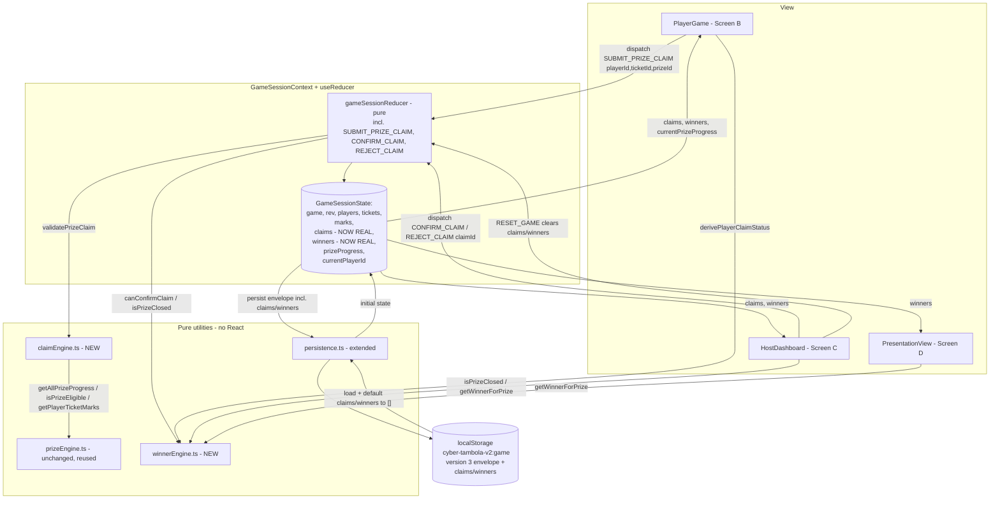
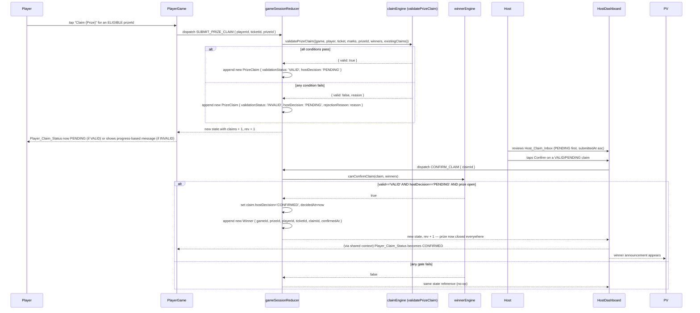

# Design Document

## Overview

Module 5 replaces two things that are currently faked in the Cyber Tambola V2 prototype: (1) `HostDashboard.tsx`'s component-local `useState<PrizeClaim[]>`/`useState<Winner[]>` seeded from `state.claims`/`state.winners` (themselves seeded from `src/data/mockClaims.ts`'s static demo fixtures), and (2) `PlayerGame.tsx`'s single `claimConfirmed` boolean, which only flips local UI state when the player taps "Claim Cyber Five" — it is never dispatched, never validated, never persisted, and never seen by the host. In their place, Module 5 introduces a real `PrizeClaim`/`Winner` domain workflow: a player submits a claim for a *specific* prize category via a new reducer action, a pure `Claim_Engine` re-validates that claim against authoritative session state, and a host must explicitly confirm or reject it before a `Winner` record — the only thing that closes a prize — is created.

The design keeps Module 4's architecture untouched: functional React components, one central `useReducer` store behind `GameSessionContext`, pure helpers in `src/utils` with no React or storage access, one versioned `localStorage` envelope, and one `BroadcastChannel` for cross-tab sync using the existing monotonic `rev` counter and union-by-id merge convention (not a version-only staleness check — that convention was replaced by Module 5's own predecessor work on `marks`, and this module extends the same mechanism rather than introducing a second one). Module 5 only adds to that architecture — three new actions (`SUBMIT_PRIZE_CLAIM`, `CONFIRM_CLAIM`, `REJECT_CLAIM`), two pure modules (`claimEngine.ts`, `winnerEngine.ts`), and real usage of the two collections (`claims`, `winners`) that already exist in `GameSessionState` today only as host demo data.

The core design tensions and how they are resolved:

- **How does a claim get re-validated without duplicating Module 4's prize-counting logic?** `validatePrizeClaim` in the new `Claim_Engine` never recomputes eligibility itself — it calls `getPlayerTicketMarks` and `getAllPrizeProgress`/`isPrizeEligible` from `prizeEngine.ts`, exactly the same functions `GameSessionContext` and `PlayerGame` already use to render live progress. Prize_Eligible for a claim is answered by the identical code path that drives the progress bar the player is looking at when they tap the claim button.
- **How does "prize closed" avoid becoming a second source of truth?** Exactly as Module 4 resolved the analogous question for `PrizeProgress.eligible`, Module 5 stores no `closed`/`status` field anywhere. `isPrizeClosed(winners, gameId, prizeId)` in the new `Winner_Engine` is the single derivation, computed fresh from `state.winners` every time it's needed — by the Claim_Engine's own validation, by `canConfirmClaim`, and by every screen.
- **How is "one retry after rejection" (Req 4.3/4.4) modeled without a counter field?** Rather than adding a `resubmissionCount` to `PrizeClaim`, the rule is derived structurally: `validatePrizeClaim` counts how many prior claims already exist for `(playerId, prizeId)` with `hostDecision === 'REJECTED'`. Zero prior rejected claims → a first submission is a normal new claim. Exactly one prior rejected claim (and no `PENDING`/`CONFIRMED` claim exists for that pair) → the resubmission is allowed, because it is the player's *second* claim record for that prize. Two or more — meaning a resubmission has already happened once — blocks any further submission. This keeps the entire history-dependent rule inside the same pure validation function, driven only by `existingClaims`, with no new stored counter that could drift from the claims list itself.
- **Why three separate reducer actions instead of one generic "claim action" reducer case?** `MARK_TERM` set the precedent: one action per player/host intent, each a single pure state transition, with all shared logic (validation, closed-state lookup) factored into `src/utils` rather than the reducer. `SUBMIT_PRIZE_CLAIM` (player intent), `CONFIRM_CLAIM` and `REJECT_CLAIM` (host intent) map onto three distinct, independently-gated user actions from Requirements 2, 8, and 9 — collapsing them would blur which validation pipeline (`validatePrizeClaim` vs. `canConfirmClaim` vs. the reject gate) applies.
- **Does persistence or the sync payload need a version bump / new staleness mechanism?** No. `claims` and `winners` already exist as fields on `GameSessionState` and are already excluded from the persisted envelope and `SyncPayload` (they're host-demo-only today). Module 5 adds them to both, following exactly the same additive, defaulted-to-`[]`-when-missing convention Module 4 established for `marks`, and reuses the existing `rev`-based staleness/merge-by-id convention already implemented in `SYNC_STATE` — no second synchronization mechanism is introduced. `PERSIST_VERSION` stays `3` (already bumped for the direct-word-call refactor, unrelated to this module); adding two more optional-with-default array fields to the envelope does not change any existing field's meaning, so no further bump is required.
- **Where does the "5 independent claim buttons" UI live without duplicating status logic per button?** A single `derivePlayerClaimStatus({progress, claim, winner})` helper (Req 12.1) is called once per `Prize_Id` inside `PlayerGame`, producing the one status value (`NOT_ELIGIBLE | ELIGIBLE | PENDING | CONFIRMED | REJECTED | CLOSED_BY_OTHER_WINNER`) that drives that prize's button label, enablement, and message — with no nested conditionals scattered through the component body.

This design is grounded in the actual current codebase read during design: `src/types/{claim.ts, prize.ts, mark.ts, game.ts, ticket.ts, player.ts}`, `src/state/{gameSessionInitialState.ts, gameSessionReducer.ts, persistence.ts, GameSessionContext.tsx, syncChannel.ts, joinService.ts}`, `src/utils/prizeEngine.ts`, `src/pages/{PlayerGame/PlayerGame.tsx, HostDashboard/HostDashboard.tsx, PresentationView/PresentationView.tsx}`, `src/data/mockClaims.ts`, and `src/components/{player/PrizeProgressList.tsx, common/ClaimStatusTag.tsx, common/StatusBadge.tsx}`. Notably, the requirements.md for this module was itself written after this same re-read and already documents the drift from Module 4's design.md (direct-word-call `WORD_ACTIVE` status instead of a reveal-answer flow; `rev`-based merge-by-id sync instead of version-only staleness; `PERSIST_VERSION` at `3`); this design carries that corrected understanding through consistently rather than re-describing the stale Module 4 mechanics.

### Research notes

No external research was required for this module. Every open design question (resubmission-budget modeling, closed-state derivation, sync/persistence extension shape) is resolved by reading the actual current implementation and this module's approved requirements — the same approach Module 4 used. There is no third-party library, API, or protocol involved.

## Architecture

### Component and data-flow overview



### Claim submission → host decision → winner flow



### Key architectural decisions

| Decision | Rationale |
| --- | --- |
| One pure `validatePrizeClaim` in `claimEngine.ts`, shared by the reducer's `SUBMIT_PRIZE_CLAIM` case and any future UI pre-check | Mirrors `validateMarkAttempt`'s precedent (Module 4); Requirement 3's nine conditions plus Requirement 4's resubmission rule must never drift between "should this button be enabled" and "should this claim be accepted." |
| `isPrizeClosed` / `getWinnerForPrize` / `canConfirmClaim` / `getPlayerWinningPrizes` centralized in `winnerEngine.ts` | Requirement 11 requires one shared answer to "is this prize closed" / "who won" across `PlayerGame`, `HostDashboard`, and `PresentationView` — computed fresh from `state.winners`, never cached (Req 5). |
| No stored `resubmissionCount`/"prize status" field anywhere | Both are fully derivable — resubmission eligibility from counting prior `REJECTED` claims for the pair (Req 4), prize-closed from `winners` (Req 5) — avoiding a second value that could drift from the claims/winners collections themselves. |
| `claims`/`winners` extend the existing persisted envelope and `SyncPayload`, reusing the `rev`/merge-by-id convention already in place for `marks` | No new sync/versioning mechanism; `PERSIST_VERSION` stays `3`; missing/invalid `claims`/`winners` default to `[]`, exactly like `marks` already does. |
| A single `derivePlayerClaimStatus` helper drives all five per-prize UI blocks in `PlayerGame` | Requirement 12.1/12.2 explicitly forbid nested conditional logic scattered through the component; one pure function of `{progress, claim, winner}` per prize keeps the five blocks structurally identical and testable in isolation. |
| `SUBMIT_PRIZE_CLAIM`/`CONFIRM_CLAIM`/`REJECT_CLAIM` are pure reducer cases with no side effects | Matches `MARK_TERM`'s precedent exactly — persistence and broadcast remain `GameSessionContext`'s job; the reducer only ever returns a new (or the same, on rejection) state object. |

## Components and Interfaces

### 1. `src/types/claim.ts` (extended, single definition retained)

```ts
import type { PrizeId } from './prize'

/**
 * The system's own automated verdict on a claim at submission time, set once
 * and never changed afterward (Req 1.2). 'PENDING' is reserved for shape
 * parity — submission validation always runs synchronously, so a stored
 * claim's validationStatus is always 'VALID' or 'INVALID' immediately.
 */
export type ValidationStatus = 'PENDING' | 'VALID' | 'INVALID'

/**
 * The host's manual verdict on a claim (Req 1.3). An INVALID claim's
 * hostDecision starts and stays 'PENDING', but the host is blocked from
 * confirming it (Req 8.1, 10.1) via canConfirmClaim.
 */
export type HostDecision = 'PENDING' | 'CONFIRMED' | 'REJECTED'

/**
 * A record of one player's manual claim attempt for one Prize_Id on one
 * ticket (Req 1.1). Extends the Module 2 shape in place — `prizeLabel`,
 * `playerName`, and `ticketRef` are retained as denormalized display fields
 * resolved at submission time so the Host_Claim_Inbox and history subsection
 * never need to re-join `players`/`tickets` to render (Req 1.5); they are
 * NOT used for any validation or identity decision, which always uses
 * `playerId`/`ticketId`/`prizeId`.
 */
export interface PrizeClaim {
  id: string
  gameId: string
  playerId: string
  ticketId: string
  prizeId: PrizeId
  /** ISO timestamp of submission. */
  submittedAt: string
  validationStatus: ValidationStatus
  hostDecision: HostDecision
  /** System-assigned reason when validationStatus is 'INVALID', or the
   *  host-supplied reason when hostDecision is 'REJECTED' (Req 9.3). */
  rejectionReason?: string
  /** ISO timestamp of the host's confirm/reject decision, if any. */
  decidedAt?: string

  // --- Denormalized display fields, resolved once at submission time ---
  prizeLabel: string
  playerName: string
  ticketRef: string

  /** @deprecated Superseded by validationStatus + hostDecision (Req 1.5).
   *  Retained only as an optional field so no existing import of the old
   *  Module 2 `ClaimStatus`-shaped literal fails to type-check; no code in
   *  this module reads or writes it. */
  status?: ClaimStatus
}

/** @deprecated Module 2's original single-field status. Superseded by
 *  ValidationStatus + HostDecision (Req 1.2, 1.3). Retained only for
 *  backwards-compatible re-export; see PrizeClaim.status. */
export type ClaimStatus = 'VALID' | 'PENDING' | 'CONFIRMED' | 'REJECTED'
```

There is exactly one `PrizeClaim` type, defined here and re-exported (unchanged mechanism) from `src/types/prize.ts` (Req 1.6). The old `status: ClaimStatus` field and `ClaimStatus` type are kept as optional/deprecated rather than deleted, because `ClaimStatusTag.tsx` currently imports `ClaimStatus` from `../../types/prize` — Module 5 updates `ClaimStatusTag` to read from `validationStatus`/`hostDecision` instead (see Screen changes below) in the same change, so nothing in the shipped app reads the deprecated field, satisfying Req 1.5's "or update in the same change" clause without a breaking type removal that could affect an untouched import elsewhere.

### 2. `src/types/prize.ts` (extended, single definition retained)

```ts
export type PrizeId =
  | 'CYBER_FIVE'
  | 'FIREWALL_LINE'
  | 'SECURITY_LINE'
  | 'DATA_DEFENDER_LINE'
  | 'CYBER_FULL_HOUSE'

export interface Prize {
  id: PrizeId
  label: string
  target: number
}

export interface PrizeProgress {
  id: PrizeId
  label: string
  current: number
  target: number
}

/**
 * A record created only when a host confirms a VALID, still-PENDING claim
 * for a still-open prize (Req 1.4). Extends the Module 2 shape in place —
 * `prizeLabel`/`playerName` are retained as denormalized display fields,
 * resolved once at confirmation time from the confirmed claim, so
 * HostDashboard's Winner Panel and PresentationView's announcement never
 * need to re-join `claims`/`players` to render (Req 1.5).
 */
export interface Winner {
  id: string
  gameId: string
  prizeId: PrizeId
  playerId: string
  ticketId: string
  /** The PrizeClaim.id this Winner was created from. */
  claimId: string
  /** ISO timestamp of confirmation. */
  confirmedAt: string

  // --- Denormalized display fields, resolved once at confirmation time ---
  prizeLabel: string
  playerName: string
}

export type { ClaimStatus, PrizeClaim, ValidationStatus, HostDecision } from './claim'
```

Same single-definition convention as `PrizeClaim` (Req 1.6): `Winner` is defined once here and used everywhere; nothing elsewhere in the codebase declares a second, competing `Winner` shape.

### 3. `src/utils/claimEngine.ts` (new, pure)

```ts
import type { Game } from '../types/game'
import type { Mark } from '../types/mark'
import type { Player } from '../types/player'
import type { PrizeId, PrizeClaim, Winner } from '../types/prize'
import type { Ticket } from '../types/ticket'
import {
  PRIZES,
  getAllPrizeProgress,
  getPlayerTicketMarks,
  isPrizeEligible,
} from './prizeEngine'
import { isPrizeClosed } from './winnerEngine'

/** Reason a claim submission was rejected as INVALID, or valid when it may proceed. */
export type ClaimValidationResult =
  | { valid: true }
  | {
      valid: false
      reason:
        | 'GAME_NOT_FOUND'
        | 'PLAYER_NOT_FOUND'
        | 'PLAYER_NOT_IN_GAME'
        | 'TICKET_NOT_FOUND'
        | 'TICKET_NOT_OWNED_BY_PLAYER'
        | 'PRIZE_NOT_FOUND'
        | 'DUPLICATE_ACTIVE_CLAIM'
        | 'RESUBMISSION_LIMIT_REACHED'
        | 'PRIZE_CLOSED'
        | 'NOT_ELIGIBLE'
    }

/**
 * The single validation pipeline for Requirements 3 and 4, shared by the
 * reducer's SUBMIT_PRIZE_CLAIM case (and available to the UI for pre-checks
 * without duplicating logic). Never mutates its inputs. Computes
 * Prize_Eligible exclusively via prizeEngine's existing functions — no
 * prize-counting logic is reimplemented here (Req 3.6).
 *
 * Gates, in order (Req 3.2, 4.1-4.4):
 *  1. GAME_NOT_FOUND            - `game` is undefined/missing an id
 *  2. PLAYER_NOT_FOUND          - `player` is undefined
 *  3. PLAYER_NOT_IN_GAME        - player.gameId !== game.id
 *  4. TICKET_NOT_FOUND          - `ticket` is undefined
 *  5. TICKET_NOT_OWNED_BY_PLAYER- ticket.playerId !== player.id (or
 *                                 ticket.id !== player.ticketId)
 *  6. PRIZE_NOT_FOUND           - prizeId is not among PRIZES
 *  7. DUPLICATE_ACTIVE_CLAIM    - player already has a claim for this
 *                                 prizeId with hostDecision 'PENDING' or
 *                                 'CONFIRMED' (Req 4.1, 4.2)
 *  8. RESUBMISSION_LIMIT_REACHED- player already has 2+ claims for this
 *                                 prizeId with hostDecision 'REJECTED'
 *                                 (i.e. a resubmission has already
 *                                 occurred) (Req 4.4)
 *  9. PRIZE_CLOSED              - isPrizeClosed(winners, game.id, prizeId)
 * 10. NOT_ELIGIBLE               - !isPrizeEligible(progress) for this
 *                                 player's ticket, computed via
 *                                 getPlayerTicketMarks + getAllPrizeProgress
 *
 * Gate 8's count is over ALL prior claims for the pair regardless of gate 7
 * (a CONFIRMED/PENDING claim would already have been rejected by gate 7, so
 * gate 8 only ever runs against a history of REJECTED-only claims plus this
 * new attempt) — exactly one prior REJECTED claim is allowed through as a
 * resubmission (Req 4.3); a second prior REJECTED claim blocks further
 * submission (Req 4.4).
 */
export function validatePrizeClaim(input: {
  game?: Game
  player?: Player
  ticket?: Ticket
  marks: readonly Mark[]
  prizeId: PrizeId
  winners: readonly Winner[]
  existingClaims: readonly PrizeClaim[]
}): ClaimValidationResult {
  const { game, player, ticket, marks, prizeId, winners, existingClaims } = input

  if (!game) return { valid: false, reason: 'GAME_NOT_FOUND' }
  if (!player) return { valid: false, reason: 'PLAYER_NOT_FOUND' }
  if (player.gameId !== game.id) {
    return { valid: false, reason: 'PLAYER_NOT_IN_GAME' }
  }
  if (!ticket) return { valid: false, reason: 'TICKET_NOT_FOUND' }
  if (ticket.playerId !== player.id || ticket.id !== player.ticketId) {
    return { valid: false, reason: 'TICKET_NOT_OWNED_BY_PLAYER' }
  }
  if (!PRIZES.some((p) => p.id === prizeId)) {
    return { valid: false, reason: 'PRIZE_NOT_FOUND' }
  }

  const priorForPair = existingClaims.filter(
    (c) => c.playerId === player.id && c.prizeId === prizeId,
  )
  const hasActiveOrWon = priorForPair.some(
    (c) => c.hostDecision === 'PENDING' || c.hostDecision === 'CONFIRMED',
  )
  if (hasActiveOrWon) {
    return { valid: false, reason: 'DUPLICATE_ACTIVE_CLAIM' }
  }
  const rejectedCount = priorForPair.filter(
    (c) => c.hostDecision === 'REJECTED',
  ).length
  if (rejectedCount >= 2) {
    return { valid: false, reason: 'RESUBMISSION_LIMIT_REACHED' }
  }

  if (isPrizeClosed(winners, game.id, prizeId)) {
    return { valid: false, reason: 'PRIZE_CLOSED' }
  }

  const validMarks = getPlayerTicketMarks(marks, player.id, ticket.id)
  const progress = getAllPrizeProgress(ticket, validMarks).find(
    (p) => p.id === prizeId,
  )!
  if (!isPrizeEligible(progress)) {
    return { valid: false, reason: 'NOT_ELIGIBLE' }
  }

  return { valid: true }
}
```

### 4. `src/utils/winnerEngine.ts` (new, pure)

```ts
import type { PrizeClaim, PrizeId, Winner } from '../types/prize'

/** True exactly when a Winner exists for this prizeId within this game (Req 5.1, 11.1). */
export function isPrizeClosed(
  winners: readonly Winner[],
  gameId: string,
  prizeId: PrizeId,
): boolean {
  return winners.some((w) => w.gameId === gameId && w.prizeId === prizeId)
}

/** The Winner record for this prizeId within this game, or undefined (Req 11.2). */
export function getWinnerForPrize(
  winners: readonly Winner[],
  gameId: string,
  prizeId: PrizeId,
): Winner | undefined {
  return winners.find((w) => w.gameId === gameId && w.prizeId === prizeId)
}

/**
 * True exactly when a host confirm action on this claim is currently
 * permitted (Req 8.1, 10.1, 11.3): validationStatus is 'VALID', hostDecision
 * is 'PENDING', and the claim's prize is not already closed.
 */
export function canConfirmClaim(
  claim: PrizeClaim,
  winners: readonly Winner[],
): boolean {
  return (
    claim.validationStatus === 'VALID' &&
    claim.hostDecision === 'PENDING' &&
    !isPrizeClosed(winners, claim.gameId, claim.prizeId)
  )
}

/** The list of Prize_Ids for which this player has a confirmed Winner (Req 11.4). */
export function getPlayerWinningPrizes(
  winners: readonly Winner[],
  playerId: string,
): PrizeId[] {
  return winners.filter((w) => w.playerId === playerId).map((w) => w.prizeId)
}

/**
 * Sort claims for display: hostDecision 'PENDING' before any other
 * hostDecision, and within each group by submittedAt ascending (Req 6.2,
 * 7.4). Never mutates the input array.
 */
export function sortClaimsForInbox(
  claims: readonly PrizeClaim[],
): PrizeClaim[] {
  return [...claims].sort((a, b) => {
    const aPending = a.hostDecision === 'PENDING' ? 0 : 1
    const bPending = b.hostDecision === 'PENDING' ? 0 : 1
    if (aPending !== bPending) return aPending - bPending
    return a.submittedAt.localeCompare(b.submittedAt)
  })
}

/**
 * Partition claims into the three Host_Claim_Inbox history groups (Req 7.5,
 * 10.2): PENDING, CONFIRMED, and REJECTED_OR_INVALID (every REJECTED claim,
 * plus every INVALID claim regardless of its still-PENDING hostDecision, so
 * a submitted-but-invalid claim is never silently dropped from history).
 */
export function groupClaimsForHistory(claims: readonly PrizeClaim[]): {
  pending: PrizeClaim[]
  confirmed: PrizeClaim[]
  rejectedOrInvalid: PrizeClaim[]
} {
  const pending: PrizeClaim[] = []
  const confirmed: PrizeClaim[] = []
  const rejectedOrInvalid: PrizeClaim[] = []
  for (const claim of claims) {
    if (claim.validationStatus === 'INVALID' || claim.hostDecision === 'REJECTED') {
      rejectedOrInvalid.push(claim)
    } else if (claim.hostDecision === 'CONFIRMED') {
      confirmed.push(claim)
    } else {
      pending.push(claim)
    }
  }
  return { pending, confirmed, rejectedOrInvalid }
}

/** The one derived status a player sees for one of their own prize categories (Req 12.1). */
export type PlayerClaimStatus =
  | 'NOT_ELIGIBLE'
  | 'ELIGIBLE'
  | 'PENDING'
  | 'CONFIRMED'
  | 'REJECTED'
  | 'CLOSED_BY_OTHER_WINNER'

/**
 * Derive the single Player_Claim_Status for one Prize_Id from that prize's
 * live progress, the player's own most recent claim for it (if any), and the
 * confirmed Winner for it (if any) (Req 12.1-12.8). Total and unambiguous:
 * every combination of inputs maps to exactly one status.
 *
 * Precedence (checked in order):
 *  1. A Winner exists for this prize, for someone OTHER than this player
 *     -> CLOSED_BY_OTHER_WINNER (Req 12.8)
 *  2. A Winner exists for this prize, for THIS player -> CONFIRMED (Req 12.6)
 *  3. The player's own latest claim for this prize has hostDecision
 *     'PENDING' -> PENDING (Req 12.5)
 *  4. The player's own latest claim for this prize has hostDecision
 *     'REJECTED' -> REJECTED (Req 12.7)
 *  5. Otherwise, eligible now -> ELIGIBLE (Req 12.4)
 *  6. Otherwise -> NOT_ELIGIBLE (Req 12.3)
 */
export function derivePlayerClaimStatus(input: {
  progress: import('../types/prize').PrizeProgress
  /** This player's own most recent claim for this prizeId, if any. */
  ownLatestClaim?: PrizeClaim
  /** The confirmed Winner for this prizeId in this game, if any. */
  winner?: Winner
  playerId: string
}): PlayerClaimStatus {
  const { progress, ownLatestClaim, winner, playerId } = input

  if (winner) {
    return winner.playerId === playerId ? 'CONFIRMED' : 'CLOSED_BY_OTHER_WINNER'
  }
  if (ownLatestClaim?.hostDecision === 'PENDING') return 'PENDING'
  if (ownLatestClaim?.hostDecision === 'REJECTED') return 'REJECTED'

  return isEligible(progress) ? 'ELIGIBLE' : 'NOT_ELIGIBLE'
}

function isEligible(progress: import('../types/prize').PrizeProgress): boolean {
  return progress.current >= progress.target
}
```

`derivePlayerClaimStatus` deliberately imports the eligibility test inline via a tiny local `isEligible` rather than re-importing `isPrizeEligible` from `prizeEngine.ts` here, to avoid a circular import (`claimEngine.ts` already imports from `winnerEngine.ts`; `winnerEngine.ts` stays independent of `prizeEngine.ts`). `PlayerGame` itself continues to call `isPrizeEligible` directly from `prizeEngine.ts` wherever it needs the boolean outside of status derivation, so there remains exactly one formula for "current >= target" in practice — this local copy exists only to keep `winnerEngine.ts` self-contained and is trivially equivalent by construction.

### 5. `src/state/gameSessionReducer.ts` (extended)

```ts
export type GameSessionAction =
  | { type: 'START_GAME' }
  | { type: 'CALL_NEXT_WORD' }
  | { type: 'PAUSE_GAME' }
  | { type: 'RESUME_GAME' }
  | { type: 'END_GAME' }
  | { type: 'RESET_GAME' }
  | { type: 'JOIN_PLAYER'; player: Player; ticket: Ticket }
  | { type: 'RESTORE_PLAYER'; playerId: string }
  | { type: 'SYNC_STATE'; payload: SyncPayload }
  | { type: 'MARK_TERM'; termId: string }
  // NEW — a player submits a claim for one specific prize (Req 2.3, 2.4):
  // only playerId/ticketId/prizeId are carried; no eligibility flag exists
  // on this action's shape, so there is nothing for the reducer to trust.
  | { type: 'SUBMIT_PRIZE_CLAIM'; playerId: string; ticketId: string; prizeId: PrizeId }
  // NEW — host confirms a specific claim (Req 8):
  | { type: 'CONFIRM_CLAIM'; claimId: string }
  // NEW — host rejects a specific claim, with an optional reason (Req 9):
  | { type: 'REJECT_CLAIM'; claimId: string; rejectionReason?: string }
```

`SUBMIT_PRIZE_CLAIM` case:

```ts
case 'SUBMIT_PRIZE_CLAIM': {
  const player = state.players.find((p) => p.id === action.playerId)
  const ticket = state.tickets.find((t) => t.id === action.ticketId)

  const result = validatePrizeClaim({
    game: state.game,
    player,
    ticket,
    marks: state.marks,
    prizeId: action.prizeId,
    winners: state.winners,
    existingClaims: state.claims,
  })

  const prizeMeta = PRIZES.find((p) => p.id === action.prizeId)!
  const newClaim: PrizeClaim = {
    id: localId(),
    gameId: state.game.id,
    playerId: action.playerId,
    ticketId: action.ticketId,
    prizeId: action.prizeId,
    submittedAt: now(),
    validationStatus: result.valid ? 'VALID' : 'INVALID',
    hostDecision: 'PENDING',
    rejectionReason: result.valid ? undefined : result.reason,
    prizeLabel: prizeMeta.label,
    playerName: player?.displayName ?? 'Unknown player',
    ticketRef: ticket?.ref ?? 'Unknown ticket',
  }
  // Every submission — VALID or INVALID — is recorded (Req 3.3, 3.4); an
  // INVALID claim is never silently dropped, so the host's history and the
  // player's own progress-based feedback (Req 10.3) both have a record to
  // read. This differs from MARK_TERM, whose invalid attempts create no
  // record at all — a claim attempt is itself a player-visible event.
  return {
    ...state,
    claims: [...state.claims, newClaim],
    rev: state.rev + 1,
  }
}
```

`CONFIRM_CLAIM` case:

```ts
case 'CONFIRM_CLAIM': {
  const claim = state.claims.find((c) => c.id === action.claimId)
  if (!claim || !canConfirmClaim(claim, state.winners)) return state // Req 8.7, 8.8 — no-op

  const decidedAt = now()
  const updatedClaims = state.claims.map((c) =>
    c.id === claim.id ? { ...c, hostDecision: 'CONFIRMED' as const, decidedAt } : c,
  )
  const newWinner: Winner = {
    id: localId(),
    gameId: claim.gameId,
    prizeId: claim.prizeId,
    playerId: claim.playerId,
    ticketId: claim.ticketId,
    claimId: claim.id,
    confirmedAt: decidedAt,
    prizeLabel: claim.prizeLabel,
    playerName: claim.playerName,
  }
  return {
    ...state,
    claims: updatedClaims,
    winners: [...state.winners, newWinner],
    rev: state.rev + 1,
  } // Req 8.2, 8.3, 8.4, 8.6 — only claims/winners change
}
```

`REJECT_CLAIM` case:

```ts
case 'REJECT_CLAIM': {
  const claim = state.claims.find((c) => c.id === action.claimId)
  if (!claim || claim.hostDecision !== 'PENDING') return state // Req 9.1 — no-op

  const decidedAt = now()
  const updatedClaims = state.claims.map((c) =>
    c.id === claim.id
      ? {
          ...c,
          hostDecision: 'REJECTED' as const,
          decidedAt,
          rejectionReason: action.rejectionReason ?? c.rejectionReason,
        }
      : c,
  )
  return { ...state, claims: updatedClaims, rev: state.rev + 1 } // Req 9.2, 9.3, 9.4
}
```

All three cases follow `MARK_TERM`'s exact style: a single early-return guard for the rejected/no-op path (same reference, Req 8.7/8.8/9.1), and a pure, side-effect-free transition on the accepted path — no `localStorage`/`BroadcastChannel` calls inside the reducer (Req 18). `localId()` and `now()` are the same helpers `MARK_TERM` already uses, imported from `joinService.ts` and defined locally in the reducer module respectively.

`SyncPayload` extended (Req 17.1):

```ts
export interface SyncPayload {
  game: Game
  rev: number
  players: Player[]
  tickets: Ticket[]
  marks: Mark[]
  claims: PrizeClaim[]   // NEW
  winners: Winner[]      // NEW
}
```

`isValidSyncPayload` is unchanged in its required-field set (Req 17.5) — `claims`/`winners`, like `marks`, are deliberately NOT required by the shape guard; `SYNC_STATE` normalizes them itself:

```ts
case 'SYNC_STATE': {
  if (!isValidSyncPayload(action.payload)) return state
  if (action.payload.rev <= state.rev) return state

  const { game, players, tickets } = action.payload
  const incomingMarks = Array.isArray(action.payload.marks) ? action.payload.marks : []
  const incomingClaims = Array.isArray(action.payload.claims) ? action.payload.claims : [] // NEW
  const incomingWinners = Array.isArray(action.payload.winners) ? action.payload.winners : [] // NEW

  const marks = mergeById(state.marks, incomingMarks)
  const claims = mergeById(state.claims, incomingClaims)     // NEW — same union-by-id convention
  const winners = mergeById(state.winners, incomingWinners)  // NEW — same union-by-id convention

  // currentPlayerId is untouched, exactly as for marks-only syncs (Req 17.6).
  return { ...state, game, rev: action.payload.rev, players, tickets, marks, claims, winners }
}
```

`mergeById` is extracted as a tiny shared helper (`function mergeById<T extends { id: string }>(local: T[], incoming: T[]): T[]`) from the existing inline `Map`-based merge already written for `marks`, so `claims` and `winners` reuse the exact same lossless, id-keyed union logic rather than three copies of the same loop (Req 17.4). Every claim/winner id is unique and neither collection ever removes a record once created, so this merge is safe for the same reason the existing `marks` merge is safe.

`RESET_GAME` needs no code change beyond the seed update below — it already returns `{ ...gameSessionInitialState, game: createSeedGame() }` (Req 19.3), so once `gameSessionInitialState.claims`/`winners` seed to `[]` (see below), they are cleared "for free" through the same mechanism Module 4 used for `marks`.

### 6. `src/state/gameSessionInitialState.ts` (updated seed)

```ts
export const gameSessionInitialState: GameSessionState = {
  game: createSeedGame(),
  rev: 0,
  players: [],
  tickets: [],
  currentPlayerId: undefined,
  marks: [],
  claims: [],    // CHANGED — was mockClaims; now real, empty seed (Req 19.1)
  winners: [],   // CHANGED — was mockWinners; now real, empty seed (Req 19.1)
  prizeProgress: seedPrizeProgress,
}
```

`src/data/mockClaims.ts` is deleted — its two exports (`mockClaims`, `mockWinners`) become dead code once `HostDashboard` reads `state.claims`/`state.winners` directly (see Screen changes below) and the initial-state seed no longer imports it. No other module in the current codebase imports `mockClaims.ts`.

### 7. `src/state/persistence.ts` (extended)

```ts
/** Version marker. Stays 3 — adding claims/winners is purely additive,
 *  exactly like marks was under Module 4; no existing field's meaning
 *  changes (Req 16.5). */
export const PERSIST_VERSION = 3 as const

export interface PersistedEnvelope {
  version: 3
  game: Game
  rev: number
  players: Player[]
  tickets: Ticket[]
  marks: Mark[]
  claims: PrizeClaim[]   // NEW
  winners: Winner[]      // NEW
}

export interface PersistedSlice {
  game: Game
  rev: number
  players: Player[]
  tickets: Ticket[]
  marks: Mark[]
  claims: PrizeClaim[]   // NEW
  winners: Winner[]      // NEW
}

export function toEnvelope(slice: PersistedSlice): PersistedEnvelope {
  return {
    version: PERSIST_VERSION,
    game: slice.game,
    rev: slice.rev,
    players: slice.players,
    tickets: slice.tickets,
    marks: slice.marks,
    claims: slice.claims,     // NEW
    winners: slice.winners,   // NEW
  }
}
```

`parseEnvelope` change (Req 16.2, 16.3, 16.4) — identical lenient-default pattern already used for `marks`:

```ts
export function parseEnvelope(raw: string | null): PersistedSlice | null {
  // ...unchanged JSON.parse, version check, isGameShape, players/tickets array checks...

  const marks = Array.isArray(envelope.marks) ? (envelope.marks as Mark[]) : []
  const claims = Array.isArray(envelope.claims) ? (envelope.claims as PrizeClaim[]) : [] // NEW
  const winners = Array.isArray(envelope.winners) ? (envelope.winners as Winner[]) : [] // NEW
  // Req 16.4: missing / null / non-array `claims`/`winners` silently default
  // to [] rather than failing the whole envelope — identical convention to
  // `marks`, so an envelope written by a pre-Module-5 build (no claims/
  // winners keys at all) still loads its game/players/tickets/marks.

  const rev = typeof envelope.rev === 'number' ? envelope.rev : 0

  return { game, rev, players, tickets, marks, claims, winners }
}
```

### 8. `src/state/GameSessionContext.tsx` (updated)

- `initState()`'s restored-slice merge adds `claims: restored.claims, winners: restored.winners`.
- The persistence/broadcast `useEffect`'s `slice` object adds `claims: state.claims, winners: state.winners`, and its dependency array adds `state.claims, state.winners`.
- No new derived context selectors are strictly required — `PlayerGame` and `HostDashboard` call `winnerEngine`/`claimEngine` helpers directly against `state.claims`/`state.winners` (Req 11.5), the same way they already call `prizeEngine` helpers directly in places, keeping the context's own memoized surface focused on what genuinely benefits from being computed once per render (`currentPlayerMarks`, `currentPrizeProgress`). This avoids growing `GameSessionContextValue` with per-screen-specific derivations that only one screen needs.

### 9. Screen changes

**`PlayerGame.tsx`** (Req 2, 10.3, 12, 13):

- Remove the single `claimConfirmed` boolean and the single generic "Claim a Prize" card. Replace with one block per `Prize_Id`, iterating `currentPrizeProgress` (already in `PRIZES` order):

```ts
const ownClaimsByPrize = useMemo(() => {
  const byPrize = new Map<PrizeId, PrizeClaim>()
  for (const claim of state.claims) {
    if (claim.playerId !== currentPlayer.id) continue
    const existing = byPrize.get(claim.prizeId)
    if (!existing || claim.submittedAt > existing.submittedAt) {
      byPrize.set(claim.prizeId, claim)
    }
  }
  return byPrize
}, [state.claims, currentPlayer.id])

const prizeBlocks = currentPrizeProgress.map((progress) => {
  const winner = getWinnerForPrize(state.winners, state.game.id, progress.id)
  const ownLatestClaim = ownClaimsByPrize.get(progress.id)
  const claimStatus = derivePlayerClaimStatus({
    progress,
    ownLatestClaim,
    winner,
    playerId: currentPlayer.id,
  })
  return { progress, claimStatus, ownLatestClaim, winner }
})
```

- Each block renders from `claimStatus` alone (Req 12.2), per the table:

| `claimStatus` | Message | Button |
| --- | --- | --- |
| `NOT_ELIGIBLE` | `"{current}/{target}"` progress text (Req 12.3) | disabled, label `"Claim {Prize_Label}"` |
| `ELIGIBLE` | `"🎉 {Prize_Label} Ready!"` (Req 12.4) | enabled, label `"Claim {Prize_Label}"`, `onClick` dispatches `SUBMIT_PRIZE_CLAIM` |
| `PENDING` | `"Claim submitted. Waiting for Host confirmation."` (Req 12.5) | disabled, label `"Claim Pending"` |
| `CONFIRMED` | `"🏆 {PRIZE_LABEL} WINNER — Your {Prize_Label} claim has been confirmed."` (Req 12.6, 13.1) | disabled, label `"Winner Confirmed"` |
| `REJECTED` | `"Claim rejected."` + `ownLatestClaim.rejectionReason` if present (Req 12.7) | enabled only if the rejection-budget still allows a resubmission (i.e. exactly one prior `REJECTED` claim so far) AND still eligible AND prize open, else disabled — mirrors `validatePrizeClaim`'s own gates so the button is never enabled for a submission the reducer would reject anyway |
| `CLOSED_BY_OTHER_WINNER` | `"{Prize_Label} has already been awarded to another player. Keep going for the remaining prizes!"` (Req 12.8) | disabled, label `"Prize Awarded"` |

  Every message pairs an icon (🎉/🏆/🔒/etc., `aria-hidden`) with distinguishable text, never color alone (Req 12.9).
- Special-cased `INVALID`-result feedback (Req 10.3): when `ownLatestClaim?.validationStatus === 'INVALID'` and its `hostDecision` is still `'PENDING'` (i.e. the system itself rejected the most recent submission, distinct from a host `REJECTED`), show `"Claim could not be validated. Your current progress is {current}/{target}."` instead of the generic `NOT_ELIGIBLE` progress line — this is checked before falling through to `derivePlayerClaimStatus`'s `NOT_ELIGIBLE`/`ELIGIBLE` branches, since an `INVALID` claim's `hostDecision` stays `'PENDING'` but must never be confused with an accepted `PENDING` claim (`derivePlayerClaimStatus` only treats a claim as the `PENDING` *status* when it is not also `INVALID`, distinguished the same way `groupClaimsForHistory` distinguishes them on the host side).
- `SUBMIT_PRIZE_CLAIM` dispatch: `dispatch({ type: 'SUBMIT_PRIZE_CLAIM', playerId: currentPlayer.id, ticketId: currentTicket.id, prizeId: progress.id })` — no eligibility value is read from anywhere and placed on the action (Req 2.4); the button's own `disabled` state (driven by `claimStatus === 'ELIGIBLE'`) is a UI convenience, not a trust boundary — `validatePrizeClaim` re-derives eligibility from `state` inside the reducer regardless of what the UI believed when the button was tapped.
- Winner celebration (Req 13): the `CONFIRMED` block's message renders inline within that prize's own card — never as a full-screen overlay — so the ticket, the other four prize blocks, and their own claim controls stay fully visible and interactive (Req 13.2, 13.3). Because every block is independently derived from `currentPrizeProgress`/`state.claims`/`state.winners`, winning one prize changes only that one block's `claimStatus`; the other four continue deriving `ELIGIBLE`/`NOT_ELIGIBLE`/etc. exactly as before, and marking new terms continues to update `currentPrizeProgress` for the remaining open prizes without any special-casing.

**`HostDashboard.tsx`** (Req 7, 8, 9, 15, 19):

- Delete the `useState<PrizeClaim[]>`/`useState<Winner[]>` local mirrors and the `confirmWinner`/`rejectClaim` local functions entirely. The Claim Inbox and Winner Panel read `state.claims`/`state.winners` directly (Req 7.1, 15.1); Confirm/Reject buttons dispatch `CONFIRM_CLAIM`/`REJECT_CLAIM` instead of mutating local state:

```ts
const inboxGroups = groupClaimsForHistory(sortClaimsForInbox(state.claims))
```

- Card layout changes from a single "Prize Claims (Demo)" list to three subsections (Req 7.5, 10.2): **Pending Claims** (`inboxGroups.pending`, already `submittedAt`-ascending from the sort), **Confirmed** (`inboxGroups.confirmed`), **Rejected / Invalid** (`inboxGroups.rejectedOrInvalid`). Each row renders `claim.playerName`, `claim.ticketRef`, `claim.prizeLabel`, `claim.submittedAt` (formatted), a validation-result tag, a host-decision tag, and Confirm/Reject controls (Req 7.2) — never `employeeDemoId` or any other player field (Req 7.3), matching the existing Participants list's own restraint.
- Confirm button: `disabled={!canConfirmClaim(claim, state.winners)}` (Req 8.1, 8.7, 8.8, 10.1); `onClick={() => dispatch({ type: 'CONFIRM_CLAIM', claimId: claim.id })}`.
- Reject button: `disabled={claim.hostDecision !== 'PENDING'}` (Req 9.1); `onClick` opens a small fixed-option + free-text prompt (Req 9.3) then dispatches `REJECT_CLAIM` with the chosen `rejectionReason`.
- `ClaimStatusTag.tsx` is updated to accept `{ validationStatus, hostDecision }` instead of the old single `status: ClaimStatus`, rendering two small tags (validation result + host decision) rather than one, since a claim now genuinely has two independent statuses (Req 1.5's "update in the same change" clause).
- Winner Panel: replace the `winners.map(...)` list with a fixed-order render over all 5 `PRIZES`, each row showing `getWinnerForPrize(state.winners, state.game.id, prize.id)?.playerName` or the literal `"Not awarded"` (Req 15.2):

```ts
{PRIZES.map((prize) => {
  const winner = getWinnerForPrize(state.winners, state.game.id, prize.id)
  return (
    <li key={prize.id} className="host__winner">
      <strong>{prize.label}</strong> —{' '}
      {winner ? winner.playerName : <span className="host__not-awarded">Not awarded</span>}
    </li>
  )
})}
```

- `resetGame()` is unchanged — `dispatch({ type: 'RESET_GAME' })` already clears `claims`/`winners` "for free" via the updated seed (Req 19.1, 19.3); after a reset, `isPrizeClosed` returns `false` for all 5 prizes because `state.winners` is `[]` (Req 19.2).

**`PresentationView.tsx`** (Req 14):

- New local state: `const [dismissedWinnerIds, setDismissedWinnerIds] = useState<Set<string>>(new Set())`. The most recent still-undismissed winner is found as `const latestWinner = [...state.winners].reverse().find((w) => !dismissedWinnerIds.has(w.id))`.
- When `latestWinner` is defined, render a winner-announcement overlay instead of (not on top of) the normal `game.status`-driven stage content: `"🏆 {PRIZE_LABEL} WINNER — {playerName}"`, using only `latestWinner.prizeLabel` and `latestWinner.playerName` (Req 14.1, 14.2) — no `playerId`, `ticketId`, or `claimId` is ever interpolated into displayed text.
- A host-controlled "Dismiss Winner Announcement" button calls `setDismissedWinnerIds((prev) => new Set(prev).add(latestWinner.id))` (Req 14.3). Because the announcement is a pure overlay branch in the render function — never mutating `state.game` or any other read value — dismissing it returns the component to rendering exactly the same `game.status`/`currentTerm`-driven branch it would have rendered had the winner never been announced (Req 14.4).
- If a second winner is confirmed while the first's announcement is still showing, `latestWinner` naturally becomes the newer winner on the next render (it is not yet in `dismissedWinnerIds`), so announcements queue implicitly by recency without extra state.

**`PrizeProgressList.tsx`**: no changes — it already renders whatever `PrizeProgress[]` it's given; Module 5 doesn't change what feeds it (claim status is rendered by `PlayerGame`'s new per-prize blocks, separately from this list).

## Data Models

### Persisted envelope (localStorage, key `cyber-tambola-v2:game`, version stays `3`)

```jsonc
{
  "version": 3,
  "game": { "id": "GAME_001", "code": "CYBER24", "status": "WORD_ACTIVE",
            "createdAt": "…", "currentRound": 3, "currentTermId": "TERM_010",
            "revealedTermIds": ["TERM_001", "TERM_006", "TERM_010"] },
  "rev": 42,
  "players": [ /* unchanged shape */ ],
  "tickets": [ /* unchanged shape */ ],
  "marks": [ /* unchanged shape from Module 4 */ ],
  "claims": [
    {
      "id": "c-1", "gameId": "GAME_001", "playerId": "p-a1", "ticketId": "t-a1",
      "prizeId": "CYBER_FIVE", "submittedAt": "2025-01-01T10:05:00.000Z",
      "validationStatus": "VALID", "hostDecision": "PENDING",
      "prizeLabel": "Cyber Five", "playerName": "Divyansh", "ticketRef": "Ticket #A72F"
    }
  ],
  "winners": []
}
```

A pre-Module-5 envelope on disk (already `version: 3`, no `claims`/`winners` keys) still passes the version check; `parseEnvelope` defaults both restored fields to `[]` (Req 16.4).

### In-memory state (`GameSessionState`)

Same as the envelope minus `version`, plus `currentPlayerId` (client-local, never persisted in the shared envelope) and `prizeProgress` (unused seed fallback, unchanged from Module 4).

### Sync payload (BroadcastChannel message body)

Identical shape to the persisted slice minus `version`: `{ game, rev, players, tickets, marks, claims, winners }`.

### Claim/winner view-models (computed, not stored)

`groupClaimsForHistory` always returns three arrays that partition (not duplicate) the input claims:

```jsonc
{
  "pending": [ /* hostDecision === 'PENDING' AND validationStatus === 'VALID' */ ],
  "confirmed": [ /* hostDecision === 'CONFIRMED' */ ],
  "rejectedOrInvalid": [ /* hostDecision === 'REJECTED' OR validationStatus === 'INVALID' */ ]
}
```

`derivePlayerClaimStatus` always returns exactly one of the six `PlayerClaimStatus` literals, never `undefined`.

## Correctness Properties

*A property is a characteristic or behavior that should hold true across all valid executions of a system — essentially, a formal statement about what the system should do. Properties serve as the bridge between human-readable specifications and machine-verifiable correctness guarantees.*

The claim-validation pipeline, the winner-lookup/derivation helpers, the claims-sorting/grouping functions, the player-status derivation, and the persistence/sync codecs are all pure functions over large input spaces with clear universal invariants — well suited to property-based testing, exactly like Module 4's `prizeEngine`/`persistence`/`sync` functions. UI wiring (which button dispatches which action, exact card layout, dismiss-button click handling) is validated with component/integration tests instead — those behaviors don't vary meaningfully with input in a way 100 iterations would exercise better than a few targeted examples.

#### Property Reflection

Before finalizing the list below, several prework-identified properties were merged to avoid redundancy:
- Requirement 3's nine validation conditions (3.2) plus the accepted/rejected outcome clauses (3.3, 3.4) plus Requirement 4's duplicate/resubmission rules (4.1–4.4) are all one property (Property 1): each is just a different reason `validatePrizeClaim` returns invalid, or the single accepted branch, over the same input shape.
- Requirement 5.1's closed-derivation and Requirement 11.1's identical restatement of `isPrizeClosed` are one property (Property 2), and Requirement 5.5's at-most-one-winner invariant is folded into the same property as a corollary check.
- Requirement 6.1 (claims retained under simultaneous submission), 6.3 (no auto-selection), and 6.4 (confirming one claim leaves others' fields untouched) are one property (Property 3) about the reducer's `SUBMIT_PRIZE_CLAIM`/`CONFIRM_CLAIM` sequence, since all three describe the same "claims collection is only ever appended to or selectively updated by id, never bulk-rewritten" invariant.
- Requirement 6.2 and 7.4's sorting rule, and 7.5/10.2's grouping rule, are two closely related but distinct properties (Property 4 for sorting, Property 5 for grouping) since sorting and partitioning are different pure functions (`sortClaimsForInbox` vs. `groupClaimsForHistory`) even though they're tested with similar generators.
- Requirement 8.1, 8.7, 8.8, 10.1, and 11.3 (all describing `canConfirmClaim`'s exact gate) are one property (Property 6).
- Requirement 8.2, 8.3, 8.4's accepted-branch clauses (claim updated, Winner created with correct fields, prize now closed to further confirms) are one property (Property 7) about the `CONFIRM_CLAIM` state transition.
- Requirement 9.1, 9.2, 9.3, 9.4 (reject gate, accepted-branch transition, reason storage, no winner created) are one property (Property 8) about the `REJECT_CLAIM` state transition.
- Requirement 18.1–18.4 (no side effects on marks/tickets/players/currentPlayerId/other prizes' progress) apply identically to all three new actions and are one shared property (Property 9), parameterized over the action type, rather than three near-duplicate properties.
- Requirement 12.1 and 12.8's "closed by another player's win" rule are one property (Property 10) about `derivePlayerClaimStatus`'s totality and precedence.
- Requirement 7.2/7.3 and 14.1/14.2's "shows required fields, never shows excluded fields" rules are two separate but structurally similar properties (Property 11 for the inbox row view-model, Property 12 for the presentation announcement view-model), kept distinct because they're different functions with different excluded-field sets (no `employeeDemoId` for the inbox vs. no `ticketId`/`claimId`/`employeeDemoId` for the announcement).
- Requirement 15.2's "5 prizes, winner-or-not-awarded" rule is its own property (Property 13), distinct from Property 2's raw `isPrizeClosed`/`getWinnerForPrize` semantics, since it additionally asserts completeness over all 5 fixed `PrizeId`s.
- Requirement 10.3's exact INVALID-claim progress message is its own property (Property 14).
- Requirement 14.4's "dismiss returns to the exact same live view" is its own property (Property 15), since it's about render-function equivalence rather than data derivation.
- Requirement 16.2–16.4 (persist/restore/default-safely for claims+winners) is one round-trip-plus-fail-safe property (Property 16), mirroring Module 4's persistence property shape exactly.
- Requirement 17.2–17.6 (broadcast inclusion, lossless union-by-id merge, safe defaulting, `currentPlayerId` preservation) is one property (Property 17), mirroring Module 4's sync property shape, extended to two more fields.
- Requirement 19.1–19.2 (reset clears claims/winners, all prizes reported open afterward) is one property (Property 18), extending Module 4's existing `RESET_GAME` property.

### Property 1: The claim validation pipeline accepts iff every condition holds, and identifies the first failing reason otherwise

*For any* `{game, player, ticket, marks, prizeId, winners, existingClaims}` input, `validatePrizeClaim` returns `{valid: true}` if and only if: `game` is defined; `player` is defined and belongs to `game`; `ticket` is defined and belongs to `player`; `prizeId` is one of the five `PRIZES`; `player` has no existing claim for `prizeId` with `hostDecision` `'PENDING'` or `'CONFIRMED'`; `player` has fewer than 2 existing claims for `prizeId` with `hostDecision` `'REJECTED'`; the prize is not closed per `isPrizeClosed`; and the player's `Valid_Marks` for `ticket` make that prize `Prize_Eligible` per `getAllPrizeProgress`/`isPrizeEligible`. Whenever any condition fails, `validatePrizeClaim` returns `{valid: false, reason}` identifying that specific failing condition, and never returns `{valid: true}`.

**Validates: Requirements 2.4, 3.1, 3.2, 3.3, 3.4, 3.6, 4.1, 4.2, 4.3, 4.4**

### Property 2: Prize-closed derivation and the at-most-one-winner invariant

*For any* `winners` collection, `gameId`, and `prizeId`, `isPrizeClosed(winners, gameId, prizeId)` returns `true` if and only if `winners` contains at least one record with that exact `gameId`/`prizeId` pair; and for any sequence of `CONFIRM_CLAIM` actions dispatched against any starting state, the resulting `winners` collection never contains two records with the same `(gameId, prizeId)` pair.

**Validates: Requirements 5.1, 5.2, 5.4, 5.5, 11.1**

### Property 3: Claims are only ever appended or selectively updated by id, never bulk-rewritten

*For any* sequence of `SUBMIT_PRIZE_CLAIM` actions for the same still-open `prizeId` from different eligible players (submitted before any `CONFIRM_CLAIM`/`REJECT_CLAIM` for that prize), the resulting `state.claims` contains every one of those submitted claims, none overwritten, and `state.winners` remains unchanged for that `prizeId`; and for any state containing two or more `VALID`/`PENDING` claims for the same `prizeId`, dispatching `CONFIRM_CLAIM` for one of them changes only that one claim's `hostDecision`/`decidedAt` fields — every other claim in `state.claims`, including other claims for the same `prizeId`, is deep-equal to its value before the dispatch.

**Validates: Requirements 6.1, 6.3, 6.4**

### Property 4: Claim inbox sorting is PENDING-first, then submission-time ascending

*For any* list of claims with arbitrary `hostDecision` values and `submittedAt` timestamps, `sortClaimsForInbox` returns a permutation of the same claims in which every claim with `hostDecision === 'PENDING'` appears before every claim with a different `hostDecision`, and within each of those two groups claims appear in non-decreasing `submittedAt` order.

**Validates: Requirements 6.2, 7.4**

### Property 5: Claim history grouping is a lossless, non-overlapping partition

*For any* list of claims with arbitrary `validationStatus`/`hostDecision` combinations, `groupClaimsForHistory` returns three arrays (`pending`, `confirmed`, `rejectedOrInvalid`) whose concatenation is a permutation of the input list (every claim appears in exactly one group, none dropped or duplicated), where a claim appears in `rejectedOrInvalid` if its `validationStatus` is `'INVALID'` or its `hostDecision` is `'REJECTED'`, in `confirmed` if its `hostDecision` is `'CONFIRMED'` (and it is not already in `rejectedOrInvalid`), and in `pending` otherwise.

**Validates: Requirements 7.5, 10.2**

### Property 6: A confirm action is permitted exactly when the claim is valid, pending, and its prize is open

*For any* `PrizeClaim` and any `winners` collection, `canConfirmClaim(claim, winners)` returns `true` if and only if `claim.validationStatus === 'VALID'` and `claim.hostDecision === 'PENDING'` and `isPrizeClosed(winners, claim.gameId, claim.prizeId)` is `false`.

**Validates: Requirements 8.1, 8.7, 8.8, 10.1, 11.3**

### Property 7: Confirming an eligible claim updates exactly that claim and creates exactly one well-formed Winner

*For any* state and any `claimId` where `canConfirmClaim` returns `true` for the referenced claim, dispatching `CONFIRM_CLAIM` yields a state whose `claims` collection has that one claim's `hostDecision` set to `'CONFIRMED'` and `decidedAt` set to a valid ISO timestamp (every other claim unchanged, per Property 3), and whose `winners` collection has exactly one more entry than before, with `gameId`/`prizeId`/`playerId`/`ticketId` equal to the confirmed claim's own values, `claimId` equal to the claim's `id`, and `confirmedAt` equal to the same decision timestamp; after this dispatch, `isPrizeClosed` for that `prizeId` is `true` and `canConfirmClaim` returns `false` for every other claim referencing that same `prizeId`.

**Validates: Requirements 8.2, 8.3, 8.4**

### Property 8: Rejecting a pending claim updates exactly that claim and never creates a Winner

*For any* state and any `claimId` referencing a claim whose `hostDecision` is `'PENDING'`, dispatching `REJECT_CLAIM` (with or without a supplied `rejectionReason`) yields a state whose `claims` collection has that one claim's `hostDecision` set to `'REJECTED'`, `decidedAt` set to a valid ISO timestamp, and `rejectionReason` equal to the supplied reason when one was given (unchanged otherwise), with every other claim unchanged, and whose `winners` collection and every prize's `isPrizeClosed` result are identical to before the dispatch. *For any* claim whose `hostDecision` is not `'PENDING'`, dispatching `REJECT_CLAIM` for it returns the same state unchanged.

**Validates: Requirements 9.1, 9.2, 9.3, 9.4**

### Property 9: Claim and winner actions never affect marks, tickets, players, currentPlayerId, or other prizes' progress

*For any* state and any of `SUBMIT_PRIZE_CLAIM`, `CONFIRM_CLAIM`, or `REJECT_CLAIM` (valid or invalid, accepted or rejected), the resulting state's `marks`, `tickets`, `players`, and `currentPlayerId` are deep-equal to their values before the dispatch, and for every `Ticket`/`Valid_Marks` pair unrelated to the acted-upon claim's `prizeId`, `getAllPrizeProgress` computed before and after the dispatch produces identical results.

**Validates: Requirements 18.1, 18.2, 18.3, 18.4**

### Property 10: Player claim status is total, unambiguous, and reflects another player's win

*For any* `{progress, ownLatestClaim, winner, playerId}` input, `derivePlayerClaimStatus` returns exactly one of the six defined statuses (never `undefined` or multiple); it returns `CLOSED_BY_OTHER_WINNER` whenever a `winner` is present whose `playerId` differs from the input `playerId`, `CONFIRMED` whenever a `winner` is present with a matching `playerId`, `PENDING`/`REJECTED` whenever no winner is present and `ownLatestClaim.hostDecision` is respectively `'PENDING'`/`'REJECTED'`, and otherwise `ELIGIBLE` exactly when `progress.current >= progress.target` and `NOT_ELIGIBLE` otherwise.

**Validates: Requirements 12.1, 12.3, 12.4, 12.5, 12.6, 12.7, 12.8**

### Property 11: Host claim inbox rows show only the fields the host needs

*For any* `PrizeClaim` and its related `Player`/`Ticket`/`Prize` records, the inbox row view-model built from them contains the player's display name, a ticket reference, the prize label, the submission time, the validation result, and the host decision, and never contains the player's `employeeDemoId` or any other player field not in that list.

**Validates: Requirements 7.2, 7.3**

### Property 12: Presentation winner announcements show only the prize label and player name

*For any* confirmed `Winner` and its originating `PrizeClaim`/`Player`, the announcement view-model built from them contains exactly the prize label and the player's display name, and never contains the player's `employeeDemoId`, the `ticketId`, the `claimId`, or any other technical/claim detail.

**Validates: Requirements 14.1, 14.2**

### Property 13: The winner panel lists all five prizes, each awarded or explicitly not

*For any* `winners` collection (covering any subset of the five `PrizeId`s, including none or all), the winner-panel view-model built from `PRIZES` and `winners` contains exactly 5 rows, one per fixed `PrizeId`, each showing that prize's confirmed winner's display name when `getWinnerForPrize` finds one, and the literal "Not awarded" otherwise.

**Validates: Requirements 15.2**

### Property 14: An INVALID claim's player-facing message names current progress

*For any* `PrizeProgress` value `{current, target}` attached to a submission that was rejected as `'INVALID'`, the message-building function produces a string containing exactly that `current`/`target` pair (e.g. `"4/5"`) rather than a generic error string.

**Validates: Requirements 10.3**

### Property 15: Dismissing a winner announcement restores the exact live-game rendering

*For any* `Game` state (any `status`/`currentTerm` combination) and any winner-announcement dismiss timing, the Presentation View's non-announcement render output for that `Game` state is identical whether or not a winner announcement was ever shown and dismissed beforehand.

**Validates: Requirements 14.3, 14.4**

### Property 16: Persistence round-trips claims and winners and defaults missing/invalid values safely

*For any* valid slice `{game, rev, players, tickets, marks, claims, winners}`, `parseEnvelope(JSON.stringify(toEnvelope(slice)))` deep-equals the original slice including `claims` and `winners`; and *for any* otherwise-valid envelope object whose `claims` or `winners` field is absent, `null`, or not an array, `parseEnvelope` returns a slice whose corresponding field is `[]` rather than rejecting the envelope, and never throws.

**Validates: Requirements 16.2, 16.3, 16.4**

### Property 17: Cross-tab sync includes, losslessly merges, and safely defaults claims and winners without disturbing currentPlayerId

*For any* state and any valid `SyncPayload` whose `rev` is strictly greater than the local `rev` and whose `claims`/`winners` are arrays, dispatching `SYNC_STATE` yields a state whose `claims`/`winners` are the union-by-id of the local and incoming collections (every record from either side present exactly once, incoming values winning on id collision) and whose `currentPlayerId` is unchanged; *for any* such payload whose `claims`/`winners` is missing or not an array, the corresponding applied collection is the local collection unioned with nothing (i.e. unchanged) rather than throwing; and every broadcast produced by the session provider includes the current `claims`/`winners` collections.

**Validates: Requirements 17.2, 17.3, 17.4, 17.5, 17.6**

### Property 18: RESET_GAME clears claims and winners, and every prize reports open afterward

*For any* state, including one with non-empty `claims` and `winners` collections, dispatching `RESET_GAME` yields `claims === []` and `winners === []`, and `isPrizeClosed` returns `false` for all five `PrizeId`s afterward — extending Module 4's existing reset guarantee to cover claims and winners.

**Validates: Requirements 19.1, 19.2**

## Error Handling

| Condition | Handling | Requirement |
| --- | --- | --- |
| `game`/`player`/`ticket` missing or mismatched for a submitted claim | `validatePrizeClaim` returns the specific reason (`GAME_NOT_FOUND`/`PLAYER_NOT_FOUND`/`PLAYER_NOT_IN_GAME`/`TICKET_NOT_FOUND`/`TICKET_NOT_OWNED_BY_PLAYER`); the claim is still recorded with `validationStatus: 'INVALID'` and that reason, never silently dropped | 3.2, 3.4 |
| `prizeId` not among the five `PRIZES` | `PRIZE_NOT_FOUND`; claim recorded as `INVALID` | 3.2 |
| Player already has a `PENDING`/`CONFIRMED` claim for the same prize | `DUPLICATE_ACTIVE_CLAIM`; claim recorded as `INVALID` | 4.1, 4.2 |
| Player already used their one resubmission after a rejection | `RESUBMISSION_LIMIT_REACHED`; claim recorded as `INVALID` | 4.4 |
| Prize already closed (a Winner exists) | `PRIZE_CLOSED`; claim recorded as `INVALID` | 3.2 |
| Player's marks don't yet satisfy the prize's target | `NOT_ELIGIBLE`; claim recorded as `INVALID`; PlayerGame shows the exact current/target progress message rather than a generic error | 3.2, 10.3 |
| Host attempts `CONFIRM_CLAIM` on an `INVALID` claim | `canConfirmClaim` returns `false`; reducer no-op; Confirm control is disabled in the UI | 8.7, 10.1 |
| Host attempts `CONFIRM_CLAIM` for a prize already closed by another claim | `canConfirmClaim` returns `false`; reducer no-op; no second Winner created | 8.8 |
| Host attempts `CONFIRM_CLAIM`/`REJECT_CLAIM` on an unknown `claimId` | Claim lookup returns `undefined`; reducer no-op (same state reference) | 8.1, 9.1 |
| Host attempts `REJECT_CLAIM` on a claim that is already `CONFIRMED` or `REJECTED` | Guard fails (`hostDecision !== 'PENDING'`); reducer no-op | 9.1 |
| Malformed JSON in persisted envelope | `parseEnvelope` catches the parse error and returns `null`; store falls back to seed (including empty `claims`/`winners`) | 16.4 |
| Persisted `claims`/`winners` field missing, `null`, or not an array | `parseEnvelope` defaults the restored field to `[]`; the rest of the envelope still loads normally if otherwise valid | 16.4 |
| Incoming `SyncPayload` missing `claims`/`winners` or not an array | `SYNC_STATE` treats the incoming collection as empty and keeps the local collection via the union-by-id merge; `game`/`players`/`tickets`/`marks` still apply normally | 17.5 |
| Incoming `SyncPayload` fails overall shape validation, or `rev` is not strictly newer | `SYNC_STATE` is a no-op; existing state (including `claims`/`winners`) is retained | 17.5 |
| `localStorage` write quota/availability error | `writeEnvelope` swallows the error (best-effort persistence), unchanged from Module 4 | 16.2 |

## Testing Strategy

### Tooling

No new tooling is required. The project already uses **Vitest**, **@testing-library/react**, and **fast-check**; Module 5 uses the same stack, following Module 4's established test-file naming convention.

### Property-based tests (fast-check, ≥100 iterations each)

Each property test runs a minimum of 100 iterations and is tagged with a comment referencing the design property, in the format `// Feature: module-5-prize-claim-processing-winner-management, Property {n}: {property text}`.

| File | Properties |
| --- | --- |
| `claimEngine.validatePrizeClaim.test.ts` | P1 (all ten gates + the accepted branch, including the resubmission-budget history rule) |
| `winnerEngine.isPrizeClosed.test.ts` | P2 |
| `gameSessionReducer.submitClaim.test.ts` | P3 (append-only/no-overwrite under simultaneous submissions), P9 (side-effect isolation for `SUBMIT_PRIZE_CLAIM`) |
| `winnerEngine.sortClaimsForInbox.test.ts` | P4 |
| `winnerEngine.groupClaimsForHistory.test.ts` | P5 |
| `winnerEngine.canConfirmClaim.test.ts` | P6 |
| `gameSessionReducer.confirmClaim.test.ts` | P3 (single-claim-field-update clause), P7, P9 (side-effect isolation for `CONFIRM_CLAIM`) |
| `gameSessionReducer.rejectClaim.test.ts` | P8, P9 (side-effect isolation for `REJECT_CLAIM`) |
| `winnerEngine.derivePlayerClaimStatus.test.ts` | P10 |
| `hostClaimInboxViewModel.test.ts` | P11 |
| `presentationWinnerViewModel.test.ts` | P12 |
| `hostWinnerPanelViewModel.test.ts` | P13 |
| `playerGame.invalidClaimMessage.test.ts` | P14 |
| `presentationView.dismissRendering.test.ts` | P15 |
| `persistence.claimsWinners.test.ts` | P16 (extends the existing `persistence.test.ts` round-trip/fallback suite) |
| `gameSessionReducer.syncState.claimsWinners.test.ts` | P17 (extends the existing sync-payload merge suite) |
| `gameSessionReducer.reset.test.ts` | P18 (extends the existing `RESET_GAME` property test) |

Generators of note:
- A claim-history generator that produces sequences of prior claims for a single `(playerId, prizeId)` pair with controlled `hostDecision` distributions (none, one `PENDING`, one `CONFIRMED`, zero/one/two-plus `REJECTED`), used by P1 to exercise the resubmission-budget gate precisely.
- A claims-list generator with random `hostDecision`/`validationStatus`/`submittedAt` combinations, reused across P4/P5 to check sorting and grouping independently.
- A winners generator constrained to at most one entry per `(gameId, prizeId)` pair (matching the invariant Property 2 itself verifies), plus an unconstrained generator specifically to check Property 2's invariant-preservation clause under `CONFIRM_CLAIM` sequences.
- Reuse of Module 4's ticket/marks generators for building realistic `PrizeProgress` inputs to P1 and P10.
- Reuse of Module 4's malformed-envelope and malformed-sync-payload generators, extended with variants that omit `claims`/`winners`, set them to `null`, or set them to non-array values, for P16/P17.

### Unit / example tests

- `PrizeClaim`/`Winner` literals compile against the extended types with all Requirement 1.1/1.4 fields present (Req 1.1, 1.4).
- `ClaimStatusTag` renders the correct icon+text pair for each `validationStatus`/`hostDecision` combination it's given (Req 1.5).
- HostDashboard's Claim Inbox renders from `state.claims`, not `mockClaims` (`src/data/mockClaims.ts` no longer exists) (Req 7.1).
- HostDashboard's Winner Panel renders from `state.winners`, not `mockWinners` (Req 15.1).
- `gameSessionInitialState.claims`/`winners` are `[]` (Req 19.1).
- Exact per-status message strings for each of the six `PlayerClaimStatus` values (Req 12.3–12.8, 13.1).

### Component tests (React Testing Library)

- **PlayerGame**: tapping an `ELIGIBLE` prize's claim button dispatches `SUBMIT_PRIZE_CLAIM` and that prize's block re-renders as `PENDING` (Req 2.1, 2.3, 12.5); an `NOT_ELIGIBLE` prize's claim button is disabled and shows progress text (Req 2.2, 12.3); claiming one prize never disables or affects the other four prizes' own buttons/messages (Req 2.5, 13.3); after a host confirms, that prize's block shows the "Winner Confirmed" celebration without covering the ticket or the other prize blocks (Req 13.1, 13.2).
- **HostDashboard**: Pending Claims subsection lists claims PENDING-first then by submission time (Req 7.4); Confirm is disabled for an `INVALID` claim and enabled for a `VALID`/`PENDING` one on an open prize (Req 8.1, 10.1); confirming one claim moves it to the Confirmed subsection and immediately shows the corresponding Winner Panel row without a refresh (Req 8.2, 8.3, 15.3); rejecting a claim with a supplied reason shows that reason in the Rejected/Invalid subsection (Req 9.2, 9.3); triggering Reset Demo Game clears both subsections and the Winner Panel back to all "Not awarded" (Req 19.1, 19.2).
- **PresentationView**: a confirmed winner triggers the announcement overlay showing only the prize label and player display name (Req 14.1, 14.2); tapping "Dismiss Winner Announcement" returns the stage to the current `game.status`/`currentTerm` view (Req 14.3).

### Integration tests

- **Claim submission → host confirm → winner propagation across screens**: dispatch `SUBMIT_PRIZE_CLAIM` for an eligible player/prize, dispatch `CONFIRM_CLAIM` for the resulting claim, and assert the Player screen, Host Winner Panel, and Presentation View all reflect the new `Winner` from the same state update, with no manual refresh (Req 8.5, 15.3).
- **Claims/winners persistence across refresh**: submit and confirm a claim, read `localStorage`, remount the provider, assert the same claim/winner are restored (Req 16.3).
- **Legacy envelope upgrade**: seed `localStorage` with a pre-Module-5 envelope (`version: 3`, no `claims`/`winners` keys), mount the provider, assert it initializes with `claims === []` and `winners === []` without throwing (Req 16.4).
- **Cross-tab claim sync**: simulate two tabs sharing a `BroadcastChannel`; submit a claim in the player tab, assert the host tab's `state.claims` updates to include it; confirm it in the host tab, assert the player tab's `state.winners`/claim status update to match (Req 17.2, 17.3).
- **Continue playing after winning one prize**: after a player's `CYBER_FIVE` claim is confirmed, dispatch further valid `MARK_TERM` actions for that player and assert progress toward the remaining four open prizes still increases exactly as Module 4's own marking guarantees describe, with `marks` and the confirmed prize's own progress unaffected (Req 13.3, 18.5, 20.1, 20.4).
- **One retry after rejection, then blocked**: submit a claim, reject it, resubmit (assert accepted), reject the resubmission, attempt a third submission for the same player/prize and assert it is rejected with `RESUBMISSION_LIMIT_REACHED` (Req 4.3, 4.4, 21.3).

### Manual test scenarios

No additional manual-only verification is required beyond what the automated tests above already assert — the same conclusion Module 4 reached for its own Requirement 18 test scenarios, carried forward here for Module 5's equivalent regression requirement (Req 20).
