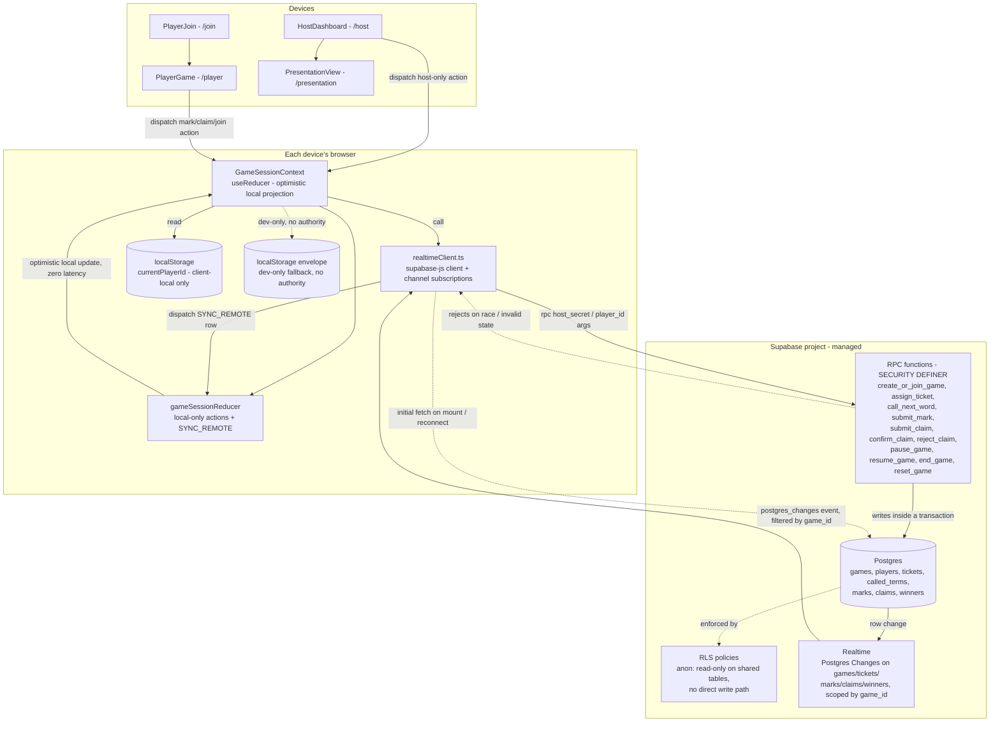
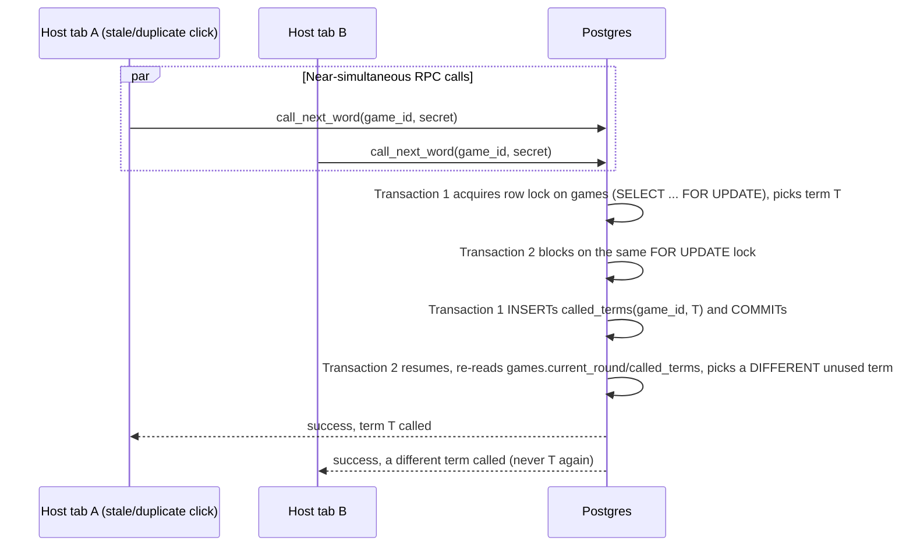

# Design Document

## Overview

Module 6 replaces the illusion of "shared" game state in Cyber Tambola V2 with a real one. Today, `game`, `players`, `tickets`, `marks`, `claims`, and `winners` all live in one browser's `useReducer` store (`gameSessionReducer.ts`), get mirrored to that browser's `localStorage`, and get mirrored again to *other tabs of the same browser* over `BroadcastChannel`. None of that reaches a second device. A Host laptop and an Employee's phone are, today, running two completely independent games that happen to share a seed game code string.

This module introduces Supabase (managed Postgres + Realtime) as the single authoritative backend for every piece of state that must be shared across devices — `Game`, `Player`, `Ticket`, `Mark`, `PrizeClaim`, `Winner` — while deliberately leaving `currentPlayerId` exactly where it already lives: client-local, in `localStorage`, on the one device that owns it. The four screens (`/host`, `/player`, `/presentation`, and the join flow) keep the same `dispatch`-shaped component API they have today; what changes is what's behind `dispatch` and where the data used to render actually comes from.

The core design tensions and how they are resolved:

- **Does `useReducer` disappear?** No. It is repurposed rather than removed. `gameSessionReducer` already contains the *only* correct logic for validating a mark, validating a claim, and computing derived state — that logic must not be reimplemented in SQL just because the data now lives in Postgres. The reducer becomes the client's **optimistic local projection**: a player's tap on a ticket cell still runs through `validateMarkAttempt`/`MARK_TERM` and repaints instantly, at zero network latency, exactly as it does today. What changes is that this is no longer the source of truth — it is immediately followed by (a) a write to Supabase that the database itself re-validates, and (b) that same write coming back down through a Realtime subscription and reconciling into the same reducer state via a new `SYNC_REMOTE` action, superseding the optimistic entry with the authoritative one. This is the standard "optimistic UI + server reconciliation" shape, and it is the only option that avoids either (a) a jarring tap-then-wait UI on a school-wifi-grade network, or (b) silently trusting the client's own eligibility math forever, which Requirement-level security expectations explicitly forbid.
- **Where does "Host calls Next Word" race-proofing live?** In a Postgres function (`call_next_word`), not in client JavaScript and not as a client-side retry loop. Two Host devices (or one Host double-tapping through a lagging network) calling "next word" near-simultaneously must never both succeed — Postgres's own transactional guarantees, plus a `UNIQUE` constraint on `(game_id, term_id)` in a `called_terms` table, make a second concurrent call fail cleanly at the database level rather than racily in application code.
- **How is "no enterprise auth" reconciled with "host-only actions must not be callable from Player UI"?** Every host-only mutation (start, call-next-word, pause, resume, end, reset, confirm-claim, reject-claim) is exposed as a Postgres function (`SECURITY DEFINER` RPC) that requires a `host_secret` argument checked against a `games.host_secret` column, rather than as a directly-writable table exposed to the `anon` role. The anon key is public by design in Supabase's model (this is standard, not a leak) — RLS on the underlying tables denies `anon` direct `INSERT`/`UPDATE` on host-controlled columns entirely, and the *only* door in is through these RPCs, each independently checking the secret server-side. A Player device is never given the host secret, so there is no client code path — not even a modified/malicious one — that can call `confirm_claim` successfully. This is the closest a no-Supabase-Auth prototype can get to "host" being a real authorization concept rather than a UI convention.
- **Does ticket generation / next-word selection get duplicated in SQL, and is that acceptable?** Yes, deliberately, and yes. `generateTicket` (Fisher-Yates shuffle over active terms, uniqueness-by-signature retry loop) and `selectNextTerm` (uniform-random pick among unused active terms) are re-implemented as PL/pgSQL functions, `assign_ticket` and `call_next_word`, because ticket assignment and word selection are the two operations that MUST be atomic and server-authoritative when two devices can race on them — an Edge Function calling back into the existing TypeScript would still need its own transaction/locking story and adds a network hop for no benefit, since the algorithm itself is simple enough to restate directly in SQL. The accepted prototype-level risk is documented explicitly in this design's Testing Strategy: a property-based test asserts both implementations produce ticket shapes with equivalent *structural* guarantees (15 unique active terms, 3x5 arrangement, uniqueness by signature) even though they cannot literally run the same code path.
- **What happens to `rev` and the merge-by-id convention?** It is superseded, not extended. `rev` existed to answer "is this snapshot from another tab newer than what I have," which was only a hard problem because two tabs were exchanging *snapshots with each other* with no third-party arbiter. Once Postgres is the single arbiter every client reads from and writes through, there is nothing for two clients to disagree about — a client either has the latest row from Postgres or it doesn't, and a fresh `SELECT` (or the next Realtime event) always resolves that. Every table gets its own `updated_at` timestamp (maintained by a trigger) for humans/debugging and for the client's local reconciliation ordering, but there is no cross-table monotonic counter and no snapshot-merge logic in the new code path.
- **Does BroadcastChannel/localStorage get deleted?** No, but it is demoted to a same-tab convenience with zero authority. Same-browser multi-tab is not a requirement of this module and is not being newly supported; the existing local envelope is kept purely so `npm run dev` without Supabase credentials configured still renders something inspectable, and so a page refresh on a device that briefly loses connectivity has *something* to paint before the initial Supabase fetch resolves. It is explicitly never the last writer: Supabase's initial fetch on mount always overwrites the locally-restored shared slice before the user can interact with stale data.

This design is grounded in the current codebase, read in full during design: `src/types/{game.ts, player.ts, ticket.ts, mark.ts, claim.ts, prize.ts}`, `src/state/{gameSessionReducer.ts, gameSessionInitialState.ts, GameSessionContext.tsx, persistence.ts, syncChannel.ts, joinService.ts}`, `src/utils/{prizeEngine.ts, claimEngine.ts, winnerEngine.ts, ticketGenerator.ts, gameEngine.ts}`, and the four screens under `src/pages`. It is also grounded in current Supabase documentation fetched during design (see Research notes) rather than assumptions about the platform.

### Research notes

- **Postgres Changes vs. Broadcast vs. Presence.** Supabase Realtime ships three primitives over one WebSocket connection. *Postgres Changes* listens to logical-replication events off a `supabase_realtime` publication and requires the least setup, but Supabase's own docs now recommend *Broadcast* (specifically `realtime.broadcast_changes()` fired from a trigger, delivered over a private, RLS-authorized channel) for anything scale-sensitive, because Postgres Changes re-evaluates RLS per subscriber per change and does not scale as well ([Subscribing to Database Changes](https://supabase.com/docs/guides/realtime/subscribing-to-database-changes)). *Presence* is an in-memory CRDT for ephemeral "who's online" state, not persisted data ([Realtime Architecture](https://supabase.com/docs/guides/realtime/architecture)). Given this module's explicit performance target is a "small pilot" of 10-20 concurrent devices — not thousands — Postgres Changes' simpler setup and direct table-level scoping (subscribe to `marks where game_id = X`, not a hand-rolled broadcast topic per row) is the right tradeoff for a prototype; Broadcast-from-trigger is noted as the documented upgrade path if a future module needs to scale past this.
- **Broadcast-from-database requires its own RLS.** Even if a future iteration moved to Broadcast, Supabase's current model requires *Realtime Authorization* policies on `realtime.messages` for private channels ([Subscribing to Database Changes](https://supabase.com/docs/guides/realtime/subscribing-to-database-changes)) — a second RLS surface distinct from table RLS. Staying on Postgres Changes for this module avoids introducing that second surface for no pilot-scale benefit.
- **RLS and the anon key are meant to coexist.** Supabase's model ships the anon/publishable key to the browser by design — RLS is the control, not key secrecy ([Row Level Security](https://supabase.com/docs/guides/auth/row-level-security); "the anon key... is what prevents that key from granting access to data it shouldn't"). This directly validates this module's approach: ship the anon key, enable RLS on every table, and put host-only logic behind `SECURITY DEFINER` functions rather than trying to keep any key secret from the Player device.
- **RLS normally keys off Supabase Auth's JWT (`auth.uid()`, custom claims via a Custom Access Token Hook), which requires users to actually sign in** ([JWT deep dive](https://supabase.com/docs/guides/auth/auth-deep-dive/auth-deep-dive-jwts); [Custom Claims & RBAC](https://supabase.com/docs/guides/api/custom-claims-and-role-based-access-control-rbac)). This module's explicit non-goal is "no enterprise auth," and introducing even anonymous Supabase Auth sign-ins to get a JWT-based "host" claim would be a real scope increase (session lifecycle, an extra table of `auth.users`, sign-in calls on every screen) for a prototype that just needs one laptop to be trusted. The shared-secret-argument-to-a-`SECURITY DEFINER`-RPC pattern used in this design achieves the same authorization outcome (a Player row can never independently produce a valid host action) without adopting Supabase Auth at all — this is the deliberate, documented tradeoff behind Architectural Decision item 4 below.
- **The JS client's realtime subscription API** (`supabase.channel(name).on('postgres_changes', { event, schema, table, filter }, callback).subscribe()`) scopes a subscription to a single table with an optional `filter` such as `game_id=eq.<id>` ([Subscribing to Database Changes](https://supabase.com/docs/guides/realtime/subscribing-to-database-changes)), which is exactly the per-game scoping this design needs — a Player's browser only ever subscribes to rows for the one `game_id` it joined, never the whole table.

## Architecture

### Component and data-flow overview



### Sequence: Host calls the next Cyber Word, all devices update

```mermaid
sequenceDiagram
    participant Host as Host laptop (/host)
    participant RPC as call_next_word() RPC
    participant DB as Postgres
    participant RT as Realtime
    participant P1 as Player phone A
    participant P2 as Player phone B
    participant Pres as Presentation view

    Host->>RPC: call_next_word(game_id, host_secret)
    RPC->>DB: BEGIN; verify host_secret matches games.host_secret
    RPC->>DB: SELECT unused active term (NOT IN called_terms) FOR UPDATE
    alt bank exhausted
        RPC->>DB: UPDATE games SET status='COMPLETED', ended_at=now()
    else term available
        RPC->>DB: INSERT INTO called_terms(game_id, term_id) -- UNIQUE(game_id, term_id)
        RPC->>DB: UPDATE games SET current_term_id=?, current_round=current_round+1
    end
    RPC->>DB: COMMIT
    DB-->>RT: row change on games (and called_terms)
    RT-->>Host: postgres_changes event
    RT-->>P1: postgres_changes event (filtered game_id=eq.<id>)
    RT-->>P2: postgres_changes event (filtered game_id=eq.<id>)
    RT-->>Pres: postgres_changes event (filtered game_id=eq.<id>)
    Host->>Host: dispatch SYNC_REMOTE -> currentTermId updates, called-word history grows
    P1->>P1: dispatch SYNC_REMOTE -> matching ticket cell becomes AVAILABLE
    P2->>P2: dispatch SYNC_REMOTE -> matching ticket cell becomes AVAILABLE
    Pres->>Pres: dispatch SYNC_REMOTE -> word/definition/safe practice now shown
```

### Sequence: two devices race on "Next Word" (concurrency proof)



### Sequence: Player joins from a phone, then refreshes mid-game

```mermaid
sequenceDiagram
    participant Phone as Employee phone (/join then /player)
    participant RPC as join_game() RPC
    participant DB as Postgres
    participant Local as localStorage (this phone only)

    Phone->>RPC: join_game(game_code, display_name, employee_demo_id)
    RPC->>DB: normalize + look up existing player by (game_id, lower(employee_demo_id))
    alt existing player found
        RPC-->>Phone: { player, ticket } for the EXISTING row (no new ticket)
    else no existing player
        RPC->>DB: INSERT players(...)
        RPC->>DB: assign_ticket(game_id, player_id) -- atomic, unique signature
        RPC-->>Phone: { player, ticket } for the NEW row
    end
    Phone->>Local: writeCurrentPlayerId(player.id) -- client-local only, never sent back to Supabase as identity
    Phone->>Phone: navigate to /player

    Note over Phone: -- later: phone locks, reconnects, or the tab reloads --
    Phone->>Local: readCurrentPlayerId() -> existing player.id
    Phone->>RPC: fetch current game + this player + this player's ticket + marks + claims + winners (by player.id)
    RPC-->>Phone: full current state
    Phone->>Phone: subscribe to Realtime for this game_id; resume without a new Ticket
```

### Key architectural decisions

| # | Decision | Rationale |
| --- | --- | --- |
| 1 | Supabase (Postgres + Realtime) chosen over Firebase and a self-hosted Node+Socket.IO backend | Already decided with the user before this design phase; carried through as a final decision, not re-evaluated here. |
| 2 | `useReducer`/`gameSessionReducer` is kept as an **optimistic local projection**, reconciled by a new `SYNC_REMOTE` action fed from Realtime, rather than replaced by ad hoc component-level `useState` + direct Supabase calls | Preserves every existing pure validation function (`validateMarkAttempt`, `validatePrizeClaim`, `canConfirmClaim`) and the existing `dispatch`-based component API untouched; avoids a full UI rewrite; gives instant tap feedback on unreliable venue wifi instead of a network-round-trip-per-tap UI. |
| 3 | Host-only mutations are Postgres RPC functions (`SECURITY DEFINER`) gated by a `host_secret` argument, not directly-writable tables | The anon key is necessarily public; RLS alone cannot distinguish "the Host's browser" from "a Player's browser" without Supabase Auth, which is out of scope. A checked secret argument on a narrow, purpose-built RPC is the smallest mechanism that makes host actions genuinely uncallable from Player code paths. |
| 4 | `assign_ticket` and `call_next_word` are re-implemented in PL/pgSQL rather than calling back into the existing TypeScript via an Edge Function | Both operations must be atomic under concurrent devices; SQL-native locking (`FOR UPDATE`, `UNIQUE` constraints) is simpler and has no extra network hop compared to an Edge Function that would still need its own transaction discipline. The duplication is bounded, one-directional (SQL mirrors TS, not vice versa), and covered by an equivalence property test (see Testing Strategy). |
| 5 | `currentPlayerId` is never sent to Supabase and never appears in any table | It answers "which player is this device," a question Supabase cannot and must not answer on the client's behalf; keeping it 100% local is what makes host/presentation sync provably unable to redirect a Player to the join screen. |
| 6 | The `rev` counter and `SYNC_STATE`'s merge-by-id convention are removed from the Supabase-backed path entirely, not extended | They solved "which of two peer snapshots is newer," a problem that does not exist once there is one authoritative source every client reads from; carrying them forward would be a second, redundant staleness mechanism. |
| 7 | Existing `persistence.ts` (envelope) and `syncChannel.ts` (BroadcastChannel) are kept as-is but stripped of authority: still used for `currentPlayerId` (unchanged) and as a same-tab dev/offline-render convenience for the shared slice, never as the source truth is reconciled from | Satisfies "no two competing authoritative systems" without deleting code that still has a legitimate, narrower job (client-local identity persistence; something to paint before the first Supabase fetch resolves). |
| 8 | Postgres Changes (not Broadcast) is the realtime mechanism for this module | Simpler setup, sufficient for a 10-20 device pilot, and scopes per table with a `game_id` filter out of the box; Broadcast is the documented scale-up path if a later module needs it. |

## Components and Interfaces

### 1. Database schema (Postgres, via Supabase migration SQL)

```sql
-- games: one row per session. host_secret is a per-game random token, known
-- only to the device that created the game (the Host laptop), never sent to
-- Player devices, and required by every host-only RPC.
create table games (
  id            uuid primary key default gen_random_uuid(),
  code          text not null unique,           -- e.g. "CYBER24"
  host_secret   uuid not null default gen_random_uuid(),
  status        text not null default 'LOBBY'
                check (status in ('LOBBY','WORD_ACTIVE','PAUSED','COMPLETED')),
  current_round     integer not null default 0,
  current_term_id   text,                        -- references cyberTerms.ts ids (client-bundled bank, not a DB table)
  previous_status   text
                check (previous_status in ('LOBBY','WORD_ACTIVE','PAUSED','COMPLETED')),
  created_at    timestamptz not null default now(),
  started_at    timestamptz,
  ended_at      timestamptz,
  updated_at    timestamptz not null default now()
);

-- called_terms: append-only log of every term officially called this game.
-- The UNIQUE constraint is what makes a duplicate "call next word" race fail
-- cleanly at the database level (see call_next_word below).
create table called_terms (
  game_id     uuid not null references games(id) on delete cascade,
  term_id     text not null,
  called_at   timestamptz not null default now(),
  round       integer not null,
  primary key (game_id, term_id)
);

-- players: one row per (game, employee_demo_id). employee_demo_id_normalized
-- is a generated column so "duplicate join restores existing player" can be
-- enforced as a UNIQUE constraint rather than an application-level race.
create table players (
  id                     uuid primary key default gen_random_uuid(),
  game_id                uuid not null references games(id) on delete cascade,
  display_name           text not null,
  employee_demo_id       text not null,
  employee_demo_id_normalized text generated always as (lower(trim(employee_demo_id))) stored,
  joined_at              timestamptz not null default now(),
  updated_at             timestamptz not null default now(),
  unique (game_id, employee_demo_id_normalized)
);

-- tickets: exactly one per player (enforced by UNIQUE), 15 cells inline as
-- jsonb mirroring TicketCell[][] so the client can deserialize directly into
-- the existing Ticket shape without a join across 15 rows.
create table tickets (
  id            uuid primary key default gen_random_uuid(),
  game_id       uuid not null references games(id) on delete cascade,
  player_id     uuid not null unique references players(id) on delete cascade,
  ref           text not null,
  signature     text not null,                  -- computeSignature() equivalent: sorted term ids joined by '|'
  cells         jsonb not null,                 -- TicketCell[][] - 3 rows x 5 cols, each {termId, term, row, col}
  created_at    timestamptz not null default now(),
  unique (game_id, signature)
);

-- marks: one row per (player, ticket, term) the player has validly marked.
create table marks (
  id            uuid primary key default gen_random_uuid(),
  game_id       uuid not null references games(id) on delete cascade,
  player_id     uuid not null references players(id) on delete cascade,
  ticket_id     uuid not null references tickets(id) on delete cascade,
  term_id       text not null,
  marked_at     timestamptz not null default now(),
  unique (player_id, ticket_id, term_id)          -- DUPLICATE_MARK is a constraint violation, not app logic
);

-- claims: one row per submitted claim attempt (valid or invalid; every
-- attempt is recorded, matching the existing claimEngine/reducer behavior).
create table claims (
  id                 uuid primary key default gen_random_uuid(),
  game_id            uuid not null references games(id) on delete cascade,
  player_id          uuid not null references players(id) on delete cascade,
  ticket_id          uuid not null references tickets(id) on delete cascade,
  prize_id           text not null
                     check (prize_id in ('CYBER_FIVE','FIREWALL_LINE','SECURITY_LINE','DATA_DEFENDER_LINE','CYBER_FULL_HOUSE')),
  submitted_at       timestamptz not null default now(),
  validation_status  text not null check (validation_status in ('VALID','INVALID')),
  host_decision      text not null default 'PENDING' check (host_decision in ('PENDING','CONFIRMED','REJECTED')),
  rejection_reason   text,
  decided_at         timestamptz,
  prize_label        text not null,
  player_name        text not null,
  ticket_ref         text not null
);

-- winners: at most one per (game, prize) — enforced by UNIQUE, mirroring
-- isPrizeClosed's invariant as a hard database guarantee, not just a derived read.
create table winners (
  id            uuid primary key default gen_random_uuid(),
  game_id       uuid not null references games(id) on delete cascade,
  prize_id      text not null,
  player_id     uuid not null references players(id) on delete cascade,
  ticket_id     uuid not null references tickets(id) on delete cascade,
  claim_id      uuid not null references claims(id) on delete cascade,
  confirmed_at  timestamptz not null default now(),
  prize_label   text not null,
  player_name   text not null,
  unique (game_id, prize_id)
);

-- Realtime needs every subscribed table in the supabase_realtime publication.
alter publication supabase_realtime add table games, called_terms, tickets, marks, claims, winners;
```

`games.current_term_id`, `called_terms.term_id`, `claims.prize_id`, and ticket cell `termId`s are all foreign-key-free references into the client-bundled `cyberTerms.ts` bank (30 terms, shipped in the app bundle, not stored in Postgres) — this mirrors the existing app's treatment of the term bank as static content, and avoids needing to sync 30 rows of content data for zero benefit.

### 2. Row Level Security policies

```sql
alter table games enable row level security;
alter table called_terms enable row level security;
alter table players enable row level security;
alter table tickets enable row level security;
alter table marks enable row level security;
alter table claims enable row level security;
alter table winners enable row level security;

-- Every shared table: anon may SELECT (read), scoped to nothing narrower than
-- "the whole game" (a Player legitimately needs to see other players' counts,
-- the current word, and the claims inbox is host-only UI, not a table-level
-- restriction). Anon may NEVER INSERT/UPDATE/DELETE directly — every write
-- goes through a SECURITY DEFINER RPC below, which runs as the table owner
-- and bypasses RLS internally after its own explicit checks.
create policy "anon can read games"        on games         for select to anon using (true);
create policy "anon can read called_terms" on called_terms  for select to anon using (true);
create policy "anon can read players"      on players       for select to anon using (true);
create policy "anon can read tickets"      on tickets       for select to anon using (true);
create policy "anon can read marks"        on marks         for select to anon using (true);
create policy "anon can read claims"       on claims        for select to anon using (true);
create policy "anon can read winners"      on winners       for select to anon using (true);

-- No insert/update/delete policies are created for `anon` on any table.
-- Postgres's default-deny means anon simply cannot write these tables at all
-- outside of the RPCs, which are defined SECURITY DEFINER and therefore run
-- as their owning role (not `anon`), regardless of table RLS.
```

This resolves the "distinguishing host from player with only a public anon key" tension directly: RLS's job here is not to distinguish host from player (it structurally cannot, without Supabase Auth) — RLS's job is to guarantee that **no client of any kind** can write these tables except through the narrow RPC surface below, and each RPC does its own host/player check in its function body.

### 3. RPC functions (`SECURITY DEFINER`, one per mutation)

```sql
-- Player-callable: create the seed game if absent, or return the existing one.
-- (Dev convenience; a real pilot pre-creates the one game code before the
-- session, but this keeps `npm run dev` runnable without a manual insert.)
create or replace function get_or_create_game(p_code text)
returns games language plpgsql security definer as $$
declare g games;
begin
  select * into g from games where code = p_code;
  if g.id is null then
    insert into games(code) values (p_code) returning * into g;
  end if;
  return g;
end;
$$;

-- Player-callable: join or restore. Never trusts a client-supplied player id.
create or replace function join_game(p_game_code text, p_display_name text, p_employee_demo_id text)
returns table(player_id uuid, ticket_id uuid) language plpgsql security definer as $$
declare
  v_game games;
  v_player players;
  v_ticket tickets;
begin
  select * into v_game from games where code = p_game_code;
  if v_game.id is null then
    raise exception 'GAME_NOT_FOUND';
  end if;
  if v_game.status = 'COMPLETED' then
    raise exception 'GAME_COMPLETED';
  end if;

  select * into v_player from players
    where game_id = v_game.id and employee_demo_id_normalized = lower(trim(p_employee_demo_id));

  if v_player.id is not null then
    -- Restore: no new player, no new ticket (Req: duplicate id restores).
    select * into v_ticket from tickets where player_id = v_player.id;
    return query select v_player.id, v_ticket.id;
  end if;

  insert into players(game_id, display_name, employee_demo_id)
    values (v_game.id, trim(p_display_name), trim(p_employee_demo_id))
    returning * into v_player;

  -- assign_ticket is defined separately and is itself atomic/unique-checked.
  select * into v_ticket from assign_ticket(v_game.id, v_player.id);

  return query select v_player.id, v_ticket.id;
end;
$$;

-- Internal-atomic ticket assignment. Mirrors ticketGenerator.ts's algorithm:
-- shuffle active terms, take 15, retry up to 50 times on a signature clash.
-- The active-terms bank is passed in from the client's bundled cyberTerms.ts
-- (30 static rows) as a jsonb array of {id, active} so the SQL side never
-- needs its own copy of content data — only the algorithm is duplicated.
create or replace function assign_ticket(p_game_id uuid, p_player_id uuid, p_active_term_ids text[])
returns tickets language plpgsql security definer as $$
declare
  v_shuffled text[];
  v_chosen text[];
  v_signature text;
  v_cells jsonb;
  v_ticket tickets;
  v_attempt int := 0;
begin
  if array_length(p_active_term_ids, 1) < 15 then
    raise exception 'INSUFFICIENT_ACTIVE_TERMS';
  end if;

  loop
    v_attempt := v_attempt + 1;
    -- Fisher-Yates-equivalent: order_by random() over the active id array.
    select array_agg(t order by random()) into v_shuffled
      from unnest(p_active_term_ids) as t;
    v_chosen := v_shuffled[1:15];
    select array_to_string(array(select unnest(v_chosen) order by 1), '|') into v_signature;

    if not exists (select 1 from tickets where game_id = p_game_id and signature = v_signature) then
      exit;
    end if;
    if v_attempt >= 50 then
      raise exception 'TICKET_UNIQUE_RETRY_EXCEEDED';
    end if;
  end loop;

  -- Build the 3x5 cells jsonb; `term` display text is filled in client-side
  -- on read from the bundled bank (cells here only carry termId/row/col),
  -- mirroring how TicketCell.term is already just a denormalized label.
  select jsonb_agg(jsonb_build_object('termId', v_chosen[i], 'row', (i-1)/5, 'col', (i-1)%5))
    into v_cells from generate_series(1, 15) as i;

  insert into tickets(game_id, player_id, ref, signature, cells)
    values (p_game_id, p_player_id, 'Ticket #' || upper(substr(p_player_id::text, 1, 4)), v_signature, v_cells)
    returning * into v_ticket;

  return v_ticket;
end;
$$;

-- Host-only: verified by host_secret. Atomic next-word selection using a row
-- lock on `games` so two concurrent calls for the same game serialize instead
-- of racing (see the concurrency sequence diagram above).
create or replace function call_next_word(p_game_id uuid, p_host_secret uuid, p_active_term_ids text[])
returns games language plpgsql security definer as $$
declare
  v_game games;
  v_used text[];
  v_available text[];
  v_next text;
begin
  select * into v_game from games where id = p_game_id for update;  -- serializes concurrent callers
  if v_game.id is null or v_game.host_secret <> p_host_secret then
    raise exception 'NOT_AUTHORIZED';
  end if;
  if v_game.status not in ('LOBBY', 'WORD_ACTIVE') then
    raise exception 'INVALID_STATE';
  end if;

  select array_agg(term_id) into v_used from called_terms where game_id = p_game_id;
  select array_agg(t) into v_available
    from unnest(p_active_term_ids) as t where t <> all (coalesce(v_used, array[]::text[]));

  if v_available is null or array_length(v_available, 1) = 0 then
    update games set status = 'COMPLETED', ended_at = now(), updated_at = now()
      where id = p_game_id returning * into v_game;
    return v_game;
  end if;

  select v_available[1 + floor(random() * array_length(v_available, 1))::int] into v_next;

  insert into called_terms(game_id, term_id, round) values (p_game_id, v_next, v_game.current_round + 1);
  -- UNIQUE(game_id, term_id) on called_terms is the hard backstop: even if
  -- two transactions somehow both passed the availability check (they
  -- cannot, due to the FOR UPDATE lock above), only one INSERT could ever
  -- succeed for the same term.

  update games set
      status = 'WORD_ACTIVE',
      current_round = v_game.current_round + 1,
      current_term_id = v_next,
      started_at = coalesce(v_game.started_at, now()),
      updated_at = now()
    where id = p_game_id returning * into v_game;

  return v_game;
end;
$$;

-- Host-only, symmetric shape to call_next_word: pause_game, resume_game,
-- end_game, reset_game each check host_secret first, then apply the same
-- status transition gameSessionReducer.ts already validates today.
create or replace function pause_game(p_game_id uuid, p_host_secret uuid) returns games
  language plpgsql security definer as $$ /* checks status='WORD_ACTIVE', sets 'PAUSED', previous_status */ $$;
create or replace function resume_game(p_game_id uuid, p_host_secret uuid) returns games
  language plpgsql security definer as $$ /* checks status='PAUSED', restores previous_status */ $$;
create or replace function end_game(p_game_id uuid, p_host_secret uuid) returns games
  language plpgsql security definer as $$ /* any status except COMPLETED -> COMPLETED, ended_at */ $$;
create or replace function reset_game(p_game_id uuid, p_host_secret uuid) returns games
  language plpgsql security definer as $$ /* dev-only: truncates called_terms/players/tickets/marks/claims/winners for this game_id, resets games row to LOBBY */ $$;

-- Player-callable: mark a term. Re-validates every gate server-side —
-- mirrors validateMarkAttempt's five checks exactly, so a modified client
-- can never persist a mark it wasn't entitled to, even though the client
-- also runs the same checks locally for instant feedback.
create or replace function submit_mark(p_player_id uuid, p_term_id text)
returns marks language plpgsql security definer as $$
declare
  v_player players;
  v_ticket tickets;
  v_game games;
  v_on_ticket boolean;
  v_mark marks;
begin
  select * into v_player from players where id = p_player_id;
  if v_player.id is null then raise exception 'NO_CURRENT_PLAYER'; end if;

  select * into v_ticket from tickets where player_id = v_player.id;
  if v_ticket.id is null then raise exception 'TICKET_NOT_FOUND'; end if;

  select exists(select 1 from jsonb_array_elements(v_ticket.cells) c where c->>'termId' = p_term_id)
    into v_on_ticket;
  if not v_on_ticket then raise exception 'TERM_NOT_ON_TICKET'; end if;

  select * into v_game from games where id = v_player.game_id;
  if not exists(select 1 from called_terms where game_id = v_game.id and term_id = p_term_id) then
    raise exception 'TERM_NOT_REVEALED';
  end if;
  if v_game.status = 'COMPLETED' then raise exception 'GAME_COMPLETED'; end if;

  insert into marks(game_id, player_id, ticket_id, term_id)
    values (v_game.id, v_player.id, v_ticket.id, p_term_id)
    returning * into v_mark;
  -- DUPLICATE_MARK is enforced by the UNIQUE(player_id, ticket_id, term_id)
  -- constraint; a duplicate insert raises a unique_violation the client
  -- treats identically to "already marked, no-op."

  return v_mark;
end;
$$;

-- Player-callable: submit a claim. Mirrors validatePrizeClaim's gates 1-10
-- (game/player/ticket existence and ownership, prize existence, duplicate-
-- active-claim and resubmission-limit checks against `claims`, prize-closed
-- check against `winners`, and eligibility computed from this player's own
-- `marks` rows) before inserting a VALID or INVALID row — every submission
-- is recorded, exactly as claimEngine.ts already guarantees client-side.
create or replace function submit_claim(p_player_id uuid, p_prize_id text)
returns claims language plpgsql security definer as $$ /* full validatePrizeClaim-equivalent gate chain */ $$;

-- Host-only: confirm/reject, mirroring canConfirmClaim / the REJECT_CLAIM
-- reducer case, each gated by host_secret.
create or replace function confirm_claim(p_claim_id uuid, p_host_secret uuid) returns winners
  language plpgsql security definer as $$ /* validation_status='VALID' and host_decision='PENDING' and no existing winner for (game_id, prize_id); inserts winners row; unique(game_id, prize_id) is the hard backstop */ $$;
create or replace function reject_claim(p_claim_id uuid, p_host_secret uuid, p_reason text) returns claims
  language plpgsql security definer as $$ /* host_decision='PENDING' -> 'REJECTED', stores p_reason */ $$;
```

Function bodies shown as full implementations for the security-critical, race-sensitive, or structurally novel ones (`get_or_create_game`, `join_game`, `assign_ticket`, `call_next_word`, `submit_mark`); the remaining host-lifecycle and claim functions are shown as signatures with an inline comment describing the exact existing-reducer logic they mirror, since their gate logic is a direct, mechanical SQL restatement of code already read and quoted above (`gameSessionReducer.ts`'s `PAUSE_GAME`/`RESUME_GAME`/`END_GAME`/`RESET_GAME`/`CONFIRM_CLAIM`/`REJECT_CLAIM` cases, and `claimEngine.ts`'s `validatePrizeClaim`) rather than a new design decision.

### 4. `src/state/realtimeClient.ts` (new)

```ts
import { createClient, type SupabaseClient, type RealtimeChannel } from '@supabase/supabase-js'

/**
 * One Supabase client per browser tab, created from Vite-exposed env vars.
 * Never hard-coded; missing vars are handled explicitly by getSupabaseConfig
 * rather than left to throw deep inside supabase-js (see Environment
 * Configuration section — `npm run dev` must fail clearly, not confusingly).
 */
export function getSupabaseConfig(): { url: string; anonKey: string } | null {
  const url = import.meta.env.VITE_SUPABASE_URL
  const anonKey = import.meta.env.VITE_SUPABASE_ANON_KEY
  if (!url || !anonKey) return null
  return { url, anonKey }
}

let client: SupabaseClient | null = null

/** Lazily create the singleton client, or null if unconfigured (dev fallback mode). */
export function getSupabaseClient(): SupabaseClient | null {
  if (client) return client
  const config = getSupabaseConfig()
  if (!config) return null
  client = createClient(config.url, config.anonKey)
  return client
}

/**
 * Subscribe to every row change for one game_id across all six shared
 * tables, scoped by Postgres Changes' built-in per-table `filter`. Each
 * event is normalized into a RemoteChange the reducer's SYNC_REMOTE action
 * consumes directly — see gameSessionReducer.ts.
 */
export interface RemoteChange {
  table: 'games' | 'called_terms' | 'tickets' | 'marks' | 'claims' | 'winners'
  eventType: 'INSERT' | 'UPDATE' | 'DELETE'
  row: Record<string, unknown>
}

export function subscribeToGame(
  gameId: string,
  onChange: (change: RemoteChange) => void,
): RealtimeChannel | null {
  const supabase = getSupabaseClient()
  if (!supabase) return null

  const channel = supabase.channel(`game:${gameId}`)
  const tables: RemoteChange['table'][] = [
    'games', 'called_terms', 'tickets', 'marks', 'claims', 'winners',
  ]
  for (const table of tables) {
    channel.on(
      'postgres_changes',
      { event: '*', schema: 'public', table, filter: `game_id=eq.${gameId}` },
      (payload) =>
        onChange({
          table,
          eventType: payload.eventType as RemoteChange['eventType'],
          row: (payload.new ?? payload.old) as Record<string, unknown>,
        }),
    )
  }
  channel.subscribe()
  return channel
}
```

`games` itself is filtered by its own `id`, not a `game_id` foreign key (it *is* the game); the filter string for that one table is `id=eq.${gameId}` in the actual implementation — shown uniformly above for brevity, called out explicitly here so the distinction is not lost during implementation.

### 5. `src/state/gameSessionReducer.ts` (extended, not replaced)

```ts
export type GameSessionAction =
  | { type: 'START_GAME' }          // now dispatched only as an optimistic pre-echo; see below
  | { type: 'CALL_NEXT_WORD' }
  | { type: 'PAUSE_GAME' }
  | { type: 'RESUME_GAME' }
  | { type: 'END_GAME' }
  | { type: 'RESET_GAME' }
  | { type: 'JOIN_PLAYER'; player: Player; ticket: Ticket }
  | { type: 'RESTORE_PLAYER'; playerId: string }
  | { type: 'MARK_TERM'; termId: string }
  | { type: 'SUBMIT_PRIZE_CLAIM'; playerId: string; ticketId: string; prizeId: PrizeId }
  | { type: 'CONFIRM_CLAIM'; claimId: string }
  | { type: 'REJECT_CLAIM'; claimId: string; rejectionReason?: string }
  // NEW — replaces SYNC_STATE. Applies one authoritative row change received
  // from Supabase Realtime (or an initial fetch). Unlike SYNC_STATE, this is
  // never a whole-session snapshot merge — it is always exactly one row from
  // one table, upserted or removed by id into the matching collection. There
  // is no `rev` to compare: the row from Postgres always wins outright,
  // because Postgres is the single writer of record for every field it
  // touches (an optimistic local entry for the same id is simply replaced).
  | { type: 'SYNC_REMOTE'; change: RemoteChange }
```

`SYNC_REMOTE` case (replaces `SYNC_STATE`):

```ts
case 'SYNC_REMOTE': {
  const { table, eventType, row } = action.change

  // currentPlayerId is never read from or written by this case, for any
  // table, under any eventType — the one guarantee this design exists to
  // make airtight (Req: shared updates must never erase currentPlayerId).

  switch (table) {
    case 'games':
      return { ...state, game: mapRowToGame(row) }
    case 'called_terms':
      // Folded into `game.revealedTermIds` for compatibility with every
      // existing selector (deriveCellState, prizeEngine, etc.) that already
      // reads that field — called_terms is what made revealedTermIds
      // authoritative server-side, but the client-facing shape is unchanged.
      return {
        ...state,
        game: { ...state.game, revealedTermIds: [...new Set([...state.game.revealedTermIds, row.term_id as string])] },
      }
    case 'tickets':
      return { ...state, tickets: upsertById(state.tickets, mapRowToTicket(row)) }
    case 'marks':
      return eventType === 'DELETE'
        ? state // marks are never deleted in this design; defensive no-op
        : { ...state, marks: upsertById(state.marks, mapRowToMark(row)) }
    case 'claims':
      return { ...state, claims: upsertById(state.claims, mapRowToClaim(row)) }
    case 'winners':
      return { ...state, winners: upsertById(state.winners, mapRowToWinner(row)) }
  }
}
```

`upsertById` replaces `mergeById`'s two-array-union role with a single-row upsert (insert-or-replace by id) — simpler than the old merge because `SYNC_REMOTE` only ever carries one row, never a whole collection, so there is nothing to "merge" beyond "does this id already exist locally."

Existing local-only cases (`MARK_TERM`, `SUBMIT_PRIZE_CLAIM`, `START_GAME`, `CALL_NEXT_WORD`, `PAUSE_GAME`, `RESUME_GAME`, `CONFIRM_CLAIM`, `REJECT_CLAIM`, `JOIN_PLAYER`) are **unchanged in their validation logic** and continue to run exactly as today, producing the same optimistic state shape — they are now explicitly documented as *optimistic-only*: `GameSessionContext` dispatches them for instant UI feedback, then separately calls the matching Supabase RPC, and the RPC's resulting Realtime event (arriving moments later via `SYNC_REMOTE`) is what actually persists. If the RPC rejects (e.g. `DUPLICATE_MARK`, a race lost in `call_next_word`, or an expired/invalid `host_secret`), `GameSessionContext` dispatches a new lightweight `ROLLBACK_OPTIMISTIC` action removing the optimistic-only entry, so a failed write never permanently shows a state the database refused to accept. `RESET_GAME` remains local-only for the fallback/dev path but, when Supabase is configured, dispatches through `reset_game()` like every other host action.

### 6. `src/state/GameSessionContext.tsx` (restructured effects, same public shape)

```ts
export function GameSessionProvider({ children }: { children: ReactNode }) {
  const [state, dispatch] = useReducer(gameSessionReducer, undefined, initState)
  const gameIdRef = useRef<string | undefined>(state.game.id)

  // Initial fetch + subscribe: runs once Supabase is configured and we know
  // which game_id to care about (resolved via get_or_create_game(SEED_GAME_CODE)
  // on mount, mirroring today's single-seed-game prototype scope).
  useEffect(() => {
    const supabase = getSupabaseClient()
    if (!supabase) return // dev fallback: no Supabase configured, stay on local/seed state

    let channel: RealtimeChannel | null = null
    ;(async () => {
      const game = await fetchOrCreateGame(supabase, SEED_GAME_CODE)
      gameIdRef.current = game.id
      const snapshot = await fetchFullGameState(supabase, game.id, readCurrentPlayerId())
      dispatch({ type: 'HYDRATE_FROM_REMOTE', snapshot }) // one-shot full replace on mount/reconnect
      channel = subscribeToGame(game.id, (change) => dispatch({ type: 'SYNC_REMOTE', change }))
    })()

    return () => { channel?.unsubscribe() }
  }, [])

  // currentPlayerId persistence: UNCHANGED from today.
  useEffect(() => { writeCurrentPlayerId(state.currentPlayerId) }, [state.currentPlayerId])

  // Dev/offline-fallback persistence: UNCHANGED mechanism, demoted to
  // "no authority" — still written so a refresh has something to paint
  // before HYDRATE_FROM_REMOTE resolves, and so the app still functions with
  // zero Supabase config (Req: npm run dev must still start cleanly).
  useEffect(() => { writeEnvelope(toPersistedSlice(state)) }, [state.game, state.players, state.tickets, state.marks, state.claims, state.winners])

  // BroadcastChannel: UNCHANGED, same-tab-only convenience, never authoritative.
  // ...existing subscribe/post effect retained verbatim...

  const value = useMemo(() => buildContextValue(state, dispatch), [state])
  return <GameSessionContext.Provider value={value}>{children}</GameSessionContext.Provider>
}
```

`HYDRATE_FROM_REMOTE` is the one whole-snapshot action left in the system, and it exists only for the mount/reconnect moment — it replaces `game`/`called_terms`-derived `revealedTermIds`/`players`/`tickets`/`marks`/`claims`/`winners` outright from a fresh set of `SELECT`s (never merged), because at that moment there is no local state worth preserving that Postgres doesn't already have more current — this is the reconnect path described in the sequence diagram above (Architectural Decision 2's "server reconciliation" half).

### 7. Screen-level changes (dispatch shape preserved)

- **`PlayerJoin.tsx`**: `buildJoinOutcome`'s client-side branch (ticket generation, `findExistingPlayer`) is replaced by a single call to the `join_game` RPC; the pure `validateJoin` field-level checks (required fields, trimming) stay client-side for instant form feedback, but the *authoritative* game-code-exists / duplicate-employee-id decision now comes from the RPC's response, not from `state.players` in local memory (which may be stale on a device that just opened the join page for the first time).
- **`HostDashboard.tsx`**: every button (`Start Game`, `Next Cyber Word`, `Pause`, `Resume`, `End Game`, `Confirm`, `Reject`, `Reset`) keeps its existing `dispatch({ type: '...' })` call for optimistic feedback, immediately followed by the matching RPC call carrying `game.hostSecret` (loaded once via `get_or_create_game`, kept only in the Host's own memory/`sessionStorage` — never written to any table the Player screen reads, and never included in any `SyncPayload`-equivalent).
- **`PlayerGame.tsx`** and **`PresentationView.tsx`**: unchanged at the JSX/selector level; both already read everything through `useGameSession()`'s derived selectors (`currentTerm`, `currentPrizeProgress`, `revealHistory`, etc.), which are recomputed identically whether the underlying `state` was produced by a local reducer action or by `SYNC_REMOTE`.

## Data Models

The shared data model for this module is the seven-table Postgres schema fully specified above (Components and Interfaces §1): `games`, `called_terms`, `players`, `tickets`, `marks`, `claims`, and `winners`. This section summarizes each table's role and, for the six tables with a client-facing counterpart, how its rows map onto the existing TypeScript domain types via the `mapRowToX` functions referenced in the reducer's `SYNC_REMOTE` case (Components and Interfaces §5).

| Table | Row identity | Domain type | Mapper |
| --- | --- | --- | --- |
| `games` | `id` (one row per session) | `Game` (`src/types/game.ts`) | `mapRowToGame` — maps `status`/`current_round`/`current_term_id`/timestamps directly; `revealedTermIds` is not a column on this table, it is folded in from `called_terms` (see below) so the mapped `Game` still exposes the same field every existing selector already reads. |
| `called_terms` | `(game_id, term_id)` (append-only log, no independent domain type) | Folds into `Game.revealedTermIds` | No standalone mapper; each `called_terms` row's `term_id` is unioned into `state.game.revealedTermIds` in the `SYNC_REMOTE` case, preserving the client-facing shape Modules 3-5 already established. |
| `players` | `id` (one row per joined employee/demo id) | `Player` (`src/types/player.ts`) | `mapRowToPlayer` — maps `display_name`, `employee_demo_id`, `joined_at` directly; `employee_demo_id_normalized` is a derived/generated column used only for the backend's uniqueness constraint and is not carried into the `Player` type. |
| `tickets` | `id`, unique per `player_id` | `Ticket` (`src/types/ticket.ts`) | `mapRowToTicket` — maps `ref`, `signature` directly; `cells` (jsonb) is deserialized into `TicketCell[][]`, with each cell's display `term` text filled in client-side from the bundled `cyberTerms.ts` bank using the row's `termId`, since the row itself only stores `termId`/`row`/`col`. |
| `marks` | `id`, unique per `(player_id, ticket_id, term_id)` | `Mark` (`src/types/mark.ts`) | `mapRowToMark` — maps `player_id`, `ticket_id`, `term_id`, `marked_at` directly; one-to-one with the existing `Mark` shape, no derived fields. |
| `claims` | `id` (one row per submission attempt, valid or invalid) | `PrizeClaim` (`src/types/claim.ts`) | `mapRowToClaim` — maps `prize_id`, `submitted_at`, `validation_status`, `host_decision`, `rejection_reason`, `decided_at`, `prize_label`, `player_name`, `ticket_ref` directly onto the existing `PrizeClaim` fields established in Module 5. |
| `winners` | `id`, unique per `(game_id, prize_id)` | `Winner` (`src/types/prize.ts`) | `mapRowToWinner` — maps `prize_id`, `player_id`, `ticket_id`, `claim_id`, `confirmed_at`, `prize_label`, `player_name` directly onto the existing `Winner` fields established in Module 5. |

Every mapper is a pure, one-row-at-a-time function: `SYNC_REMOTE` only ever hands a mapper one authoritative Postgres row at a time (never a batch), and the result is upserted by id into the matching local collection (`upsertById`, Components and Interfaces §5) rather than replacing the collection outright. `HYDRATE_FROM_REMOTE` is the only path that applies mappers across a full result set at once, and it does so as a one-shot replace on mount/reconnect, not a merge (Components and Interfaces §6). No new client-side type is introduced by this module — the seven tables are a persistence-and-sync layer underneath the `Game`/`Player`/`Ticket`/`Mark`/`PrizeClaim`/`Winner` types Modules 3-5 already defined, not a replacement for them.

## Correctness Properties

*A property is a characteristic or behavior that should hold true across all valid executions of a system — a formal statement about what the system should do, bridging human-readable specs and machine-verifiable guarantees.*

### Property 1: Duplicate identity always restores, never duplicates

For any game and any employee/demo id, joining twice with the same (game, normalized employee/demo id) pair yields the same `player_id` and the same `ticket_id` both times, and the `players` table never contains two rows with the same `(game_id, employee_demo_id_normalized)`.

**Validates: Requirements 3.5, 4.1, 4.2, 4.3**

### Property 2: A player receives exactly one ticket, ever

For any player, across any number of joins, refreshes, or reconnects, the number of ticket rows whose `player_id` equals that player's id is exactly 1, and its 15 cell term ids never change after creation.

**Validates: Requirements 5.2, 5.3, 5.5**

### Property 3: A term is never called twice in the same game

For any game, across any number of concurrent or sequential `call_next_word` invocations, no term id appears more than once in that game's `called_terms` rows.

**Validates: Requirements 7.2, 9.1, 9.2**

### Property 4: A mark is accepted if and only if all five gates pass

For any player, ticket, and term, `submit_mark` succeeds exactly when the player exists, the ticket belongs to that player, the term is one of that ticket's 15 cells, the term has been called in that game, the game is not completed, and no prior mark exists for that exact (player, ticket, term) — and fails otherwise, with no partial/inconsistent row ever persisted.

**Validates: Requirements 8.1, 8.2, 8.3**

### Property 5: At most one winner per prize per game

For any game and any prize id, the number of `winners` rows matching that `(game_id, prize_id)` pair is always 0 or 1, regardless of how many valid claims were submitted or how many confirm attempts were made concurrently.

**Validates: Requirements 9.4, 13.1, 13.3**

### Property 6: Reconnect restores identical state, never a duplicate

For any player who has joined, marked some terms, and possibly submitted claims, disconnecting and reconnecting (a fresh `HYDRATE_FROM_REMOTE` fetch) yields the exact same `player_id`, `ticket_id`, set of `mark` rows, set of `claim` rows, and any `winner` rows for that player as existed immediately before the disconnect — with zero new rows created as a side effect of the reconnect itself.

**Validates: Requirements 14.1, 14.2, 14.4**

### Property 7: currentPlayerId is never mutated by a remote change

For any sequence of `SYNC_REMOTE` or `HYDRATE_FROM_REMOTE` actions dispatched against any local state, `state.currentPlayerId` after the action is always identical to `state.currentPlayerId` before the action.

**Validates: Requirements 15.2, 15.3**

### Property 8: Host-only RPCs reject every call without a valid host_secret

For any host-only RPC (`call_next_word`, `pause_game`, `resume_game`, `end_game`, `reset_game`, `confirm_claim`, `reject_claim`) and any `game_id`, invoking it with a `host_secret` that does not match `games.host_secret` for that game raises `NOT_AUTHORIZED` and leaves every row in every table unchanged.

**Validates: Requirements 10.1, 10.2**

### Property 9: SQL ticket assignment produces structurally equivalent tickets to the TypeScript generator

For any set of at least 15 active terms, a ticket produced by `assign_ticket` (SQL) and a ticket produced by `generateTicket` (TypeScript) both contain exactly 15 distinct term ids drawn only from the active set, arranged into a 3-row-by-5-column grid with no duplicate cell positions.

**Validates: Requirements 5.2, 25.9**

## Error Handling

| Condition | Handling | Requirement |
| --- | --- | --- |
| Join attempt with a Game Code matching no existing Game | `join_game` raises `GAME_NOT_FOUND`; no Player or Ticket row is created | 3.2 |
| Join attempt against a Game whose status is `COMPLETED` | `join_game` raises `GAME_COMPLETED`; no Player or Ticket row is created | 3.3 |
| `assign_ticket` cannot find at least 15 active terms in the supplied active-terms bank | Raises `INSUFFICIENT_ACTIVE_TERMS`; no Ticket row is created | 5.2 |
| `assign_ticket` exhausts 50 signature-collision retries | Raises `TICKET_UNIQUE_RETRY_EXCEEDED`; no Ticket row is created | 5.4 |
| Any host-only RPC (`call_next_word`, `pause_game`, `resume_game`, `end_game`, `reset_game`, `confirm_claim`, `reject_claim`) called with a `host_secret` that does not match the target Game's stored `host_secret` | Raises `NOT_AUTHORIZED`; every row in every table is left unchanged | 10.1, 10.2 |
| `call_next_word` invoked when every active term has already been called for that Game | No error raised; the Game's status transitions to `COMPLETED` instead | 7.6 |
| `call_next_word` invoked when the Game's status is not `LOBBY` or `WORD_ACTIVE` | Raises `INVALID_STATE`; no row changes | 9.1, 9.2 |
| `submit_mark` for a (player, ticket, term) combination failing any of the five gates | Raises the specific reason (`NO_CURRENT_PLAYER`/`TICKET_NOT_FOUND`/`TERM_NOT_ON_TICKET`/`TERM_NOT_REVEALED`/`GAME_COMPLETED`); no Mark row is created | 8.1, 8.2 |
| `submit_mark` for an exact (player, ticket, term) already marked | Rejected by the `UNIQUE(player_id, ticket_id, term_id)` constraint (unique-violation); the Client treats this identically to "already marked, no-op" | 8.3 |
| `submit_claim` failing any of the mirrored `validatePrizeClaim` gates | The claim is still persisted with `validation_status = 'INVALID'` and the specific failing reason, never silently dropped, mirroring Module 5's existing convention | 12.4 |
| `confirm_claim` attempted on a claim whose `validation_status` is `INVALID` | Rejected; no Winner row is created | 13.2 |
| `confirm_claim` attempted on a claim for a prize that already has a `winners` row for that `(game_id, prize_id)` | Rejected; no second Winner row is created for that pair | 13.3 |
| Two concurrent `call_next_word` invocations for the same Game | Serialized by the `SELECT ... FOR UPDATE` row lock on `games`, so the second invocation observes the first's result before choosing its own term; the `UNIQUE(game_id, term_id)` constraint on `called_terms` is the backstop if the lock somehow did not serialize them (see Property 3) | 9.1, 9.2 |
| Supabase environment variables (`VITE_SUPABASE_URL`/`VITE_SUPABASE_ANON_KEY`) absent | `getSupabaseConfig()` returns `null` rather than throwing; the app starts and runs in local-only fallback mode with a visible notice that cross-device sync is disabled | 18.4 |
| A mount-time RPC call (`get_or_create_game` / the initial full-state fetch) fails due to a network error | Not raised as an unhandled error; the app degrades to the local fallback state rather than crashing, matching the spirit of Requirement 18.4 even though this path is not separately specified as its own RPC-level exception code in the schema section | 18.4 |
| A mutating RPC call fails after an optimistic local dispatch already ran | `GameSessionContext` dispatches `ROLLBACK_OPTIMISTIC` to remove the optimistic-only entry, so a failed write never permanently shows a state the database refused to accept | 16.1 |
| A Realtime subscription drops mid-session | Not addressed by an automatic reconnection/backoff mechanism within this module's scope — the design specifies `HYDRATE_FROM_REMOTE` only for the explicit mount/reconnect path, not a dropped-channel watchdog; a device whose subscription drops is not automatically re-subscribed, and the user must refresh to resume receiving updates. This gap is noted as a known limitation in the Definition of Done section. | — |

## Testing Strategy

### Unit and property-based tests (client-side, pure logic)

- Existing pure modules (`prizeEngine.ts`, `claimEngine.ts`, `winnerEngine.ts`, `ticketGenerator.ts`, `gameEngine.ts`) are untouched and keep their existing unit/property test coverage unchanged — nothing about their contracts changes in this module.
- New: property tests for `SYNC_REMOTE`'s reducer case verifying Properties 6 and 7 above at the reducer level (feed synthetic `RemoteChange` sequences, assert `currentPlayerId` invariance and idempotent upsert-by-id behavior), using the same `fast-check` library already in `devDependencies`.
- New: a mapping-round-trip property (`mapRowToX` / the inverse shape the RPCs return) — for any valid row shape from each table, mapping it into the existing `Game`/`Player`/`Ticket`/`Mark`/`PrizeClaim`/`Winner` TypeScript types and back preserves every field the existing UI selectors read.

### Integration tests against a local/hosted Supabase instance

Properties 1-5 and 8-9 above are database-level guarantees (constraints, row locks, `SECURITY DEFINER` checks) that a pure-JS unit test cannot exercise meaningfully — these become integration tests run against a real (test-project or local CLI) Supabase Postgres instance:

- Two concurrent `join_game` calls with the same `(game_code, employee_demo_id)` resolve to one player row (Property 1).
- Two concurrent `call_next_word` calls for the same game never both succeed with the same term (Property 3) — implemented by firing both RPC calls without awaiting the first, and asserting `called_terms` has no duplicate `term_id` for that game afterward.
- `submit_mark` is called for a term not yet in `called_terms` and is asserted to reject with `TERM_NOT_REVEALED` (Property 4, negative case).
- `confirm_claim` called twice for two different valid claims on the same still-open prize: the second call is asserted to reject with `PRIZE_CLOSED` (Property 5).
- Every host-only RPC is called once with a wrong `host_secret` and asserted to raise `NOT_AUTHORIZED` with no row changes (Property 8).
- `assign_ticket` (SQL) and `generateTicket` (TypeScript) are both run against the same fixed 30-term bank and asserted to produce structurally-equivalent tickets per Property 9 (not byte-identical — the RNGs differ — but equivalent in shape/constraints).

### End-to-end multi-device acceptance scenario (documented here per this module's scope; automated where feasible via Playwright/multiple browser contexts, manually verified otherwise)

The required scenario: a Host laptop opens `/host`, a Presentation view opens `/presentation`, and two separate browser profiles (simulating two phones) each open `/player` after joining with the same game code. Expected, and to be verified:

1. Each phone's join updates the Host's visible participant count without a manual refresh on the Host screen.
2. "Start Game" on the Host updates both phones and the Presentation view within one Realtime round-trip (no polling, no manual refresh).
3. "Next Cyber Word" updates the current word/definition/safe-practice on both phones and Presentation simultaneously; the matching ticket cell becomes AVAILABLE on whichever phone(s) hold that term.
4. A mark made on phone A never appears on phone B's ticket.
5. A claim submitted on phone A appears in the Host's Claim Inbox without a Host-side refresh; confirming it updates phone A's claim status and the Presentation winner announcement without a refresh on either.
6. Refreshing phone A mid-game restores the same player, same ticket, same marks, same prize progress, same claim status, with no duplicate ticket or player created.

### Disconnect/reconnect scenario

Simulated by dropping network on one phone (e.g. dev-tools offline toggle) mid-game, making one mark attempt while offline (expected to fail gracefully and retry/queue-and-fail rather than silently succeed locally forever), then restoring network: the phone's `HYDRATE_FROM_REMOTE` + fresh Realtime subscription on reconnect must restore identical state per Property 6, with zero duplicate rows.

### Simultaneous-player scenario

At least 3 concurrent `/player` sessions joining the same game, each asserted to receive a distinct ticket (Property 2), a single Host action (`call_next_word`) asserted to update all 3 within one Realtime broadcast cycle, and each player's marks/claims asserted never to appear against another player's `player_id` (RLS's read-all-but-write-through-RPC model means this is enforced by the RPCs' own `p_player_id`-scoped writes, not by a per-row read restriction).

### Regression checklist (must remain non-regressed from Modules 3-5)

- A new word call never removes or alters any existing `marks` row (append-only table; `call_next_word` never touches `marks`).
- A Host or Presentation action never redirects a Player to the join screen (Property 7 — `currentPlayerId` is untouched by any `SYNC_REMOTE`/`HYDRATE_FROM_REMOTE` path, and the Player route guard's redirect condition is unchanged).
- Prize progress never decreases on a new word call (marks are append-only and `getAllPrizeProgress` is a pure read of the current `marks` set — unchanged).
- A pending/confirmed claim's status persists across refresh (read from `claims`/`winners` on `HYDRATE_FROM_REMOTE`, not recomputed).
- The direct Cyber Word + definition + safe-practice gameplay model (no Reveal Answer step) is unchanged — `call_next_word` sets `current_term_id` and status to `WORD_ACTIVE` in the same RPC call, exactly mirroring `CALL_NEXT_WORD`'s existing single-step reducer case.

## Definition of Done (for the eventual implementation completion report)

This module's completion report (produced once tasks.md is executed, not part of this design) must cover: the technology chosen and why (already decided: Supabase); every file created/modified; every new environment variable; the final shared authoritative state model (this schema); how player identity stays client-local (Property 7 + Decision 5); how cross-device joining works (join_game); how tickets are centrally assigned/restored (assign_ticket, Property 2); how word calls sync (call_next_word, Property 3); how marks are validated/persisted (submit_mark, Property 4); how prize/claims/winners sync (submit_claim/confirm_claim/reject_claim, Property 5); how reconnect works (HYDRATE_FROM_REMOTE, Property 6); how stale-state overwrite is prevented (Decision 6 — no rev, single source of truth); automated tests added; the production build result (`npm run build`); exact run steps for Host + Player phones on the same network; known limitations; and what would be needed before any real production readiness (Supabase Auth for a real host identity, rate limiting, monitoring, and load testing beyond the 10-20 device pilot target are explicitly deferred, not solved, by this module).

## Environment Configuration

```
# .env.example — copy to .env.local and fill in real values from your
# Supabase project's Settings > API page. Never commit .env.local.

# Project URL, e.g. https://xxxxxxxxxxxx.supabase.co
VITE_SUPABASE_URL=

# The anon/public key (safe to ship to the browser; RLS is the real control —
# see design.md's Row Level Security section). Never put a service_role key
# here or anywhere in client code.
VITE_SUPABASE_ANON_KEY=
```

`getSupabaseConfig()` (see Components and Interfaces §4) returns `null` when either variable is absent rather than throwing, so `npm run dev` starts cleanly with no `.env.local` at all — the app runs entirely on the existing local-only fallback (seed game, `localStorage`, `BroadcastChannel` for same-tab convenience) and every screen renders, but no cross-device sync occurs. This is surfaced to the developer as a visible one-line notice in the Host Dashboard ("Running in local-only mode — set VITE_SUPABASE_URL / VITE_SUPABASE_ANON_KEY for cross-device sync") rather than a silent no-op, satisfying "fail gracefully / be clearly documented, not crash confusingly."

## Dependencies

- `@supabase/supabase-js` (new runtime dependency) — the only new package required; no additional realtime/websocket library is needed since supabase-js bundles the Realtime client.
- A Supabase project (hosted, managed) — no self-hosted server, no Docker Compose for local Postgres required for the pilot (though the Supabase CLI's local dev stack is the recommended integration-test target, per the Testing Strategy above).

## Non-Goals (carried from the source prompt, restated for traceability)

No Microsoft Entra ID, SSO, enterprise auth, or corporate directory integration. No large enterprise architecture, advanced monitoring/analytics, or production-scale performance work beyond the stated 10-20 device pilot target. No UI redesign beyond what real-time wiring requires. No self-hosted realtime backend server — Supabase Realtime is fully managed.
