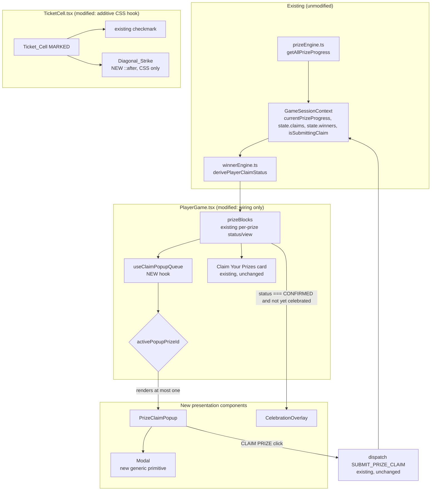

# Design Document

## Overview

This feature adds a UX layer on top of `PlayerGame.tsx`'s existing claim/prize machinery. No change is made to `prizeEngine.ts`, `winnerEngine.ts`, the reducer, `submit_claim`, realtime sync, or reconnect logic — those remain the single source of truth this design reads from.

The design introduces four new pieces, all additive:

1. **`PrizeClaimPopup`** — a new modal component shown automatically the instant a prize's `Player_Claim_Status` is `ELIGIBLE`, reusing `derivePlayerClaimStatus`, `claimStatusView`, `isSubmittingClaim`, and the existing `SUBMIT_PRIZE_CLAIM` dispatch verbatim.
2. **`useClaimPopupQueue`** — a new hook, owned by `PlayerGame.tsx`, that derives *which single* popup (if any) should be visible right now, purely as a function of the existing per-prize `status` list plus one small piece of session-only, in-memory UI state (the dismissed set). This hook is the only new "decision" logic in the feature; everything else is presentation.
3. **`CelebrationOverlay`** — a new transient overlay shown when a prize's status reaches `CONFIRMED`, auto-dismissing itself, honoring `prefers-reduced-motion`.
4. **`Modal`** — a new generic, reusable modal/bottom-sheet primitive in `src/components/common`, since none exists yet. `PrizeClaimPopup` is built on top of it.

Additionally, `TicketCell.tsx` gets one additive CSS hook for the diagonal strike — no markup is removed, no prop/behavior changes.

### Why a queue-derivation hook instead of ad-hoc state in PlayerGame.tsx

`PlayerGame.tsx` already computes `prizeBlocks` (one `{progress, status, view, ...}` per prize) on every render, purely derived from `state`. The popup system needs exactly one more derived value: "which one Prize_Id, if any, should have its popup open right now." Rather than scattering `useState`/`useEffect` calls across `PlayerGame.tsx`, this is isolated into one small hook (`useClaimPopupQueue`) so:

- The *only* piece of genuinely new client-side state is the in-memory dismissed-set (Requirement 4.4) and which Prize_Id is "currently presented" — both ephemeral, un-persisted, and reset on every mount/reload (satisfying Requirement 4.5's "no client-only persisted already-shown state" constraint).
- Popup visibility, ordering, and advancement are expressed as pure functions of `(statuses, dismissedSet, currentlyShownId)`, which is exactly what makes them property-testable (see Correctness Properties).

## Architecture



**Key architectural rule carried through every component below:** nothing in `PrizeClaimPopup`, `useClaimPopupQueue`, or `CelebrationOverlay` ever re-derives eligibility, validation, or claim-decision logic. They only *read* `status` (the existing `PlayerClaimStatus`), `view` (the existing `claimStatusView` output), `isSubmittingClaim(prizeId)`, and `dispatch`.

## Components and Interfaces

### 1. `Modal` (new, `src/components/common/Modal.tsx`)

A generic, reusable, bottom-sheet-style modal, since the codebase has no modal primitive today (confirmed: no hits for "modal" or "dialog" in `src/components`). Minimal API, modeled after the existing `Card`/`Button` conventions (plain props, no portal library, no new dependency):

```tsx
interface ModalProps {
  /** Controls mount/unmount. Modal renders nothing when false. */
  open: boolean
  /** Called when the user dismisses via backdrop tap or close button. */
  onDismiss?: () => void
  /** If false, no close affordance is rendered and onDismiss is never wired to backdrop/Esc (used for the Celebration_Overlay's non-dismissable variant and for popups where dismissal has specific semantics). */
  dismissable?: boolean
  'aria-label': string
  children: ReactNode
}

export function Modal({ open, onDismiss, dismissable = true, children, ...rest }: ModalProps)
```

- Renders a fixed-position backdrop + a bottom-sheet-style panel (`position: fixed; inset: 0`, panel pinned to bottom, `max-width: 460px` centered — matching `.player__inner`), not a `<dialog>`/portal, since the whole app already renders inline (no portal root exists). Rendered directly inside `PlayerGame`'s tree where used, which also naturally keeps it under the Ticket's focus scope without extra wiring.
- Uses `role="dialog"` and `aria-modal="true"` for accessibility; traps no focus beyond what's needed (single primary button in practice) to keep this minimal.
- `Modal.css` follows the existing per-component CSS file convention (`Button.css`, `Card.css`).

### 2. `PrizeClaimPopup` (new, `src/components/player/PrizeClaimPopup.tsx`)

```tsx
interface PrizeClaimPopupProps {
  progress: PrizeProgress
  status: PlayerClaimStatus
  view: { message: string; buttonLabel: string; buttonDisabled: boolean }
  isSubmitting: boolean
  onClaim: () => void
  onDismiss: () => void
}

export function PrizeClaimPopup({ progress, status, view, isSubmitting, onClaim, onDismiss }: PrizeClaimPopupProps)
```

- Renders inside `Modal`. Title = `progress.label` (Req 1.2). Body message = `view.message` (reused verbatim from `claimStatusView`, satisfying Req 2.4's "same rejection message" and Req 1.4's "no new claim-decision logic").
- Primary button label = `isSubmitting ? 'Submitting Claim...' : view.buttonLabel`, `disabled={view.buttonDisabled || isSubmitting}` — identical derivation to the existing "Claim Your Prizes" card's button (Req 2.1, 2.2, 2.6), so the two surfaces can never disagree.
- `onClick` of the primary button calls `onClaim`, which `PlayerGame.tsx` wires to the exact same dispatch call already used by the card:
  ```tsx
  onClaim={() => dispatch({ type: 'SUBMIT_PRIZE_CLAIM', playerId: currentPlayer.id, ticketId: currentTicket.id, prizeId: progress.id })}
  ```
  (Req 1.3.) No new dispatch shape, no new action type.
- `Modal`'s `dismissable` is `true` only while `status === 'ELIGIBLE'` (a player can back out of an eligible-but-not-yet-claimed popup, Req 4.4); it is `false` while `status === 'PENDING'`/submitting (nothing meaningful to dismiss *to* — the card still shows the same pending state) and the popup instead auto-closes via the queue hook on `CONFIRMED`/`REJECTED`/`CLOSED_BY_OTHER_WINNER` transitions (Req 2.3, 2.5). On `REJECTED`, dismissal is allowed again (same `ELIGIBLE`-like resubmittable shape, Req 2.6).
- Does not itself contain any status-branching beyond what's needed to pick `dismissable` and button label — all message/label/disabled content comes from `view`.

### 3. `useClaimPopupQueue` (new hook, `src/hooks/useClaimPopupQueue.ts`)

This is the one piece of new decision logic. It is a pure function wrapped in a `useReducer`-backed hook so it can hold the small amount of session-only UI state (Requirement 4.4/4.5).

```ts
export interface ClaimPopupQueueInput {
  /** One entry per prize, in the exact order getAllPrizeProgress() already returns (Req 3.4). */
  prizeStatuses: { prizeId: PrizeId; status: PlayerClaimStatus }[]
}

export interface ClaimPopupQueueResult {
  /** The single Prize_Id whose popup should be visible right now, or undefined (Req 3.1, 3.2). */
  activePopupPrizeId: PrizeId | undefined
  /** Call when the player explicitly dismisses the currently-active popup while it is ELIGIBLE (Req 4.4). */
  dismissActivePopup: () => void
  /** The set of Prize_Ids that just transitioned into CONFIRMED and have not yet had their Celebration_Overlay shown (Req 2.3, 6.1). Consumed/cleared via acknowledgeCelebration. */
  pendingCelebrationPrizeId: PrizeId | undefined
  acknowledgeCelebration: (prizeId: PrizeId) => void
}

export function useClaimPopupQueue(input: ClaimPopupQueueInput): ClaimPopupQueueResult
```

**Pure derivation function** (the part that is property-tested directly, independent of React):

```ts
export function deriveActivePopup(
  prizeStatuses: { prizeId: PrizeId; status: PlayerClaimStatus }[],
  dismissedThisSession: ReadonlySet<PrizeId>,
  currentlyShown: PrizeId | undefined,
): PrizeId | undefined {
  // 1. If a popup is already showing and its status is still "poppable"
  //    (ELIGIBLE or PENDING-from-this-popup's-own-submission), keep showing it —
  //    this is what lets the loading/rejected states render in place rather
  //    than the popup flickering to a different prize mid-submission.
  const current = prizeStatuses.find((p) => p.prizeId === currentlyShown)
  if (current && (current.status === 'ELIGIBLE' || current.status === 'PENDING' || current.status === 'REJECTED')) {
    return currentlyShown
  }
  // 2. Otherwise pick the first ELIGIBLE, not-yet-dismissed-this-session
  //    prize, in prizeStatuses' own order (already PRIZES order per Req 3.4).
  return prizeStatuses.find(
    (p) => p.status === 'ELIGIBLE' && !dismissedThisSession.has(p.prizeId),
  )?.prizeId
}
```

- `dismissedThisSession` is a plain in-memory `Set<PrizeId>` held in `useState`/`useReducer` inside the hook — **never written to `localStorage`/`sessionStorage`**, so it is naturally cleared on reload/reconnect (Req 4.5). It only ever suppresses *automatic* re-popping of an `ELIGIBLE` prize the player already explicitly dismissed; it is never consulted by the existing "Claim Your Prizes" card, which stays fully independent (Req 1.5, 4.4).
- Celebration tracking (`pendingCelebrationPrizeId`) is derived the same way: the hook remembers the previous render's statuses (via a ref) and, when a prize's status transitions from anything else *to* `CONFIRMED`, flags it for one celebration; `acknowledgeCelebration` clears the flag once `CelebrationOverlay` finishes. This state is also in-memory only.
- Because `activePopupPrizeId` and `pendingCelebrationPrizeId` are mutually exclusive by construction (a `CONFIRMED` prize is never `ELIGIBLE`, so step 2 above can never select it, and step 1 only keeps a popup open for `ELIGIBLE`/`PENDING`/`REJECTED`), **a popup and the celebration overlay can never both be non-undefined at once** (Req 3.2).

### 4. `CelebrationOverlay` (new, `src/components/player/CelebrationOverlay.tsx`)

```tsx
interface CelebrationOverlayProps {
  prizeLabel: string
  onDismiss: () => void
  /** Overridable for tests; defaults to reading `matchMedia('(prefers-reduced-motion: reduce)')`. */
  reducedMotion?: boolean
}

export function CelebrationOverlay({ prizeLabel, onDismiss, reducedMotion }: CelebrationOverlayProps)
```

- Not built on `Modal` (it is non-dismissable by the user and must not trap interaction — Req 6.4), but visually layered the same way: a fixed-position container within `.player__inner`'s width.
- Reads `reducedMotion` via `window.matchMedia('(prefers-reduced-motion: reduce)').matches` by default (standard web API, no new dependency), overridable by prop for deterministic testing.
- **Animated branch** (`reducedMotion === false`): a small, dependency-free CSS-only confetti effect — a fixed number (e.g. 24) of absolutely-positioned `<span>` elements with staggered `animation-delay`, animated via CSS `@keyframes` (fall + fade), layered over a "🏆 {prizeLabel} confirmed!" message. No canvas, no animation library — keeps the dependency footprint at zero, consistent with `package.json`'s current dependency set (no animation libs present).
- **Reduced-motion branch**: renders the identical "🏆 {prizeLabel} confirmed!" message with no animated spans and no `@keyframes`-driven elements — same confirmed-win information, Req 6.6.
- Auto-dismiss: a `useEffect` with `setTimeout(onDismiss, CELEBRATION_DURATION_MS)` (constant, e.g. 3000ms), cleared on unmount. `onDismiss` is `acknowledgeCelebration(prizeId)` from the queue hook, which unmounts `CelebrationOverlay` entirely — satisfying Req 6.5 ("remove every DOM element it added") by construction, since conditional rendering (`{pendingCelebrationPrizeId && <CelebrationOverlay .../>}`) removes the whole subtree.
- Rendered with `pointer-events: none` on the decorative confetti spans (not the dismiss timer) so the ticket beneath remains tappable while the overlay is visible (Req 6.4) — the overlay itself does not cover the full ticket, only a banner-style region, so Requirement 6.4's "remain usable" holds without needing to special-case pointer-events on the whole overlay.

### 5. `PlayerGame.tsx` (modified: wiring only)

Changes are additive and localized:

```tsx
const popupQueue = useClaimPopupQueue({
  prizeStatuses: prizeBlocks.map((b) => ({ prizeId: b.progress.id, status: b.status })),
})

const activeBlock = prizeBlocks.find((b) => b.progress.id === popupQueue.activePopupPrizeId)
const celebratingBlock = prizeBlocks.find((b) => b.progress.id === popupQueue.pendingCelebrationPrizeId)
```

- `activeBlock` (if any) renders one `<PrizeClaimPopup>` using that block's existing `progress`/`status`/`view`/`isSubmitting`, wired to the existing dispatch and to `popupQueue.dismissActivePopup`.
- `celebratingBlock` (if any) renders one `<CelebrationOverlay prizeLabel={celebratingBlock.progress.label} onDismiss={() => popupQueue.acknowledgeCelebration(celebratingBlock.progress.id)} />`.
- Both are rendered as siblings near the top of `.player__inner`'s JSX (position is irrelevant since both use `position: fixed`), **after** the existing "Claim Your Prizes" card's JSX in source order so they are both still inside the component but visually overlay everything — the card itself is untouched (Req 1.5).
- No other change to `PlayerGame.tsx`'s existing logic, state, or the `prizeBlocks` derivation.

### 6. `TicketCell.tsx` (modified: additive CSS hook only)

```tsx
<button
  type="button"
  className={`ticket-cell ${isMarked ? 'ticket-cell--marked' : 'ticket-cell--unmarked'}`}
  ...
>
  {cell.state === 'MARKED' && (
    <span className="ticket-cell__icon" aria-hidden="true">{STATE_META.MARKED.icon}</span>
  )}
  <span className="ticket-cell__term">{cell.term}</span>
</button>
```

No JSX change is actually required: `.ticket-cell--marked` already exists as a class on exactly the cells this feature needs to target. The diagonal strike is added **purely in `Ticket.css`**, as a `::after` pseudo-element scoped to `.ticket-cell--marked`:

```css
.ticket-cell--marked {
  position: relative; /* establishes the containing block for ::after, Req 5.4 */
}

.ticket-cell--marked::after {
  content: '';
  position: absolute;
  left: 6%;
  right: 6%;
  top: 50%;
  height: 2px;
  background: var(--color-accent-strong);
  transform: translateY(-50%) rotate(-18deg);
  pointer-events: none; /* never intercepts the cell's own click (Req 5.1 additive, not replacing tap behavior) */
}
```

- `position: relative` + percentage-based `left`/`right` keep the strike confined to the cell's own box at any width, including `.player__inner`'s 460px mobile frame (Req 5.4, 7.3) — no fixed pixel widths that could overflow on narrow phones.
- `pointer-events: none` and `content: ''` on a pseudo-element mean `.ticket-cell__term`'s actual text node is never touched, removed, or covered by a sibling DOM node (Req 5.2) — it is a thin line layered via `z-index`-free stacking (the pseudo-element paints after the text in the same stacking context, but at 2px tall and translated to the vertical center it does not visually cover full glyph height for the term font sizes in `Ticket.css`, satisfying Req 5.3 at the component level; final visual confirmation is manual, see Testing Strategy).
- Rendered only when `.ticket-cell--marked` is present, i.e. exactly when `cell.state === 'MARKED'` — never for `--unmarked` (Req 5.5), with zero new JSX/props.

## Data Models

No new persisted data model. Two new, purely client-side, in-memory (never serialized, never sent to Supabase) shapes:

```ts
/** Owned entirely inside useClaimPopupQueue's internal state; never exported raw. */
interface ClaimPopupQueueState {
  /** Prize_Ids the player explicitly dismissed this session while ELIGIBLE (Req 4.4). Plain Set, in-memory only. */
  dismissedThisSession: Set<PrizeId>
  /** The Prize_Id whose popup is currently being shown, if any (lets the hook keep showing the same popup through PENDING/REJECTED transitions). */
  currentlyShown: PrizeId | undefined
  /** The previous render's status-per-prize snapshot, used to detect a fresh transition into CONFIRMED (so celebration fires once, not on every re-render while CONFIRMED). */
  previousStatuses: Map<PrizeId, PlayerClaimStatus>
  /** The Prize_Id currently flagged for its one-time Celebration_Overlay, if any. */
  pendingCelebrationPrizeId: PrizeId | undefined
}
```

All fields reset to their initial empty values on every mount (component remount = page reload = new game session tab), which is exactly the desired behavior per Requirement 4.5 — there is no `localStorage`/`sessionStorage` write anywhere in this feature.

No change to `PrizeProgress`, `PlayerClaimStatus`, `PrizeClaim`, or `Winner` (all reused verbatim from `src/types/prize.ts` and `winnerEngine.ts`).

## Correctness Properties

*A property is a characteristic or behavior that should hold true across all valid executions of a system-essentially, a formal statement about what the system should do. Properties serve as the bridge between human-readable specifications and machine-verifiable correctness guarantees.*

The queue-derivation logic (`deriveActivePopup` and its celebration-tracking counterpart) is a pure function over small enumerable input spaces (5 `PrizeId`s × 6 `PlayerClaimStatus` values × a boolean dismissed-set × an optional "currently shown" id), making it an ideal target for property-based testing with `fast-check` (already a devDependency). `PrizeClaimPopup`'s and `TicketCell`'s rendering are likewise pure functions of their props, suitable for property tests over randomized prop combinations. Visual/layout concerns (strike confinement at a given CSS width, "readability," overlay rendering within 460px) are **not** modeled as properties — they require manual/visual review and are called out explicitly in Testing Strategy instead.

### Property 1: Exactly one eligible-and-not-dismissed prize's popup is shown, in PRIZES order

*For any* list of `(prizeId, status)` pairs covering any subset of the five `PrizeId`s in any status, and *for any* dismissed-set and currently-shown value, `deriveActivePopup` returns either `undefined` or a `prizeId` whose status is `ELIGIBLE`, `PENDING`, or `REJECTED` — and when it falls through to picking a fresh prize (no eligible "currently shown" carried over), it returns the *first* prize in the input's own order whose status is `ELIGIBLE` and which is not in the dismissed-set, matching the order `getAllPrizeProgress()` already produces.

**Validates: Requirements 1.1, 3.1, 3.4, 4.1, 4.2, 4.3**

### Property 2: Popup and Celebration overlay are mutually exclusive

*For any* sequence of status-list snapshots fed into the queue hook across successive renders, at no point are both `activePopupPrizeId` and `pendingCelebrationPrizeId` simultaneously defined.

**Validates: Requirements 3.2**

### Property 3: Closing the current popup advances to the next still-eligible queued prize, or to none

*For any* set of `PrizeId`s with `ELIGIBLE` status and a currently-shown prize among them, simulating that popup's closure (by changing its status away from `ELIGIBLE`/`PENDING`/`REJECTED`, or by dismissing it) causes the next call to `deriveActivePopup` to return the next remaining `ELIGIBLE`, not-dismissed prize in `PRIZES` order, or `undefined` if none remain.

**Validates: Requirements 3.3**

### Property 4: Dismissing an eligible popup suppresses it for the rest of the session but never touches other prizes or the manual claim card

*For any* `PrizeId` dismissed while its status is `ELIGIBLE`, every subsequent call to `deriveActivePopup` with that same `prizeId` still `ELIGIBLE` and still in the dismissed-set never returns that `prizeId`, while any *other* `PrizeId` that independently becomes `ELIGIBLE` is unaffected by that dismissal and can still be returned.

**Validates: Requirements 4.4**

### Property 5: A CONFIRMED transition is flagged for celebration exactly once

*For any* sequence of status snapshots in which a given `prizeId`'s status changes from a non-`CONFIRMED` value to `CONFIRMED` and then stays `CONFIRMED` across further renders, the queue hook flags that `prizeId` as `pendingCelebrationPrizeId` on the render where the transition is first observed, and does not re-flag it again on subsequent renders while it remains `CONFIRMED` (until `acknowledgeCelebration` is called and a *new* transition could occur only for a different prize, since a prize cannot leave `CONFIRMED` once reached).

**Validates: Requirements 2.3, 6.1, 6.2**

### Property 6: Popup content and button state are a pure function of status, progress, and submission flag

*For any* `PrizeProgress`, `PlayerClaimStatus`, `claimStatusView` output, and `isSubmitting` boolean, `PrizeClaimPopup`'s rendered title equals `progress.label`, its rendered message equals the given `view.message` verbatim, and its primary button is disabled if and only if `view.buttonDisabled || isSubmitting` — identical to the derivation already used by the existing "Claim Your Prizes" card.

**Validates: Requirements 1.2, 2.1, 2.4, 2.6**

### Property 7: Claiming always dispatches the exact existing action shape, exactly once per enabled click

*For any* `playerId`, `ticketId`, and `prizeId`, activating `PrizeClaimPopup`'s primary button while it is enabled calls the provided `onClaim` exactly once per click, and `PlayerGame.tsx`'s wiring of `onClaim` issues `dispatch({ type: 'SUBMIT_PRIZE_CLAIM', playerId, ticketId, prizeId })` with no additional fields; activating it while disabled (per Property 6) never calls `onClaim`.

**Validates: Requirements 1.3, 2.2**

### Property 8: The diagonal strike CSS hook is present if and only if the cell is MARKED, and term text is always preserved

*For any* `TicketCellData` (any `termId`/`term`/`state`), `TicketCell`'s rendered root `className` includes `ticket-cell--marked` if and only if `cell.state === 'MARKED'`, the existing checkmark icon is present if and only if `cell.state === 'MARKED'`, and the rendered `.ticket-cell__term` text content always equals `cell.term` exactly, regardless of state.

**Validates: Requirements 5.1, 5.2, 5.5**

### Property 9: Celebration overlay shows identical confirmed-win information under both motion preferences

*For any* `prizeLabel` string and boolean `reducedMotion` value, `CelebrationOverlay`'s rendered text content includes `prizeLabel`'s confirmed-win message in both branches, and the animated confetti elements are rendered if and only if `reducedMotion` is `false`.

**Validates: Requirements 6.6**

## Error Handling

This feature introduces no new error states of its own — it has no network calls, no validation, and no new failure modes beyond what `SUBMIT_PRIZE_CLAIM`'s existing dispatch path already handles (rollback on RPC rejection, `REJECTED` status, `lastSessionGuardFailure`). Specifically:

- **Claim rejected mid-popup**: handled entirely by reading `status === 'REJECTED'` and `view.message` (Req 2.4) — no new error branch.
- **Session guard failure while a popup is open** (`lastSessionGuardFailure.prizeId === progress.id`, existing mechanism): `PlayerGame.tsx`'s existing card already special-cases this with a "Refresh" prompt. `PrizeClaimPopup` is given the same `sessionGuardFailed` boolean already computed in `prizeBlocks` and renders the identical "session out of date, refresh" message/button in place of the claim button when true, rather than inventing a second messaging path.
- **Component unmounts mid-flight** (e.g. player navigates away while `isSubmittingClaim` is true): no cleanup needed beyond React's own unmount — `isSubmittingClaim` lives in `GameSessionContext`, not in these components, so it is unaffected by `PrizeClaimPopup` unmounting.
- **`matchMedia` unavailable** (older/non-standard environment): `CelebrationOverlay` guards the read with `typeof window.matchMedia === 'function'`, defaulting `reducedMotion` to `false` (animated branch) if the API is absent, so the overlay never throws.
- **Multiple prizes reaching `ELIGIBLE`/`CONFIRMED` in the same render** (e.g. a single mark completes two line prizes at once): fully covered by `deriveActivePopup`'s deterministic ordering (Property 1) and the celebration flag being keyed per-`prizeId` (Property 5) — no race, since this is a pure synchronous derivation from one render's status snapshot, not an async operation.

## Testing Strategy

**Property-based tests** (Properties 1-9 above), using `fast-check` (already a devDependency, consistent with the rest of the codebase's testing conventions seen in `*.integration.test.tsx`/`*.test.tsx` files), each configured for a minimum of 100 iterations and tagged with its design property:

- Generators needed: arbitrary subsets/orderings of the 5 `PrizeId`s, arbitrary `PlayerClaimStatus` values, arbitrary status-sequences (for transition properties 3 and 5), arbitrary `PrizeProgress`/`view` shapes, arbitrary strings for `prizeLabel`/`term`.
- Each property test imports and calls the real exported pure functions (`deriveActivePopup` and the hook's celebration-tracking logic extracted similarly, or exercised via `@testing-library/react`'s `renderHook`) and the real `PrizeClaimPopup`/`TicketCell`/`CelebrationOverlay` components via `@testing-library/react`, matching the existing test style (`PrizeProgressList.test.tsx`, `ClaimStatusTag.test.tsx`, `Ticket.test.tsx`).
- Tag format in each test file: `// Feature: player-ux-improvements, Property N: <property text>`.

**Unit/example tests** (not property-based, per the decision guide — fixed single scenarios, not varying meaningfully with input):

- Req 2.7 / 6.4 (ticket remains tappable while popup/overlay is open): render `PrizeGame`'s relevant subtree with a popup/overlay mounted, fire one tap on a `TicketCell`, assert the tap's `onToggle` still fires.
- Req 6.3 (auto-dismiss timing) and Req 6.5 (DOM cleanup on dismiss): mount `CelebrationOverlay` with fake timers (`vi.useFakeTimers()`, consistent with existing Vitest setup), advance exactly the configured duration, assert `onDismiss` fired and (when wired through `PlayerGame`'s conditional render) the overlay's container is no longer in the DOM.
- `Modal` basic behavior: open/closed render, backdrop/Esc dismissal only when `dismissable`, `role="dialog"`/`aria-modal` present.
- Error-handling branch: session-guard-failed rendering inside `PrizeClaimPopup` (one fixed scenario, mirroring the existing card's own test coverage pattern if any exists, otherwise a new focused test).

**Not covered by automated tests — explicitly manual/visual review** (per Requirements 5.3, 5.4, 7.1-7.4, 6.7, which are visual/layout concerns not expressible as jsdom assertions):
- Diagonal strike legibility across the longest terms in the term bank, at 460px and wider.
- Popup and celebration overlay fitting within `.player__inner` at common smartphone viewport heights without the CLAIM PRIZE button being pushed off-screen.
- No horizontal scroll introduced by the overlay/popup at mobile widths.

These are called out to the user as required manual checks before merge, consistent with this design's note in Error Handling / Testing Strategy that visual qualities are not property-testable.

**Preservation**: no existing test file for `prizeEngine.ts`, `winnerEngine.ts`, the reducer, or the existing "Claim Your Prizes" card's rendering is modified by this feature — those continue to pass unchanged, confirming Requirement 8's "UX layer only" constraint is upheld in practice, not just by design intent.
