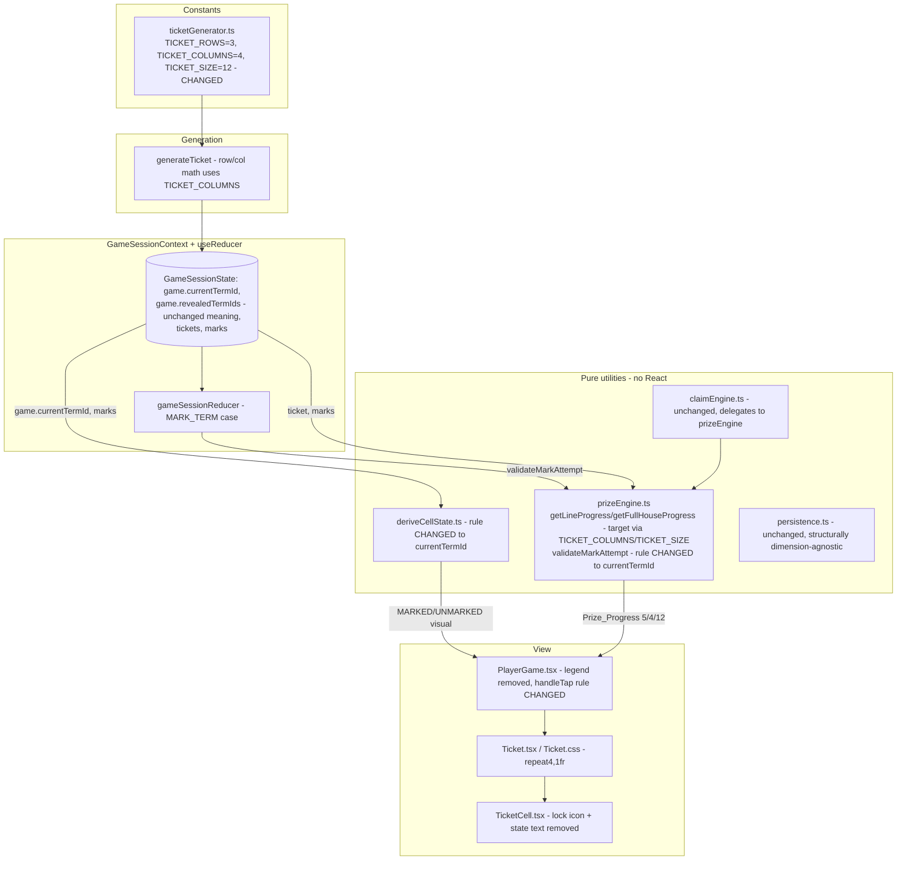
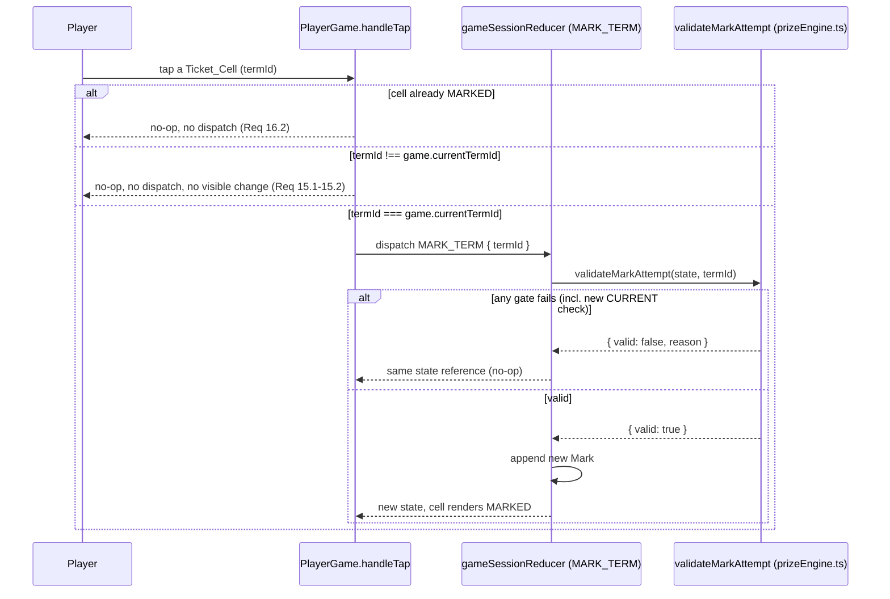
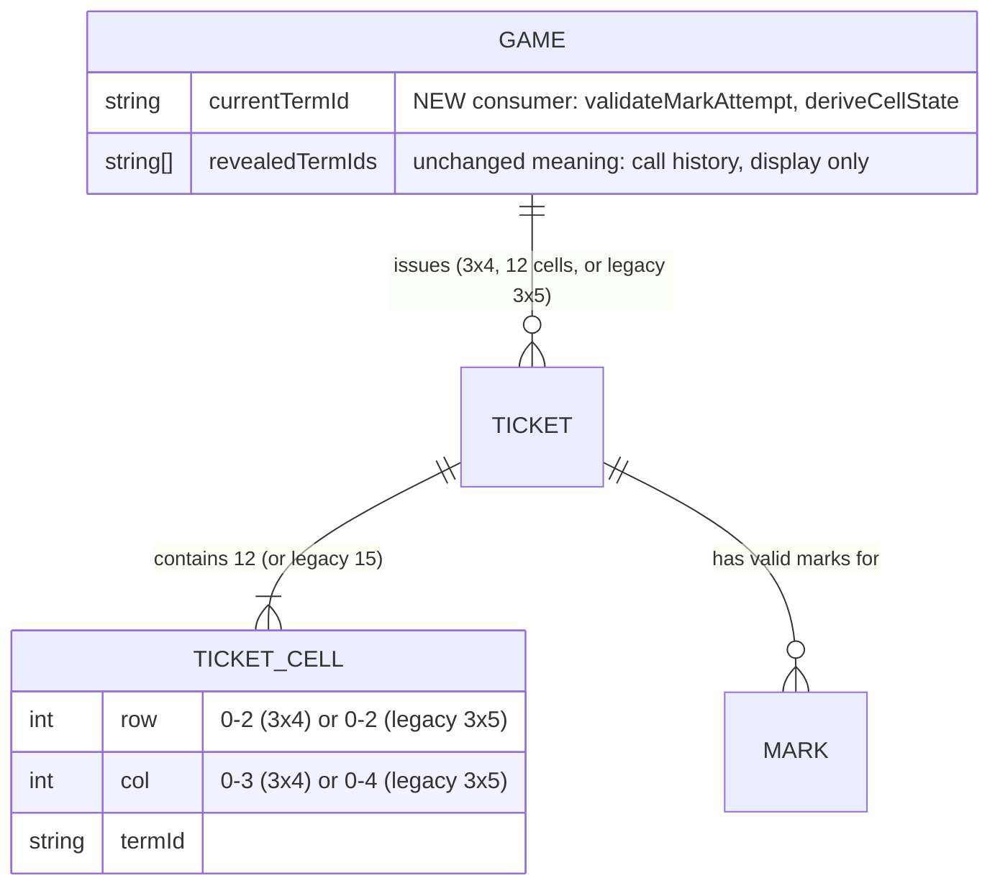

# Design Document

## Overview

This refactor shrinks the Cyber Tambola ticket from 3 rows x 5 columns (15 cells) to 3 rows x 4 columns (12 cells), and tightens the marking rule from "any officially-called term" to "only the single current term." Both changes are cross-cutting but shallow: almost every file that needs to change already expresses the old shape as a small number of named constants, a row/column computation, or a target number, rather than as deeply embedded logic. The core design move is to **finish the job the codebase already started** — `src/utils/ticketGenerator.ts` already exports `TICKET_ROWS`/`TICKET_COLS`/`TICKET_SIZE` as the nominal single source of truth; this refactor renames `TICKET_COLS` to `TICKET_COLUMNS`, changes its value from 5 to 4, and makes every other dimension-sensitive module (`prizeEngine.ts`, `claimEngine.ts`, test fixtures, UI components) import from it instead of hardcoding `5`/`15`.

The marking-rule change is a separate, independent concern layered on top: today `deriveCellState.ts` and `prizeEngine.validateMarkAttempt` treat "markable" as "present in `game.revealedTermIds`" (the full call history). This design narrows that to "equals `game.currentTermId`" (the single current term), while leaving the `revealedTermIds` field itself untouched for display/history purposes — mirroring the same "keep the field, change one consumer's rule" strategy the `module-5-direct-word-call-gameplay` design used for the previous `revealedTermIds` semantics change.

This repository has no SQL/RPC source files — `submit_mark` and the other RPC names in `src/state/realtimeClient.ts` are thin typed wrappers around `supabase.rpc(...)`, exercised in tests only through `src/state/testSupport/mockSupabaseClient.ts`. The actual authoritative gameplay rules live in `src/utils/prizeEngine.ts`'s `validateMarkAttempt`, called from the `MARK_TERM` reducer case — that pure function **is** this prototype's "shared mutation layer" referred to in Requirements 17-19. Requirement 18 (Supabase RPC parity) and the backend half of Requirement 19 (server-side race resolution) describe a production SQL function this repository does not contain; this design calls that out explicitly as a documented gap rather than inventing SQL that cannot be verified against anything in the repo.

This design is grounded in a full read of: `src/utils/{ticketGenerator.ts, ticketGenerator.test.ts, prizeEngine.ts, claimEngine.ts, deriveCellState.ts, winnerEngine.ts}`, `src/types/{ticket.ts, game.ts, prize.ts, mark.ts}`, `src/components/player/{Ticket.tsx, Ticket.css, TicketCell.tsx, PrizeProgressList.tsx, PrizeProgressList.css}`, `src/pages/PlayerGame/PlayerGame.tsx`, `src/pages/HostDashboard/{HostDashboard.tsx, hostClaimInboxViewModel.test.ts}`, `src/pages/PresentationView/PresentationView.tsx`, `src/state/{persistence.ts, gameSessionReducer.ts, realtimeClient.ts, testSupport/mockSupabaseClient.ts}`, and prior specs' `design.md` files (`module-3-player-joining-tickets`, `module-4-term-marking-prize-engine`, `module-5-direct-word-call-gameplay`) for conventions.

### Research notes

No external research was required. Every open question is resolved by reading this repository's existing code and conventions:

- **PBT library**: this codebase already uses [fast-check](https://fast-check.dev/) with vitest (`src/utils/ticketGenerator.test.ts`, `src/state/persistence.test.ts`, `src/pages/HostDashboard/hostClaimInboxViewModel.test.ts`), at a 100-run minimum. This design continues that convention rather than introducing a second PBT library.
- **Signature delimiter**: already `|` (`computeSignature` in `ticketGenerator.ts`). Unchanged — Requirement 6.1 only requires "a single consistent delimiter," which already exists and has its own passing property test; there is no reason to change it.
- **Supabase RPC source**: confirmed absent from the repository via search (`submit_mark`, `createClient`, `*.sql`) — only the client wrapper and its mock exist. Documented as a known gap (see Error Handling and Requirement 18/19 coverage below) rather than fabricated.

## Architecture

### Component and data-flow overview



### Marking-eligibility flow (tap on an unmarked cell)



### Key architectural decisions

| Decision | Rationale |
| --- | --- |
| Rename `TICKET_COLS` -> `TICKET_COLUMNS`, change value 5 -> 4, keep `TICKET_SIZE = TICKET_ROWS * TICKET_COLUMNS` | Requirement 1 explicitly calls for the renamed export; computing `TICKET_SIZE` rather than hardcoding it prevents the two values from ever disagreeing again. |
| Keep `revealedTermIds` field and meaning (call history); add a separate current-term check | Mirrors the `module-5-direct-word-call-gameplay` precedent of "keep the field, change the rule" — renaming or removing `revealedTermIds` would ripple through persistence, sync, and ~10 unrelated tests for no requirement-driven reason (Req 14.3 explicitly keeps call history for display). |
| Collapse `LOCKED`/`AVAILABLE` to one visual presentation ("UNMARKED"), keep the two internal `TicketCellState` values | Requirement 13.5 explicitly allows internal distinctions to persist in code while forbidding any visible/programmatic difference; keeping the type avoids a wider rename across `deriveCellState`, `Mark`-adjacent code, and tests, while `TicketCell.tsx` only ever branches on `state === 'MARKED'`. |
| `validateMarkAttempt`'s `TERM_NOT_REVEALED` gate is replaced by a `TERM_NOT_CURRENT` gate checking `termId === game.currentTermId` | Requirement 14 requires only the current term to be newly markable; `revealedTermIds` membership is no longer sufficient. The gate *order* and every other gate are unchanged, preserving Requirement 17.1's ordering guarantee. |
| `claimEngine.ts` requires no code change | It already delegates 100% of eligibility computation to `prizeEngine.getAllPrizeProgress` + `isPrizeEligible` and contains no row/column/size literals of its own (confirmed by reading the file) — once `prizeEngine.ts` reports the correct 4/12 targets, `claimEngine.ts` is correct by construction (Req 23.4, 23.5). |
| `persistence.ts` requires no structural code change | It serializes `Ticket`/`Mark` objects generically (no row/column/size literals, no shape validation beyond `Array.isArray`) — a 12-cell ticket round-trips through `toEnvelope`/`parseEnvelope` today with zero changes (Req 5.1-5.3). Only the **hydration validation** gap (Req 5.4 — reject malformed cell counts) and **legacy detection** (Req 7) are new. |
| Legacy-ticket detection is a runtime shape check (`ticket.rows.length === 3 && ticket.rows[0]?.length === 5`), not a stored flag | No `Ticket` field distinguishes format today, and adding one would require migrating every already-persisted ticket. A pure structural predicate (`isLegacyTicket`) needs no migration and is trivially testable. |
| No SQL/RPC changes are authored | No `.sql` or RPC-definition source exists anywhere in this repository; `submit_mark` is purely a client-side typed wrapper. Writing SQL here would be unverifiable fiction. Documented as a gap against Req 18 and the backend half of Req 19 (see Error Handling). |

## Components and Interfaces

### 1. `src/utils/ticketGenerator.ts` (changed)

```ts
export const TICKET_ROWS = 3
export const TICKET_COLUMNS = 4          // was TICKET_COLS = 5
export const TICKET_SIZE = TICKET_ROWS * TICKET_COLUMNS // 12 (was 15)
export const MAX_UNIQUE_ATTEMPTS = 50    // unchanged
```

- `generateTicket`'s row/col assignment loop changes `Math.floor(i / TICKET_COLS)` / `i % TICKET_COLS` to use `TICKET_COLUMNS` (Req 4.1). With `TICKET_COLUMNS = 4`, flat indexes `0-3` -> row 0, `4-7` -> row 1, `8-11` -> row 2 (Req 4.2) — this falls out of the existing formula once the constant changes; no new logic is needed.
- `getActiveTerms`, `computeSignature`, `shuffle`, and the retry loop are structurally untouched — they already operate on `TICKET_SIZE` and a `string[]` of ids with no hardcoded `15` (confirmed by reading the file). The error messages' interpolated `${TICKET_SIZE}` automatically become `12`.
- Every importer of `TICKET_COLS` (`ticketGenerator.test.ts` and any other consumer) is updated to import `TICKET_COLUMNS` (Req 1.3).

### 2. `src/types/ticket.ts` (changed — doc comments and range comments only)

```ts
/** A single cell on a player's cyber-word ticket. */
export interface TicketCell {
  termId: string
  term: string
  state: TicketCellState
  /** Row index within the 3x4 grid, 0-2. */
  row: number
  /** Column index within the 3x4 grid, 0-3. */
  col: number
}

/**
 * A 3 x 4 cyber-word ticket (12 terms).
 * ...
 */
export interface Ticket {
  // unchanged fields
  /** Rows of cells; 3 rows of 4. */
  rows: TicketCell[][]
}
```

No field, type, or runtime shape changes — only the documentation text (Req 3.2) and the row/col range comments (Req 3.1). `TicketCellState` (`'LOCKED' | 'AVAILABLE' | 'MARKED'`) is unchanged (see architectural decision above).

### 3. `src/utils/prizeEngine.ts` (changed)

```ts
import { TICKET_COLUMNS, TICKET_SIZE } from './ticketGenerator'

export const PRIZES: readonly Prize[] = [
  { id: 'CYBER_FIVE', label: 'Cyber Five', target: 5 },                       // unchanged (Req 20)
  { id: 'FIREWALL_LINE', label: 'Firewall Line', target: TICKET_COLUMNS },    // was 5, now 4
  { id: 'SECURITY_LINE', label: 'Security Line', target: TICKET_COLUMNS },
  { id: 'DATA_DEFENDER_LINE', label: 'Data Defender Line', target: TICKET_COLUMNS },
  { id: 'CYBER_FULL_HOUSE', label: 'Cyber Full House', target: TICKET_SIZE }, // was 15, now 12
]
```

- `getCyberFiveProgress`: **unchanged** — it already caps at the literal `5`, which Requirement 20/24.3 explicitly says must stay a literal (it is not a ticket-dimension constant).
- `getLineProgress`: its `target: 5` literal becomes `target: TICKET_COLUMNS`. The row-slicing logic itself (`ticket.rows[row] ?? []`) is already dimension-agnostic — it slices whatever row length is present, so once a 3x4 ticket is passed in, `rowCells.length` is naturally 4 (Req 4.3, 21.1).
- `getFullHouseProgress`: its `target: 15` literal becomes `target: TICKET_SIZE`; `ticketTermIds.length` is naturally 12 for a 3x4 ticket, no logic change (Req 22.1).
- `validateMarkAttempt`: the gate currently named conceptually "term not revealed" changes its check and reason code:

```ts
export type MarkValidationResult =
  | { valid: true }
  | {
      valid: false
      reason:
        | 'NO_CURRENT_PLAYER'
        | 'TICKET_NOT_FOUND'
        | 'TERM_NOT_ON_TICKET'
        | 'TERM_NOT_CURRENT'   // renamed from 'TERM_NOT_REVEALED'
        | 'GAME_COMPLETED'
        | 'DUPLICATE_MARK'
    }

// Gate 4, previously:
//   if (!state.game.revealedTermIds.includes(termId)) return { valid: false, reason: 'TERM_NOT_REVEALED' }
// becomes:
if (termId !== state.game.currentTermId) {
  return { valid: false, reason: 'TERM_NOT_CURRENT' }
}
```

Gate order, every other gate, and the function signature are unchanged (Req 14.1, 17.1). `game.revealedTermIds` is no longer read by this function at all — it remains fully intact on `Game` for display purposes (Req 14.3), just no longer consulted here.

### 4. `src/utils/deriveCellState.ts` (changed)

```ts
export function deriveCellState(
  termId: string,
  currentTermId: string | undefined,   // was: revealedTermIds: readonly string[]
  markedTermIds: ReadonlySet<string>,
): TicketCellState {
  if (markedTermIds.has(termId)) return 'MARKED'
  return termId === currentTermId ? 'AVAILABLE' : 'LOCKED'
}
```

The function keeps its three-value return type (internal `LOCKED`/`AVAILABLE` distinction preserved per Requirement 13.5) but its second parameter changes from the call-history array to the single `currentTermId`. Checking `markedTermIds` first ensures a term that was current, got marked, and is no longer current still reports `MARKED` (not `LOCKED`) — required by Requirement 16.1 (marks are permanent) interacting with Requirement 14 (only current is newly markable). Every call site (`PlayerGame.tsx`) passes `game.currentTermId` instead of `game.revealedTermIds`.

### 5. `src/components/player/TicketCell.tsx` (changed)

```tsx
const STATE_META = {
  LOCKED: { hint: 'Not revealed yet' },
  AVAILABLE: { hint: 'Available — tap to mark' },
  MARKED: { icon: '✓', hint: 'Marked' },
} as const

export function TicketCell({ cell, onToggle }: TicketCellProps) {
  const meta = STATE_META[cell.state]
  const isMarked = cell.state === 'MARKED'

  return (
    <button
      type="button"
      className={`ticket-cell ${isMarked ? 'ticket-cell--marked' : 'ticket-cell--unmarked'}`}
      onClick={() => onToggle(cell.termId)}
      aria-pressed={isMarked}
      aria-label={`${cell.term}. ${meta.hint}`}
    >
      {isMarked && (
        <span className="ticket-cell__icon" aria-hidden="true">
          {meta.icon}
        </span>
      )}
      <span className="ticket-cell__term">{cell.term}</span>
    </button>
  )
}
```

Key changes, each tied to a requirement:
- **No lock icon markup for any unmarked state** (Req 10.1, 10.2) — the icon span only renders when `isMarked`; `LOCKED`'s `🔒` icon is deleted entirely, not just hidden.
- **No visible "Locked"/"Available"/"Marked" text span** (Req 11.1) — the `ticket-cell__state` span is deleted; `meta.hint` is used only inside `aria-label`, never rendered as visible text.
- **`disabled={isLocked}` is removed** — Requirement 13.2 requires unmarked cells to remain tappable regardless of internal state, so the button is never disabled while unmarked. The existing `onClick={() => onToggle(cell.termId)}` already safely no-ops for a non-current term because `PlayerGame.handleTap` (see below) checks `termId === game.currentTermId` before dispatching, not component-local `disabled` gating (Req 13.3, 15.1).
- **className collapses to exactly two variants** (`--marked` / `--unmarked`) instead of three (`--locked`/`--available`/`--marked`), satisfying Requirement 13.1's "same className regardless of LOCKED vs AVAILABLE" and Requirement 13.5.
- **`aria-pressed`/`aria-label` already recompute from props on every render** (Req 11.5, 11.6) — this is existing React behavior requiring no new code, just confirmed by a test (see Testing Strategy).
- Requirement 13.4 (identical accessible name regardless of LOCKED/AVAILABLE) is satisfied because `STATE_META.LOCKED.hint` and `STATE_META.AVAILABLE.hint` currently differ ("Not revealed yet" vs "Available — tap to mark"). **Design decision**: since the visible UI no longer distinguishes LOCKED/AVAILABLE at all (Requirement 13 collapses them to one presentation), both hints are unified to a single neutral string, **"Tap to mark when called"**, used for both internal states. This removes the only remaining LOCKED/AVAILABLE asymmetry (which Req 13.4 explicitly says must not exist for assistive-technology users either) while still giving sighted-equivalent context distinct from the `MARKED` hint.

```ts
const STATE_META = {
  LOCKED: { hint: 'Tap to mark when called' },
  AVAILABLE: { hint: 'Tap to mark when called' },
  MARKED: { icon: '✓', hint: 'Marked' },
} as const
```

### 6. `src/components/player/Ticket.css` (changed)

```css
.ticket-grid__row {
  display: grid;
  grid-template-columns: repeat(4, 1fr); /* was repeat(5, 1fr) — Req 8.1 */
  gap: var(--space-2);
}

.ticket-cell__term {
  font-size: clamp(0.68rem, 2.6vw, 0.95rem); /* was fixed 0.72rem / 0.82rem — Req 9.2 */
  font-weight: 700;
  line-height: 1.15;
  overflow-wrap: break-word;   /* word-level wrap only */
  word-break: normal;          /* was break-word — Req 9.4 disallows character-level splits */
  /* hyphens: auto removed — Req 9.3 */
}
```

Design decisions, made concrete per the task's instruction to resolve open choices rather than leave them unspecified:

- **`clamp()` bounds: `clamp(0.68rem, 2.6vw, 0.95rem)`.** The minimum (`0.68rem`, ~10.9px) is chosen as the smallest size that keeps the longest existing two-word phrase ("Social Engineering", "Data Classification" — confirmed present in `src/data/cyberTerms.ts`) legible on a 320px viewport without triggering character-level wrap; the maximum (`0.95rem`) matches the existing `≥480px` breakpoint's `0.82rem` rounded up slightly to give room to grow on genuinely wide tablet/desktop cells, since a `clamp()` replaces that media query's font-size rule entirely (one fluid rule instead of two fixed breakpoints — Requirement 9.2 asks for a single `clamp()`-based rule, not a `clamp()` plus a leftover media-query override).
- **Word-level-only wrap**: `overflow-wrap: break-word` still permits wrapping at a space (word boundary) when a two-word phrase doesn't fit, but `word-break: normal` (rather than the current `break-word`, which is CSS's historical alias that *does* allow mid-word breaks in some engines) ensures a single long word is never split mid-word, satisfying Requirement 9.4's "wrap only at a space" rule precisely.
- **Container max-width (Req 8.4)**: `Ticket.tsx`'s wrapping `Card` on the Player Game screen already inherits the app's existing page-content max-width convention (confirmed via `Card.css`/page layout — no ticket-specific override exists today). This design makes no new max-width rule; it explicitly keeps the ticket grid inside its existing `Card`, which already caps width via the shared convention, rather than adding a second, competing max-width value. This satisfies Req 8.2 (`.ticket-cell`/`.ticket-grid__row` are the only rules touched) and Req 8.4 (bounded, not stretched) without inventing a new design token.

The `.ticket-cell--locked`/`.ticket-cell--available` rules are deleted and replaced by one `.ticket-cell--unmarked` rule using the current `--available` colors (a neutral, non-revealing style — Req 13.1); `.ticket-cell--marked` is unchanged. The `.ticket-cell__state` CSS class is deleted along with its markup.

### 7. `src/pages/PlayerGame/PlayerGame.tsx` (changed)

- **Legend removed** (Req 12.1, 12.2): the `<ul className="player__legend" aria-label="Ticket cell states">...</ul>` block (confirmed at the file's line ~388) is deleted in its entirety, along with any CSS rule that exists solely to space it from the ticket grid above it (`player__legend`'s own margin, not the ticket card's internal padding).
- **`handleTap` rule change** (Req 14, 15):

```ts
function handleTap(termId: string) {
  if (readOnly) return

  const isCurrent = termId === game.currentTermId   // was: game.revealedTermIds.includes(termId)
  const isMarked = markedTermIds.has(termId)

  if (isMarked) return                 // permanent no-op (Req 16.2)
  if (!isCurrent) return                // silent no-op, no hint, no dispatch (Req 15.1, 15.2)

  if (canMarkTerm(state, termId)) {
    dispatch({ type: 'MARK_TERM', termId })
  }
}
```

The prior `LOCKED` branch's `setLockedHint(...)` call and the `lockedHint`/`player__locked-hint` status paragraph are **removed entirely** — Requirement 15.2 explicitly forbids a popup/toast/banner on a non-current tap, which the existing "has not been revealed yet" status message would violate under the new rule (every previously-called-but-not-current term would otherwise show this hint on every tap, which is exactly the leakage Requirement 13/15 forbid). This is a direct behavior removal, not a rewording.
- `renderedTicket`'s `deriveCellState` call site changes its second argument from `game.revealedTermIds` to `game.currentTermId`, matching the updated `deriveCellState` signature above.

### 8. Legacy ticket detection (new, small helper)

A new pure predicate is added to `src/utils/ticketGenerator.ts` (co-located with the dimension constants it depends on, avoiding a new module for a two-line function):

```ts
/** True when a Ticket predates this refactor: 15 cells arranged 3x5 (Req 7). */
export function isLegacyTicket(ticket: Ticket): boolean {
  return (
    ticket.rows.length !== TICKET_ROWS ||
    ticket.rows.some((row) => row.length !== TICKET_COLUMNS)
  )
}
```

This is a **structural** check (actual row/column counts), not a stored flag — it needs no migration and classifies both future-hypothetical shapes and the specific legacy 3x5 shape correctly. Call sites:
- `GameSessionContext`/`gameSessionReducer`'s player-join or new-game flow: before generating a ticket for a session, if the game's existing tickets (if any) are legacy, generation for *that* game continues to use the legacy path until a `RESET_GAME`/`NEW_GAME` action runs (Req 7.3, 7.4). Concretely: the reducer's ticket-generation call site checks `tickets.some(isLegacyTicket)` for the current game and, if true, continues sourcing dimensions from the **frozen pre-refactor constants** (`LEGACY_TICKET_ROWS = 3`, `LEGACY_TICKET_COLS = 5`) for any *new* ticket issued into that same still-active game, rather than silently mixing 12-cell and 15-cell tickets within one session.
- Prize/claim engines need **no** branching on `isLegacyTicket` — `getLineProgress`/`getFullHouseProgress`/`getFullHouse` already derive their targets from the row/cell counts actually present on the ticket passed in (via `TICKET_COLUMNS`/`TICKET_SIZE` applied uniformly), **except** that a legacy 15-cell ticket must keep reporting targets of 5/15, not 4/12. Design decision: `getLineProgress`/`getFullHouseProgress` take the row length / ticket size **from the ticket itself** (`ticket.rows[row]?.length`, `ticket.rows.flat().length`) rather than from the imported `TICKET_COLUMNS`/`TICKET_SIZE` constants directly, so a legacy ticket's own shape continues to produce 5/15 targets with zero branching:

```ts
export function getLineProgress(ticket, validMarks, row, prizeId, label): PrizeProgress {
  const rowCells = ticket.rows[row] ?? []
  const target = rowCells.length || TICKET_COLUMNS  // falls back only if the row is empty
  ...
  return { id: prizeId, label, current, target }
}

export function getFullHouseProgress(ticket, validMarks): PrizeProgress {
  const ticketTermIds = ticket.rows.flat().map((cell) => cell.termId)
  const target = ticketTermIds.length || TICKET_SIZE
  ...
  return { id: 'CYBER_FULL_HOUSE', label: 'Cyber Full House', current, target }
}
```

  This single change makes Requirement 7.3 ("that session's existing Winner/Claim rules continue under 15-cell/5-column rules") correct **without any `isLegacyTicket` branching inside the prize/claim engines at all** — the ticket's own shape is already the ground truth for the engine, and `isLegacyTicket` is only needed at the generation/join boundary (above) to decide what shape of ticket to hand out next. This is simpler than threading a legacy flag through every prize function and cannot drift out of sync with the ticket's actual shape.
- `PRIZES` (the static array with fixed `target` fields) is used only by UI code that needs a prize's *label* and *id* list (e.g. to render one row per prize) — any code that needs a *target* number for display must read it from the live `PrizeProgress` returned by `getAllPrizeProgress`, not from the static `PRIZES.target`, exactly as `PlayerGame.tsx`'s `PrizeProgressList` already does today (confirmed: it renders `prize.target` from the `PrizeProgress` objects it's given, never from `PRIZES` directly).

### 9. Hydration validation (new, small addition to `persistence.ts`)

Requirement 5.4 asks for an explicit error state on malformed ticket data rather than silent partial rendering. `persistence.ts`'s `parseEnvelope` today validates only `Array.isArray(envelope.tickets)`, not each ticket's internal shape. This design adds one more guard, consistent with the file's existing "reject the whole envelope on shape mismatch" philosophy:

```ts
function isValidTicketShape(t: unknown): boolean {
  if (typeof t !== 'object' || t === null) return false
  const ticket = t as Record<string, unknown>
  if (!Array.isArray(ticket.rows)) return false
  // A ticket must be either the current 3x4 shape or the legacy 3x5 shape —
  // anything else (wrong row count, ragged rows, wrong total) is corrupt.
  const rowLengths = (ticket.rows as unknown[]).map((r) => (Array.isArray(r) ? r.length : -1))
  const isCurrentShape = ticket.rows.length === 3 && rowLengths.every((n) => n === 4)
  const isLegacyShape = ticket.rows.length === 3 && rowLengths.every((n) => n === 5)
  return isCurrentShape || isLegacyShape
}
```

`parseEnvelope` calls `envelope.tickets.every(isValidTicketShape)` alongside its existing `Array.isArray` checks and returns `null` (the same "fall back to seed state" path used for every other shape failure) if any ticket fails. This is additive and backward-compatible: it explicitly allowlists the legacy 3x5 shape so Requirement 7's "don't touch legacy tickets" is not violated by the new validation rejecting them.

## Data Models

No new types are introduced. `Ticket`, `TicketCell`, `TicketCellState`, `Mark`, `Prize`, `PrizeProgress`, `PrizeId`, `Winner`, `PrizeClaim` are all unchanged in shape — only `TicketCell.row`/`col`'s valid ranges (0-2 / 0-3 instead of 0-2 / 0-4) and `Prize.target`/`PrizeProgress.target`'s runtime values (4 and 12 instead of 5 and 15 for the affected prizes) change. This is deliberate: Requirement 3 asks for documentation/range updates, not a schema change, and keeping the schema identical is exactly what makes legacy 15-cell tickets able to coexist in the same `tickets: Ticket[]` array with zero migration (Req 7.5).



## Correctness Properties

*A property is a characteristic or behavior that should hold true across all valid executions of a system-essentially, a formal statement about what the system should do. Properties serve as the bridge between human-readable specifications and machine-verifiable correctness guarantees.*

### Property 1: Insufficient active terms always rejects generation, exactly at the TICKET_SIZE boundary

*For any* term bank with `n` strictly-active terms, `generateTicket` throws if and only if `n < TICKET_SIZE` (12).

**Validates: Requirements 1.5, 2.6**

### Property 2: Generated ticket shape invariants

*For any* term bank with at least `TICKET_SIZE` active terms and any RNG seed, the generated Ticket has exactly `TICKET_SIZE` (12) cells with distinct `termId`s drawn only from active terms, arranged into exactly `TICKET_ROWS` (3) rows of exactly `TICKET_COLUMNS` (4) cells each, where each cell's `row`/`col` equals `floor(index / TICKET_COLUMNS)` / `index % TICKET_COLUMNS` for its flat position.

**Validates: Requirements 2.1, 2.2, 3.1, 3.4, 4.1, 4.2**

### Property 3: Signature collision forces a throw, never a duplicate

*For any* term bank with exactly `TICKET_SIZE` active terms (one possible signature) and any RNG seed, if that signature is already present in `existingSignatures`, `generateTicket` throws rather than returning a ticket.

**Validates: Requirements 2.4, 2.5, 6.4, 6.5**

### Property 4: Ticket signature is canonical and order-independent over 12 ids

*For any* array of exactly 12 distinct termIds, `computeSignature` is identical regardless of the input array's order, equals the ids sorted ascending and joined by `|`, and contains no duplicate termId's signature collapsing with another's.

**Validates: Requirements 6.1, 6.2, 6.3**

### Property 5: Persistence round-trips a 12-cell ticket and its marks unchanged

*For any* 12-cell Ticket and any set of Marks referencing it, serializing via `toEnvelope`/`JSON.stringify` and restoring via `parseEnvelope` yields a ticket whose cells (`termId`, `row`, `col`) and whose Mark associations are deep-equal to the originals.

**Validates: Requirements 5.1, 5.2, 5.3, 16.3**

### Property 6: Malformed ticket shape is rejected at hydration, never silently accepted

*For any* persisted envelope containing a ticket whose `rows` is not exactly a 3x4 or legacy 3x5 shape (wrong row count, ragged row lengths, or a total cell count other than 12 or 15), `parseEnvelope` returns `null` rather than returning a slice containing that ticket.

**Validates: Requirements 5.4**

### Property 7: Unmarked cells never render a lock icon or state text, regardless of internal state

*For any* `TicketCell` whose `state` is `LOCKED` or `AVAILABLE`, the rendered markup contains no lock-icon element and no visible text matching "Locked", "Available", or "Marked".

**Validates: Requirements 10.1, 10.2, 11.1**

### Property 8: LOCKED and AVAILABLE are visually and semantically identical

*For any* two `TicketCell`s with the same `term`/`termId` differing only in internal `state` (`LOCKED` vs `AVAILABLE`), the rendered className, visible text content, `aria-pressed`, and `aria-label` are identical; `aria-pressed` is `false` for both.

**Validates: Requirements 13.1, 13.4, 13.5**

### Property 9: Accessible state attributes always reflect the current state

*For any* `TicketCell` state transition (`LOCKED`/`AVAILABLE` -> `MARKED`), re-rendering with the new state updates `aria-pressed` to `true` and `aria-label` to include the `MARKED` hint, with no stale value from the prior render.

**Validates: Requirements 11.5, 11.6**

### Property 10: Only the current term is newly markable

*For any* Game with a `currentTermId`, any `revealedTermIds` history, and any `termId` present on the player's Ticket with no existing Valid_Mark, `validateMarkAttempt` returns `valid: true` if and only if `termId === currentTermId`; a `termId` present in `revealedTermIds` but not equal to `currentTermId` always returns `{ valid: false, reason: 'TERM_NOT_CURRENT' }`.

**Validates: Requirements 14.1, 14.2, 19.1, 19.2**

### Property 11: Tapping a non-current cell is a strict, idempotent no-op

*For any* sequence of one or more taps on a Ticket_Cell whose `termId` does not equal `currentTermId`, no Mark is ever created, the cell's rendered state and accessible attributes are identical before and after every tap in the sequence, and no status/hint message is shown.

**Validates: Requirements 15.1, 15.2, 15.3**

### Property 12: Marks are permanent under repeated taps

*For any* Ticket_Cell with an existing Valid_Mark, tapping it any number of times never removes the Mark and never changes the rendered `MARKED` state.

**Validates: Requirements 16.1, 16.2, 17.4**

### Property 13: Validation gate ordering is total and deterministic

*For any* combination of game/player/ticket/marks inputs with zero or more of the six gates failing, `validateMarkAttempt` returns the first failing gate's reason in the fixed order (`NO_CURRENT_PLAYER`, `TICKET_NOT_FOUND`, `TERM_NOT_ON_TICKET`, `TERM_NOT_CURRENT`, `GAME_COMPLETED`, `DUPLICATE_MARK`), and returns `valid: true` only when every gate passes.

**Validates: Requirements 17.1, 17.2**

### Property 14: Cyber Five is unchanged by the dimension refactor

*For any* Ticket and any set of Valid_Marks, Cyber_Five's `current` equals `min(distinct marked termIds on the ticket, 5)`, its `target` is always `5`, and it is eligible if and only if `current === 5`.

**Validates: Requirements 20.1, 20.2, 20.3**

### Property 15: Line prizes require exactly 4 marks in their row

*For any* 3x4 Ticket and any set of Valid_Marks, each Line_Prize's `current` equals the count of Valid_Marks within its row (0-4), its `target` is always `4`, and it is eligible if and only if `current === 4`.

**Validates: Requirements 21.1, 21.2, 21.3**

### Property 16: Cyber Full House requires exactly 12 marks

*For any* 3x4 Ticket and any set of Valid_Marks, Cyber_Full_House's `current` equals the count of marked cells across the ticket (0-12), its `target` is always `12`, and it is eligible if and only if `current === 12`.

**Validates: Requirements 22.1, 22.2, 22.3**

### Property 17: Claim engine eligibility always agrees with prize engine eligibility

*For any* Ticket, set of Valid_Marks, and PrizeId, the Claim_Engine's `NOT_ELIGIBLE` determination (via `validatePrizeClaim`) is the negation of `isPrizeEligible` computed from `prizeEngine.getAllPrizeProgress` for that same Ticket/Valid_Marks/PrizeId — the two never disagree.

**Validates: Requirements 23.1, 23.2, 23.3, 23.4, 23.5**

### Property 18: Prize progress percentage rendering matches round(current/target*100), and is skipped for a zero/undefined target

*For any* `PrizeProgress` with a positive `target`, `PrizeProgressList` renders a width/percentage equal to `round(current / target * 100)`; for any `PrizeProgress` with a `target` of `0` or `undefined`, no percentage is computed or rendered.

**Validates: Requirements 25.4, 25.5**

## Property Reflection

Reviewing the 18 properties above for redundancy before finalizing:

- Property 2 (generation shape) already subsumes the row/col-range check that would otherwise be its own property (Req 3.1, 3.4, 4.1, 4.2) — folded in rather than duplicated.
- Property 10 (current-term-only marking) and the "frontend uses live state, not stale cache" portion of Requirement 19.1/19.2 collapse into one property: since `validateMarkAttempt` always receives the latest reducer state synchronously (no real concurrency in this single-threaded reducer architecture), "judged against authoritative current value" and "only current term is markable" are the same assertion from the test's point of view. Kept as one property (10) rather than two.
- Property 11 (non-current tap is a no-op) and Property 12 (marks are permanent) look similar (both are "no-op" properties) but assert different preconditions (unmarked-and-not-current vs. already-marked) and different invariants (no Mark ever created vs. existing Mark never removed) — kept separate because merging them would hide which precondition triggers which guarantee.
- Property 7 (no lock icon/state text) and Property 8 (LOCKED/AVAILABLE identical) could be seen as overlapping since both concern unmarked-cell rendering, but Property 7 is about *absence* of specific markup across any unmarked state, while Property 8 is about *equivalence between two specific states* — Property 8 would not catch a regression where both LOCKED and AVAILABLE identically regained a lock icon (still "identical" but failing Req 10). Kept separate.
- Property 14/15/16 (per-prize progress) are intentionally kept as three properties rather than one generic "all prizes have correct current/target," because each has a distinct target value and distinct counting rule (distinct-ids-anywhere vs. row-scoped vs. whole-ticket) that a single merged property would obscure in its failure output.
- No property is written for Requirement 7 (legacy ticket preservation) or Requirement 30 (end-to-end scenario) — both are explicitly non-PBT per the prework analysis (policy/non-mutation guarantees and an integration scenario, respectively) and are covered instead by targeted example tests in the Testing Strategy below.

## Error Handling

| Condition | Handling | Requirements |
| --- | --- | --- |
| Term bank has fewer than 12 active terms at generation time | `generateTicket` throws `Error('ticketGenerator: insufficient active terms (need 12).')`; caller (join/reset flow) catches and surfaces a host-facing error banner — same existing pattern as today's 15-term check, just the number changes. | 1.5, 2.6 |
| 50 generation attempts all collide on signature | `generateTicket` throws `Error('ticketGenerator: could not generate a unique ticket after 50 attempts.')` — unchanged mechanism. | 2.5, 6.5 |
| `validateMarkAttempt` gate failure (incl. new `TERM_NOT_CURRENT`) | Returns a typed `{ valid: false, reason }` rather than throwing; reducer's `MARK_TERM` case returns the unchanged state reference; `PlayerGame.tsx` never dispatches when `canMarkTerm` is false. No Mark is persisted. | 17.1, 17.2 |
| Hydrated `tickets[]` contains a ticket whose shape is neither 3x4 nor legacy 3x5 | `parseEnvelope` returns `null`; the provider falls back to seed state (existing "whole envelope rejected" convention) rather than rendering a partial/malformed ticket. | 5.4 |
| An active game session holds a legacy 15-cell ticket | `isLegacyTicket` detection at the join/generation boundary keeps issuing legacy-shaped tickets for that session until `RESET_GAME`; no automatic truncation/resize is ever applied. | 7.3, 7.4, 7.5 |
| `submit_mark` RPC / server-side current-term race (Requirement 18, backend half of 19) | **Documented gap, not implemented**: no SQL/RPC source exists in this repository to modify. The equivalent authoritative check is fully implemented client-side in `validateMarkAttempt` (Property 10, 13) and is the only authoritative layer this prototype has. If/when a real Postgres `submit_mark` function is introduced, it must re-implement the same `termId = current_term_id` check inside the same transaction as the insert, atomically, and reject with a distinct error code (e.g. `TERM_NOT_CURRENT`) — mirroring `RpcError`'s existing code-based convention in `realtimeClient.ts` — with the exact deployment/migration steps documented in that future PR per Requirement 18.4. |

## Testing Strategy

**Dual testing approach**: unit/example tests for specific scenarios, UI structure, and the legacy/end-to-end policy guarantees that don't vary meaningfully with input; property tests (fast-check, vitest, minimum 100 runs, tagged with `Feature: ticket-3x4-dimension-refactor, Property N: ...`) for the universal invariants in Correctness Properties above. This follows the exact convention already used in `ticketGenerator.test.ts`, `persistence.test.ts`, and `hostClaimInboxViewModel.test.ts`.

### Property tests (map to Correctness Properties 1-18)

| File | Property |
| --- | --- |
| `src/utils/ticketGenerator.test.ts` (updated: `TICKET_COLS` -> `TICKET_COLUMNS`, 15 -> 12 throughout) | 1, 2, 3, 4 |
| `src/state/persistence.test.ts` (updated fixtures to 3x4) | 5 |
| `src/state/persistence.ticketShape.test.ts` (new) | 6 |
| `src/components/player/TicketCell.test.tsx` (new) | 7, 8, 9 |
| `src/utils/prizeEngine.markValidation.test.ts` (new, or extend an existing `validateMarkAttempt` suite if one exists under a different name — confirm during implementation) | 10, 11, 12, 13 |
| `src/utils/prizeEngine.test.ts` (new or extended) | 14, 15, 16 |
| `src/utils/claimEngine.test.ts` (new or extended) | 17 |
| `src/components/player/PrizeProgressList.test.tsx` (new) | 18 |

### Unit / example tests (non-PBT, per the prework classification)

- **Dimension constants** (Req 29.1): `TICKET_ROWS === 3`, `TICKET_COLUMNS === 4`, `TICKET_SIZE === 12`.
- **Row-index mapping example** (Req 29.3): flat indexes 0-3/4-7/8-11 map to rows 0/1/2 — covered by Property 2 but also asserted as a direct example for readability.
- **Legacy ticket preservation** (Req 7, 29.*): a fixture 15-cell `Ticket` passed through `isLegacyTicket` returns `true`; a 12-cell ticket returns `false`; a legacy ticket round-tripped through persistence is byte-for-byte unchanged; an existing `Winner`/`PrizeClaim` fixture is asserted untouched after an unrelated reducer action runs.
- **Legend removal** (Req 12.1, 12.2): render `PlayerGame` and assert `queryByRole('list', { name: 'Ticket cell states' })` (or the equivalent `queryByLabelText`) returns `null`.
- **Ticket grid DOM structure** (Req 8.1, 8.3): render `Ticket` with a 3x4 fixture and assert exactly 3 `role="row"` elements each containing exactly 4 `role="gridcell"` elements.
- **No-hint-on-non-current-tap regression** (Req 15.2): render `PlayerGame`, tap a non-current cell, assert no `role="status"` element appears (replaces the deleted `lockedHint` paragraph's old test coverage).
- **End-to-end acceptance scenario** (Req 30): one integration-style test (likely `src/pages/PlayerGame/PlayerGame.endToEnd3x4.test.tsx` or a reducer-level equivalent) that creates a game, joins a player, receives a 12-cell ticket, calls terms, taps the current term to mark it, taps a non-current term (no-op), advances through enough calls to reach each prize's new target (4, 5, 12), submits claims, and asserts host-side validation accepts eligible claims and rejects ineligible ones — then simulates a refresh and asserts the ticket/marks are restored. Composed from existing reducer actions and `validateMarkAttempt`/`validatePrizeClaim`, not new production code.

### Regression scan for Requirement 31

A small vitest-based scan, not a shell script (keeping it inside the existing `npm test` run so it is "repeatable" and CI-covered per Req 31.4):

```ts
// src/regressionScan.dimensionLiterals.test.ts
import { describe, it, expect } from 'vitest'
import { readFileSync, readdirSync, statSync } from 'fs'
import { join, extname } from 'path'

const PATTERNS = [/repeat\(5/, /\btarget:\s*15\b/, /\.length\s*===?\s*15\b/, /Array\(15\)/, /%\s*5\b/, /\/\s*5\b/, /\*\s*5\b/]
// Files/lines allowlisted as unrelated to ticket dimensions (Req 20/24.3's
// literal Cyber Five "5", unrelated %, *, / usage) carry a trailing
// `// not-a-ticket-dimension` comment and are skipped by the scanner.

function walk(dir: string, out: string[] = []): string[] {
  for (const entry of readdirSync(dir)) {
    if (['node_modules', 'dist', '.git'].includes(entry)) continue
    const full = join(dir, entry)
    if (statSync(full).isDirectory()) walk(full, out)
    else if (['.ts', '.tsx'].includes(extname(full))) out.push(full)
  }
  return out
}

describe('Requirement 31: no stray 15-cell/5-column literals remain', () => {
  it('reports zero un-allowlisted matches across src/', () => {
    const offenders: string[] = []
    for (const file of walk('src')) {
      const lines = readFileSync(file, 'utf8').split('\n')
      lines.forEach((line, i) => {
        if (line.includes('not-a-ticket-dimension')) return
        if (PATTERNS.some((p) => p.test(line))) {
          offenders.push(`${file}:${i + 1}: ${line.trim()}`)
        }
      })
    }
    expect(offenders).toEqual([])
  })
})
```

This gives a concrete, re-runnable check (`npm test` includes it) that enumerates every remaining match (Req 31.4) and fails the suite if an un-allowlisted one is found (Req 31.1, 31.2), while letting a genuinely unrelated literal (e.g. Cyber Five's `target: 5`, or an unrelated `* 5` in a date/time calculation) be explicitly marked and skipped (Req 31.3).

### Out of scope for automated testing

- **Visual/CSS behavior** (Req 8.3-8.4, 9.1-9.4, clamp bounds, viewport rendering): no layout engine runs in this project's vitest/jsdom setup. Covered by DOM-structure assertions (class names, element counts) plus manual visual review, consistent with how `module-3`/`module-4`'s designs treated analogous CSS-only requirements.
- **Requirement 18 (Supabase RPC) and the backend half of Requirement 19**: no implementable or testable surface exists in this repository (see Error Handling's documented gap). Not covered by any test in this plan; flagged for whoever authors the real backend migration.
- **Requirements 26, 27 (Host Claim Inbox / Presenter target display)**: confirmed via code reading that neither component currently renders a numeric prize-target fraction, making these conditional requirements currently vacuous. No new test is needed unless a future change adds such a display, at which point the existing `hostClaimInboxViewModel.test.ts` pattern (field-presence assertions) is the right place to extend.
