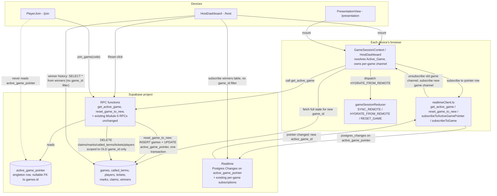

# Design Document

## Overview

Today `reset_game` (`supabase/migrations/0005_rpc_lifecycle_and_claims.sql`) hard-deletes `winners` for the game it is given and rewinds that *same* `games` row back to `LOBBY`. Both Host Dashboard and Presentation View resolve "the game to show" by calling `get_or_create_game(SEED_GAME_CODE)` on mount — a fixed seed-code lookup with no notion of "the currently live game" distinct from "whichever row happens to match that code," and with no way to atomically hand every connected screen a brand-new game identity on reset.

This module makes two additive changes on top of Module 6's schema, RPCs, RLS posture, and Realtime wiring:

1. **Winners become permanent.** `reset_game` stops touching `winners` at all. A new read path lets Host Dashboard fetch and subscribe to the complete `winners` table (every game, not just the active one) and render it as a grouped history.
2. **A genuine server-side pointer replaces the seed-code lookup.** A new singleton `active_game_pointer` table (one row, `id` fixed) holds a nullable foreign key to `games.id`. A new `get_active_game()` RPC resolves it. A reworked `reset_game` becomes `reset_game_to_new()`: it creates a brand-new `games` row with a freshly generated, collision-checked code, repoints `active_game_pointer` to it, and scopes every deletion (`claims`, `marks`, `called_terms`, `tickets`, `players`) to the *old* game id — all inside one `SECURITY DEFINER` function, so the two effects (new game exists; pointer points at it) commit together or not at all. Host Dashboard and Presentation View subscribe to `active_game_pointer`'s row over Realtime; when it changes, each client tears down its old per-game channel and opens a new one scoped to the new `game_id`, exactly mirroring the existing `subscribeToGame`/`SYNC_REMOTE` shape already established for every other table.

Player Join is untouched by the pointer mechanism entirely — it keeps resolving a game exclusively through `join_game(p_game_code, ...)`, a client-submitted code, per Module 6 Requirement 3.1. This is not an oversight to reconcile; it is the explicit design boundary Requirement 7 draws.

This design is grounded in the actual current code, read in full during design: `supabase/migrations/0001_schema.sql` through `0005_rpc_lifecycle_and_claims.sql`, `src/state/{gameSessionReducer.ts, gameSessionInitialState.ts, GameSessionContext.tsx, realtimeClient.ts, remoteRowMappers.ts}`, `src/pages/{HostDashboard/HostDashboard.tsx, PresentationView/PresentationView.tsx, PlayerJoin/PlayerJoin.tsx}`, `src/components/common/JoinQrCode.tsx`, `src/types/{game.ts, prize.ts}`, and Module 6's own `design.md` (whose structure and conventions this document follows).

### Why a dedicated pointer table, not an `is_active` column on `games`

Two shapes were possible:

- **(A) `active_game_pointer` singleton table**: one row (`id boolean primary key default true` pinned to a single value, or a fixed known UUID), with `active_game_id uuid references games(id)`, nullable.
- **(B) `games.is_active boolean` column** with a partial unique index (`create unique index on games(is_active) where is_active`).

(A) is the better fit here, for reasons Requirement 3 makes explicit:

- Requirement 3.4 requires the System to be able to say "no Active_Game currently exists" as a distinct, first-class state — not an error, not a fallback. With (B), "no active game" means every row's `is_active` is `false` (or null), which is a valid but unenforced state — nothing stops a bug from leaving *every* row `false` forever, and nothing about the schema documents that "no active game" is expected/normal. With (A), "no active game" is simply `active_game_id is null` on the one pointer row — a state the table's own shape names directly, matching the Glossary's own definition of Active_Game_Pointer as "a singleton server-side record."
- Requirement 3.1/3.5's "at most one Game as Active_Game at any moment" needs to be a hard database guarantee, not a query-time convention. A single-row table enforces "at most one pointer" trivially (there is only ever one row to update, never insert a second), and the foreign key on `active_game_id` enforces "points at a real game or nothing" — two independent, composable constraints. A partial unique index on `is_active` achieves the same "at most one true" guarantee, but requires a second constraint (the FK to `games.id` already exists via the column being `games.id` itself, so nothing new is being validated there) and conflates "which game is active" with "the games table's own row shape," which every future query against `games` (including the ones this module explicitly must NOT use, like `order by created_at desc`) would need to remember to filter by.
- Winner history (Requirement 2) needs to read `winners` joined against *every* `games` row, active or not — that read must never accidentally filter by `is_active`. Keeping "is this the active game" a fact about a *separate* one-row table, rather than a column sitting right there on every `games` row next to `code`/`status`/etc., makes it structurally harder for a future query to accidentally reintroduce a recency- or active-flag-based filter into a history read that must span every game (the exact bug Requirement 3.2 forbids for the *live* resolution path, and which this module must not let leak into the *history* path either).
- A singleton table's single row is also the natural thing to put in the `supabase_realtime` publication and subscribe to directly (see "Realtime pointer propagation" below) — a client subscribing to `active_game_pointer`'s one row gets exactly one event per reset, with no `game_id` filter needed at all (there is nothing to filter; there is only one row). Subscribing to `is_active` changes on `games` would require filtering on `is_active=eq.true` and reasoning about the two-row transition (old row flips to `false`, new row flips to `true`) as two separate events arriving in an unspecified order — strictly more for a client to get right for no benefit.

## Architecture

### Component and data-flow overview



### Sequence: Host clicks Reset, all open Host/Presentation tabs follow

```mermaid
sequenceDiagram
    participant Host as Host tab (clicked Reset)
    participant RPC as reset_game_to_new() RPC
    participant DB as Postgres
    participant RT as Realtime
    participant OtherHost as Other open Host tab
    participant Pres as Presentation tab

    Host->>RPC: reset_game_to_new(old_game_id, host_secret)
    RPC->>DB: BEGIN; verify host_secret matches OLD game's stored host_secret
    RPC->>DB: generate New_Game_Code (retry-on-collision), INSERT new games row (status=LOBBY)
    RPC->>DB: UPDATE active_game_pointer SET active_game_id = new_game.id
    RPC->>DB: DELETE claims/marks/called_terms/tickets/players WHERE game_id = old_game_id
    Note over DB: winners for old_game_id is never touched
    RPC->>DB: COMMIT
    DB-->>RT: row change on active_game_pointer
    RT-->>Host: postgres_changes event: active_game_id = new_game.id
    RT-->>OtherHost: postgres_changes event: active_game_id = new_game.id
    RT-->>Pres: postgres_changes event: active_game_id = new_game.id
    Host->>Host: unsubscribe old per-game channel; subscribe new_game.id; fetch + HYDRATE_FROM_REMOTE
    OtherHost->>OtherHost: unsubscribe old per-game channel; subscribe new_game.id; fetch + HYDRATE_FROM_REMOTE
    Pres->>Pres: unsubscribe old per-game channel; subscribe new_game.id; fetch + HYDRATE_FROM_REMOTE
    Pres->>Pres: QR code / join instructions now render new_game.code
```

### Sequence: Host Dashboard's winner history stays complete across a reset

```mermaid
sequenceDiagram
    participant Host as Host Dashboard
    participant DB as Postgres
    participant RT as Realtime

    Host->>DB: SELECT * FROM winners (no game_id filter) -- on mount, once
    Host->>RT: subscribe to winners table, event=*, no filter
    Note over Host: Winner_History view-model groups these rows by game_id,\njoined against a SELECT of every games row for code/created_at
    par Later, in the current Active_Game
        Host->>DB: confirm_claim -> INSERT winners row for the CURRENT game
    and Even later, after a Reset
        Host->>DB: confirm_claim -> INSERT winners row for the NEW game
    end
    RT-->>Host: postgres_changes INSERT on winners, for either game
    Host->>Host: Winner_History section grows; grouped by game_id; unaffected by which game is Active_Game
```

### Key architectural decisions

| # | Decision | Rationale |
| --- | --- | --- |
| 1 | Active_Game_Pointer is a dedicated singleton table (`active_game_pointer`), not an `is_active` column on `games` | See "Why a dedicated pointer table" above — makes "no active game" a first-class state, keeps winner-history reads structurally free of any active/recency filter, and gives clients one unfiltered row to subscribe to for pointer-change notifications. |
| 2 | `reset_game_to_new` is a *new* RPC, not a rewrite of `reset_game`'s existing signature | `reset_game(p_game_id, p_host_secret)` returning `games` (the single mutated row) cannot express "here is a second, brand-new game" in its existing return shape without breaking every existing caller's expectations. A new function name with a new, richer return shape (old game id + new game row) is the smallest change that keeps `0005_rpc_lifecycle_and_claims.sql`'s existing four sibling functions (`pause_game`/`resume_game`/`end_game`) and their callers completely unchanged. The old `reset_game` is dropped (nothing else calls it once `GameSessionContext.tsx`'s `RESET_GAME` case is repointed). |
| 3 | Winners are fetched and subscribed to with **no `game_id` filter at all** for Host Dashboard's history view, as a second, independent read path alongside the existing per-active-game subscription | The existing `subscribeToGame(gameId, ...)` channel (scoped to one `game_id`) remains exactly as-is for `games`/`called_terms`/`players`/`tickets`/`marks`/`claims` — those five/six tables are legitimately scoped to the Active_Game only. `winners` is the one table Host Dashboard needs both ways: scoped (for the live Winner Panel, Req 15 from Module 6) and unscoped (for history, Req 2 here). Rather than overload one channel's filter, Host Dashboard opens a **second**, separate Realtime subscription for `winners` with no filter, alongside the existing per-game channel. |
| 4 | `winners` rows already carry denormalized `prizeLabel`/`playerName` (Module 6); this module adds no new columns to `winners` and needs no join to render history | Confirmed by re-reading `0001_schema.sql`'s `winners` table and `types/prize.ts`'s `Winner` interface: `prize_label` and `player_name` are already stored at confirmation time. The only join Winner_History needs is `winners.game_id -> games.id` to get that game's own `code` and `created_at` for the group header (Req 2.4) — ticket reference is *not* already on `winners` (only on `claims`), so it is added as a denormalized column on `winners` at confirmation time (see schema change below) rather than joined, keeping the "no cross-table join required for display" property intact end-to-end. |
| 5 | Pointer-change propagation reuses the exact same Postgres Changes / `SYNC_REMOTE`-shaped mechanism Module 6 already established, applied to the new `active_game_pointer` table | No new sync primitive is introduced. A pointer-change event is handled by a small new piece of glue (see "Pointer-follow effect" below) that calls the existing `subscribeToGame`/unsubscribe/`HYDRATE_FROM_REMOTE` machinery with a new `game_id` — it does not reimplement reconciliation logic Module 6 already solved. |
| 6 | New_Game_Code generation lives in SQL (`generate_new_game_code()`), following the exact collision-retry shape `assign_ticket`'s signature-uniqueness loop already established | Reuses an already-reviewed, already-tested pattern in this codebase (`0003_rpc_join_and_tickets.sql`'s `loop ... exit when not exists ... raise exception on retry exhaustion`) rather than inventing a second retry idiom. |
| 7 | Local Fallback splits local state into "current game's live winners" (still resets, unchanged existing field) and a new "winner history across local sessions" array (never resets) | Mirrors the server-side split (`winners` table survives; `active_game_pointer` moves) as closely as client-local state can: the reducer already treats `state.winners` as "this session's winners" everywhere it's read (Winner Panel, PresentationView announcement) — repurposing it to mean "every winner ever, across resets" would change those call sites' meaning for no reason. A new `winnerHistory` array is the smaller, additive change. |

## Components and Interfaces

### 1. Schema changes (new migration `0006_active_game_and_winner_history.sql`)

```sql
-- active_game_pointer: singleton table. Exactly one row ever exists (seeded
-- once by this migration); active_game_id is nullable so "no Active_Game"
-- (Req 3.4) is representable without any sentinel game row. The `id`
-- column is pinned to a single fixed value so a second row can never be
-- inserted (Req 3.1, 3.5 — "at most one Game as Active_Game" is enforced by
-- there being at most one pointer row to begin with, not by a partial index
-- over many rows).
create table active_game_pointer (
  id              boolean primary key default true check (id),
  active_game_id  uuid references games(id) on delete set null,
  updated_at      timestamptz not null default now()
);

insert into active_game_pointer (id, active_game_id) values (true, null);

create trigger active_game_pointer_set_updated_at
  before update on active_game_pointer
  for each row execute function set_updated_at();

-- winners gains ticket_ref, denormalized at confirm_claim time from the
-- confirming claim's own ticket_ref -- so Winner_History (Req 2.3) never
-- needs a join to tickets to render a ticket reference, matching the
-- "no cross-table joins required for display" property already true of
-- prize_label/player_name.
alter table winners add column ticket_ref text;
update winners set ticket_ref = 'Unknown ticket' where ticket_ref is null;
alter table winners alter column ticket_ref set not null;

-- RLS: anon may read the pointer row (Host/Presentation need this to
-- resolve the Active_Game with only the anon key, exactly like every other
-- shared table). No write policy for anon -- the pointer is only ever
-- written by reset_game_to_new (SECURITY DEFINER), same convention as every
-- other write path in this schema.
alter table active_game_pointer enable row level security;
create policy "anon can read active_game_pointer" on active_game_pointer for select to anon using (true);

-- Realtime needs the new table in the publication so pointer changes reach
-- subscribed clients.
alter publication supabase_realtime add table active_game_pointer;
```

Why `id boolean primary key default true check (id)` rather than a fixed known UUID: a `boolean` primary key can only ever hold `true` or `false`, and the `check (id)` constraint forbids `false` outright — so there is exactly one valid primary key value in existence, making a second row a primary-key violation by construction rather than a convention future code must remember to honor. This is a small, deliberate variant on the standard "Postgres singleton settings table" idiom, chosen because it needs no seeded constant to remember or import on the client (the client never needs to know the row's key at all — `select * from active_game_pointer limit 1` or `.single()` always resolves it).

### 2. New RPC functions

```sql
-- Read-only, callable by anyone (player, host, or presentation device):
-- resolves the Active_Game strictly through the pointer (Req 3.2, 3.3, 3.4).
-- Returns no row at all when active_game_id is null -- callers must treat
-- "zero rows" as "no Active_Game currently exists," never falling back to
-- any other games query.
create or replace function get_active_game()
returns games language sql stable as $$
  select g.*
    from active_game_pointer p
    join games g on g.id = p.active_game_id
    where p.id = true;
$$;

-- Internal: generates a New_Game_Code in the SEED_GAME_CODE convention
-- (uppercase alphanumeric, e.g. "CYBER24") and retries on the rare collision
-- with an existing games.code, mirroring assign_ticket's own
-- collision-retry loop shape (0003_rpc_join_and_tickets.sql).
create or replace function generate_new_game_code()
returns text language plpgsql as $$
declare
  v_code text;
  v_attempt int := 0;
begin
  loop
    v_attempt := v_attempt + 1;
    -- 4 random uppercase letters + 2 random digits, e.g. "QXKD47" --
    -- alphanumeric and uppercase, matching CYBER24's own shape without
    -- colliding with the fixed dev seed code's exact letter count.
    select
        string_agg(chr(65 + floor(random() * 26)::int), '')
        || lpad(floor(random() * 100)::text, 2, '0')
      into v_code
      from generate_series(1, 4);

    if not exists (select 1 from games where code = v_code) then
      return v_code;
    end if;
    if v_attempt >= 50 then
      raise exception 'GAME_CODE_RETRY_EXCEEDED';
    end if;
  end loop;
end;
$$;

-- Host-only: atomically retires the OLD Active_Game and activates a newly
-- created one (Req 5.1-5.7). Requires the OLD game's own host_secret,
-- exactly like every other host-only RPC in 0005_rpc_lifecycle_and_claims.sql
-- (Req 5.5, 5.6). Deletes are scoped to p_old_game_id only and never touch
-- winners (Req 1.1, 1.2, 5.7) -- this is reset_game's replacement.
create or replace function reset_game_to_new(p_old_game_id uuid, p_host_secret uuid)
returns table(old_game_id uuid, new_game games) language plpgsql security definer as $$
declare
  v_old_game games;
  v_new_code text;
  v_new_game games;
begin
  select * into v_old_game from games where id = p_old_game_id for update;
  if v_old_game.id is null or v_old_game.host_secret <> p_host_secret then
    raise exception 'NOT_AUTHORIZED';
  end if;

  v_new_code := generate_new_game_code();

  insert into games(code, status) values (v_new_code, 'LOBBY')
    returning * into v_new_game;

  update active_game_pointer set active_game_id = v_new_game.id where id = true;

  -- Scoped strictly to the OLD game (Req 1.2, 5.7): winners is
  -- deliberately absent from this list.
  delete from claims where game_id = p_old_game_id;
  delete from marks where game_id = p_old_game_id;
  delete from tickets where game_id = p_old_game_id;
  delete from players where game_id = p_old_game_id;
  delete from called_terms where game_id = p_old_game_id;

  return query select p_old_game_id, v_new_game;
end;
$$;
```

`confirm_claim` (`0005_rpc_lifecycle_and_claims.sql`) gains one line to populate the new `ticket_ref` column, using `v_claim.ticket_ref` (already available on the claim row it reads):

```sql
insert into winners(game_id, prize_id, player_id, ticket_id, claim_id, prize_label, player_name, ticket_ref)
  values (v_claim.game_id, v_claim.prize_id, v_claim.player_id, v_claim.ticket_id, v_claim.id, v_claim.prize_label, v_claim.player_name, v_claim.ticket_ref)
  returning * into v_winner;
```

No other existing RPC changes. `get_or_create_game(SEED_GAME_CODE)` remains in the codebase unmodified (still used by `join_game`'s tests/dev tooling if anything still calls it directly), but `GameSessionContext.tsx`'s mount effect stops calling it — see below.

### 3. Client: resolving and following the Active_Game

**`realtimeClient.ts` additions** (thin wrappers, same convention as every existing export in this file):

```ts
export interface ActiveGamePointerRow {
  id: true
  active_game_id: string | null
  updated_at: string
}

/** Resolves the Active_Game via get_active_game(). Returns undefined when none exists (Req 3.4). */
export async function getActiveGame(): Promise<GetOrCreateGameResult | undefined> {
  const supabase = getSupabaseClient()
  if (!supabase) return undefined
  const { data, error } = await supabase.rpc('get_active_game')
  if (error) throw toRpcError(error)
  const rows = data as GetOrCreateGameResult[] | GetOrCreateGameResult | null
  const row = Array.isArray(rows) ? rows[0] : rows
  return row ?? undefined
}

export interface ResetGameToNewResult {
  old_game_id: string
  new_game: GetOrCreateGameResult
}

export async function resetGameToNew(
  oldGameId: string,
  hostSecret: string,
): Promise<ResetGameToNewResult> {
  return callRpc<ResetGameToNewResult[]>('reset_game_to_new', {
    p_old_game_id: oldGameId,
    p_host_secret: hostSecret,
  }).then((rows) => rows[0])
}

/**
 * Subscribes to the single active_game_pointer row. Unlike subscribeToGame,
 * there is no game_id to filter by -- the table has exactly one row, so
 * every change event is relevant. Fires onChange with the new
 * active_game_id (string) or null (Req 3.4, 6.1, 6.5).
 */
export function subscribeToActiveGamePointer(
  onChange: (activeGameId: string | null) => void,
): RealtimeChannel | null {
  const supabase = getSupabaseClient()
  if (!supabase) return null
  const channel = supabase.channel('active-game-pointer')
  channel.on(
    'postgres_changes',
    { event: '*', schema: 'public', table: 'active_game_pointer' },
    (payload) => onChange((payload.new as { active_game_id: string | null }).active_game_id),
  )
  channel.subscribe((status, err) => {
    console.info(`[realtime] active-game-pointer channel status: ${status}`, err ?? '')
  })
  return channel
}

/**
 * Fetches every winners row across every game, joined against each game's
 * own code/created_at for Winner_History's group headers (Req 2.1-2.4).
 * A plain read-only SELECT, no RPC -- winners already has an anon read
 * policy (0002_rls.sql), and this reads it with no game_id filter,
 * deliberately unlike every other table read in this codebase.
 */
export async function fetchAllWinnersWithGames(): Promise<{
  winners: Record<string, unknown>[]
  games: Record<string, unknown>[]
}> {
  const supabase = getSupabaseClient()
  if (!supabase) return { winners: [], games: [] }
  const [{ data: winners }, { data: games }] = await Promise.all([
    supabase.from('winners').select('*'),
    supabase.from('games').select('id, code, created_at'),
  ])
  return { winners: winners ?? [], games: games ?? [] }
}
```

**Pointer-follow effect**, added to `GameSessionContext.tsx` (Host Dashboard and Presentation View both consume this context, so one implementation covers Req 4.1 and 4.2). This *replaces* the existing `getOrCreateGame(SEED_GAME_CODE)` call in the mount effect:

```ts
useEffect(() => {
  const supabase = getSupabaseClient()
  if (!supabase) return

  let gameChannel: RealtimeChannel | null = null
  let cancelled = false

  async function hydrateForGame(gameRow: GetOrCreateGameResult) {
    gameIdRef.current = gameRow.id
    // host_secret is only meaningful if THIS device is the Host; Presentation
    // View simply never calls a host-only RPC, so storing it unconditionally
    // here is unchanged from today's behavior.
    writeHostSecret(gameRow.host_secret)
    hostSecretRef.current = gameRow.host_secret

    const snapshot = await fetchFullGameState(supabase as unknown as SupabaseLike, gameRow as unknown as Record<string, unknown>)
    if (cancelled) return
    dispatch({ type: 'HYDRATE_FROM_REMOTE', snapshot })

    // Req 6.2: tear down the OLD per-game channel before/while establishing
    // the new one. Unsubscribing first (rather than after) means a stale
    // event from the old game_id can never be delivered once this function
    // returns (Req 6.3) -- there is a brief window with zero subscriptions,
    // never a window with two.
    gameChannel?.unsubscribe()
    gameChannel = subscribeToGame(gameRow.id, (change) => {
      dispatch({ type: 'SYNC_REMOTE', change })
    })
  }

  ;(async () => {
    try {
      const activeGame = await getActiveGame()
      if (cancelled) return
      if (activeGame) {
        await hydrateForGame(activeGame)
      } else {
        // Req 4.3: no Active_Game exists -- explicit "no active game" state,
        // never a fallback to any previously resolved game.
        dispatch({ type: 'NO_ACTIVE_GAME' })
      }
    } catch {
      // transient fetch failure -- keep whatever local/seed state is already
      // rendered rather than crashing (unchanged convention from Module 6).
    }
  })()

  // Req 4.4, 6.1: keep listening for pointer changes for the lifetime of
  // this provider, whether or not an Active_Game is currently held.
  const pointerChannel = subscribeToActiveGamePointer((newActiveGameId) => {
    if (cancelled) return
    if (newActiveGameId === gameIdRef.current) return // no-op: same game re-announced
    if (newActiveGameId === null) {
      gameChannel?.unsubscribe()
      gameChannel = null
      gameIdRef.current = undefined
      dispatch({ type: 'NO_ACTIVE_GAME' })
      return
    }
    getActiveGame().then((row) => {
      if (!cancelled && row) hydrateForGame(row)
    })
  })

  return () => {
    cancelled = true
    gameChannel?.unsubscribe()
    pointerChannel?.unsubscribe()
  }
  // eslint-disable-next-line react-hooks/exhaustive-deps -- runs once on mount
}, [])
```

`gameIdRef.current` (already existing) is the guard that satisfies Req 6.3 at the reducer boundary too: `SYNC_REMOTE`'s dispatched `change` always originates from whichever channel is currently subscribed, and the old channel is always unsubscribed (not merely ignored) before the new one opens — so there is no code path left where an event tagged with the old `game_id` can even reach `dispatch`, let alone be applied.

A new, minimal reducer action supports the "no Active_Game" state (Req 4.3):

```ts
| { type: 'NO_ACTIVE_GAME' }
```

handled by resetting `state` to `gameSessionInitialState` with a distinguished `game.id` sentinel (`''`) that every screen's render already guards on being falsy/empty, plus (new) an explicit `hasActiveGame: false` flag threaded through `GameSessionContextValue` so Host Dashboard/Presentation View can render "no active game" copy instead of inferring it from an empty id.

**Player Join is untouched** (Req 7.1-7.4): `PlayerJoin.tsx` never imports `getActiveGame`, `subscribeToActiveGamePointer`, or `resetGameToNew`. It keeps calling `joinGame({ gameCode, displayName, employeeDemoId })` exactly as today, where `gameCode` is only ever the value typed/scanned into its own form field — no code path in this module writes to that field, and the pointer-follow effect above lives in `GameSessionContext`'s mount effect, which `PlayerJoin` already does not depend on for its code-entry step (it calls `joinGame` from the context value, not the mount-effect's resolved game).

### 4. Host Dashboard: Winner_History

A new, Host-only view-model module (`hostWinnerHistoryViewModel.ts`), pure functions over already-fetched data — no Supabase calls of its own:

```ts
export interface WinnerHistoryRowViewModel {
  prizeLabel: string
  playerName: string
  ticketRef: string
  confirmedAt: string
}

export interface WinnerHistoryGroupViewModel {
  gameId: string
  gameCode: string
  gameCreatedAt: string
  rows: WinnerHistoryRowViewModel[]
}

/**
 * Groups winners by owning game, most-recently-created game first (Req 2.2,
 * 2.4). Pure and source-agnostic: fed from Supabase rows today, and from
 * Local_Fallback's winnerHistory + past-sessions list in dev mode (Req 9.2)
 * -- the SAME function serves both, so there is exactly one place grouping/
 * ordering is implemented.
 */
export function toWinnerHistoryViewModel(
  winners: readonly Winner[],
  games: readonly { id: string; code: string; createdAt: string }[],
): WinnerHistoryGroupViewModel[] {
  const gameById = new Map(games.map((g) => [g.id, g]))
  const byGame = new Map<string, Winner[]>()
  for (const winner of winners) {
    const list = byGame.get(winner.gameId) ?? []
    list.push(winner)
    byGame.set(winner.gameId, list)
  }
  return [...byGame.entries()]
    .map(([gameId, rows]) => {
      const g = gameById.get(gameId)
      return {
        gameId,
        gameCode: g?.code ?? 'Unknown game',
        gameCreatedAt: g?.createdAt ?? rows[0]?.confirmedAt ?? '',
        rows: rows.map((w) => ({
          prizeLabel: w.prizeLabel,
          playerName: w.playerName,
          ticketRef: w.ticketRef,
          confirmedAt: w.confirmedAt,
        })),
      }
    })
    .sort((a, b) => (a.gameCreatedAt < b.gameCreatedAt ? 1 : -1))
}
```

Note the row view-model's fixed field set (`prizeLabel`/`playerName`/`ticketRef`/`confirmedAt`) structurally excludes `employeeDemoId` (Req 2.7) the same way `toClaimInboxRowViewModel`/`toAnnouncementViewModel` already do elsewhere in this codebase — `Winner` itself carries no `employeeDemoId` field at all (confirmed by re-reading `types/prize.ts`), so there is nothing to leak even before this view-model narrows the shape; the narrowing is defense-in-depth consistent with the existing convention.

`HostDashboard.tsx` adds its own effect (independent of `GameSessionContext`'s per-active-game one) to populate this section:

```ts
useEffect(() => {
  const supabase = getSupabaseClient()
  if (!supabase) return
  let cancelled = false
  let channel: RealtimeChannel | null = null

  async function refetch() {
    const { winners, games } = await fetchAllWinnersWithGames()
    if (!cancelled) setWinnerHistoryData({ winners: winners.map(mapRowToWinner), games: games.map(mapGameSummary) })
  }

  refetch()
  channel = supabase.channel('winner-history').on(
    'postgres_changes',
    { event: 'INSERT', schema: 'public', table: 'winners' }, // no filter (Req 2.6)
    () => refetch(),
  )
  channel.subscribe()

  return () => {
    cancelled = true
    channel?.unsubscribe()
  }
}, [])
```

Re-fetching the small `winners`+`games` summary on every INSERT (rather than folding the single new row in via `upsertById`, as `SYNC_REMOTE` does) is a deliberate simplification: winner history is Host-only, read-only, and — even across a long event — bounded to a few dozen rows total (5 prizes x however many games), so a full re-`SELECT` is cheap and avoids needing a second copy of the `games` id->code->createdAt lookup logic to keep incrementally in sync.

**`PresentationView.tsx` is unchanged beyond the Active_Game-follow wiring it gets for free through `GameSessionContext`** — Req 2.5 is satisfied by the Winner_History section simply not existing anywhere in `PresentationView.tsx`'s render tree (it never imports `hostWinnerHistoryViewModel.ts` or calls `fetchAllWinnersWithGames`), the same way `PresentationView.test.tsx`'s existing Req 17.3 test already asserts no `employeeDemoId` field appears anywhere in its rendered output.

### 5. Local Fallback (no Supabase configured)

`gameSessionInitialState.ts` gains one new field:

```ts
export interface GameSessionState {
  game: Game
  players: Player[]
  tickets: Ticket[]
  currentPlayerId?: string
  marks: Mark[]
  claims: PrizeClaim[]
  winners: Winner[]        // unchanged meaning: THIS session's winners
  winnerHistory: Winner[]  // NEW: every winner from every local session, never cleared by RESET_GAME
  prizeProgress: PrizeProgress[]
}
```

`gameSessionReducer.ts`'s `RESET_GAME` case changes from an unconditional full reset to one that folds the outgoing session's `winners` into `winnerHistory` before reseeding, and generates a fresh local game id/code via the same format convention as the SQL generator (Req 9.3):

```ts
case 'RESET_GAME': {
  return {
    ...gameSessionInitialState,
    game: createSeedGame(generateLocalGameCode()), // new game identity + New_Game_Code-style code
    winnerHistory: [...state.winnerHistory, ...state.winners], // Req 9.1: retained, never cleared
  }
}
```

`createSeedGame` gains an optional `code` parameter (defaulting to `SEED_GAME_CODE` for the very first load, so first-run behavior is unchanged) and a new `generateLocalGameCode()` helper in `gameSessionInitialState.ts` mirrors `generate_new_game_code()`'s exact shape (4 uppercase letters + 2 digits) so a local-only dev session's codes are visually indistinguishable from server-generated ones (Req 9.3, "following the same New_Game_Code format convention as Requirement 5.3").

`HostDashboard.tsx`'s Winner_History effect, when Supabase is not configured, reads `state.winnerHistory` concatenated with `state.winners` (the current, not-yet-reset session's winners belong in the history view too) and a locally-tracked list of `{id, code, createdAt}` for past local games, feeding the exact same `toWinnerHistoryViewModel` function used for the Supabase path (Decision 7; Req 9.2). `PresentationView.tsx` needs no local-fallback-specific change — Req 9.4 is the same structural absence as Req 2.5.

## Data Models

| Table/field | Change | Notes |
| --- | --- | --- |
| `active_game_pointer` (new) | `id boolean primary key default true check (id)`, `active_game_id uuid references games(id) on delete set null`, `updated_at timestamptz` | Singleton; exactly one row, seeded by migration. `on delete set null` means a (never-expected, but not schema-forbidden) deletion of the active game's row degrades to "no Active_Game" rather than a dangling FK violation. |
| `winners.ticket_ref` (new column) | `text not null`, denormalized from `claims.ticket_ref` at `confirm_claim` time | Completes the "no cross-table join required for display" property for Winner_History's four required fields (Req 2.3). |
| `games`, `claims`, `marks`, `called_terms`, `tickets`, `players` | **No column changes.** | Reset's new scoping behavior is entirely in `reset_game_to_new`'s `DELETE ... WHERE game_id = p_old_game_id` clauses, not a schema change. |
| Client `GameSessionState.winnerHistory` (new) | `Winner[]`, local-fallback only | See "Local Fallback" above. |

## Error Handling

| Scenario | Handling |
| --- | --- |
| `get_active_game()` finds no pointer row's `active_game_id` set | Returns zero rows (not an error) — client dispatches `NO_ACTIVE_GAME` and renders the explicit no-active-game state (Req 3.4, 4.3). |
| `reset_game_to_new` called with a `host_secret` that doesn't match the OLD game's stored secret | `raise exception 'NOT_AUTHORIZED'` before any `INSERT`/`UPDATE`/`DELETE` runs — no new game is created and the pointer is untouched (Req 5.6), identical convention to `pause_game`/`resume_game`/`end_game`. |
| `generate_new_game_code()` exhausts 50 collision retries | `raise exception 'GAME_CODE_RETRY_EXCEEDED'` — propagates out of `reset_game_to_new` as a whole, so the transaction rolls back entirely (no partial new game, no repointing). Practically unreachable at this app's code-space size (26^4 * 100 ≈ 45.6M combinations) but the same defensive bound `assign_ticket` already uses for its own retry loop. |
| Realtime pointer subscription drops (network blip, `CHANNEL_ERROR`/`TIMED_OUT`) | Logged via the same `console.info(status)` convention `subscribeToGame` already uses; no silent failure mode is newly introduced, and this module does not attempt automatic channel reconnection beyond what `supabase-js` already retries internally — matching Module 6's existing accepted scope. |
| A pointer-change event arrives naming a `game_id` that has since been deleted (should not happen; nothing in this design deletes a `games` row) | `getActiveGame()` would return zero rows on the immediately-following fetch (the join in `get_active_game()` fails), which is handled identically to "no Active_Game" — no special-cased crash path. |
| Host Dashboard's winner-history fetch fails (transient network error) | The effect's `refetch()` leaves the previous `winnerHistoryData` in place rather than clearing it — a failed re-fetch never blanks an already-rendered history, mirroring `GameSessionContext`'s existing "keep the last good state on a failed fetch" convention. |

## Correctness Properties

*A property is a characteristic or behavior that should hold true across all valid executions of a system — essentially, a formal statement about what the system should do. Properties serve as the bridge between human-readable specifications and machine-verifiable correctness guarantees.*

### Property 1: Reset retains and never touches prior winners

For any game with any set of existing `winners`, `claims`, `marks`, `called_terms`, `tickets`, and `players` rows, calling `reset_game_to_new` for that game leaves every existing `winners` row for that game byte-identical and present afterward, and leaves every `winners` row belonging to any *other* game untouched, while every `claims`/`marks`/`called_terms`/`tickets`/`players` row scoped to that game is removed.

**Validates: Requirements 1.1, 1.2, 1.3, 5.7**

### Property 2: Winner_History includes every winner across every game

For any set of `winners` rows spanning any number of distinct games, `toWinnerHistoryViewModel` applied to that full set (and the corresponding games) produces a result whose rows are exactly that set — no winner is omitted and none is duplicated, regardless of which game is currently the Active_Game.

**Validates: Requirements 2.1, 2.6**

### Property 3: Winner_History groups are ordered newest-game-first and correctly labeled

For any set of games with distinct `createdAt` values and any distribution of winners across them, `toWinnerHistoryViewModel`'s output groups are ordered by descending `gameCreatedAt`, and each group's `gameCode`/`gameCreatedAt` match that group's own owning game's `code`/`createdAt` — never another game's.

**Validates: Requirements 2.2, 2.4**

### Property 4: Winner_History rows carry exactly the required display fields, never an employee/demo id

For any `Winner`, the row view-model built from it always has `prizeLabel`, `playerName`, `ticketRef`, and `confirmedAt` equal to that winner's own values, and the built object's keys never include any employee/demo-id-shaped field.

**Validates: Requirements 2.3, 2.7**

### Property 5: The Active_Game_Pointer designates at most one game, and resolves to exactly what it designates

For any sequence of updates to the singleton `active_game_pointer` row (including attempts to point at a second game before the first update settles), the table never holds more than one row, and `get_active_game()` always returns either nothing (when `active_game_id` is null) or exactly the game currently designated by the row — never a different game, and never a most-recently-created game chosen by any other means.

**Validates: Requirements 3.1, 3.3, 3.4, 3.5**

### Property 6: Reset always produces a fresh, valid, LOBBY-status game and repoints atomically

For any previous Active_Game (in any status, with any accumulated child rows), calling `reset_game_to_new` with the correct host secret always: creates exactly one new `games` row whose `id` differs from every previously existing game's `id`, whose `status` is `'LOBBY'`, and whose `code` is a value never previously used by any game; and updates `active_game_pointer.active_game_id` to that new row's `id` such that a subsequent `get_active_game()` call returns it.

**Validates: Requirements 5.1, 5.2, 5.3, 5.4**

### Property 7: New_Game_Code always matches the established format

For any successful call to `generate_new_game_code()`, the returned value consists solely of uppercase letters and digits and matches the fixed `4 letters + 2 digits` shape established for New_Game_Codes.

**Validates: Requirements 5.3**

### Property 8: A mismatched host secret rejects Reset without any side effect

For any previous Active_Game and any secret value that does not equal that game's stored `host_secret`, calling `reset_game_to_new` with that secret raises `NOT_AUTHORIZED`, and afterward `active_game_pointer` still designates the same game it designated before the call, and no new `games` row exists beyond whatever existed before the call.

**Validates: Requirements 5.5, 5.6**

### Property 9: A pointer change always yields exactly one live subscription, scoped to the new game

For any old `game_id` a client currently holds a subscription for, and any new `game_id` announced by a pointer-change event, handling that event results in the old channel's `unsubscribe` having been called and exactly one active channel remaining, subscribed to the new `game_id` — never zero, never two, and never one still scoped to the old id.

**Validates: Requirements 6.1, 6.2**

### Property 10: Events tagged with a superseded game id are never applied after a switch

For any client that has completed a switch from an old `game_id` to a new one, any subsequently-arriving event whose own `game_id` is the old one is not applied to that client's displayed per-game state (`game`, `players`, `tickets`, `marks`, `claims`, `winners` for the live/scoped view).

**Validates: Requirements 6.3**

### Property 11: Switching Active_Game fully replaces displayed per-game state with no residual fields

For any prior per-game client state and any newly fetched snapshot for a different game (reached either via initial mount with no prior game, or via a pointer-change switch), the resulting displayed state's `game` (including its `code`, used for QR/join instructions), `players`, `tickets`, `marks`, `claims`, and `winners` equal exactly the new snapshot's values, with none of the prior game's per-game field values surviving.

**Validates: Requirements 4.3, 6.4, 8.1, 8.2**

### Property 12: Player Join's code field is never altered by a pointer change

For any sequence of Active_Game_Pointer change events delivered while a Player Join screen is mounted, and any value the user has typed or the field otherwise holds, that field's value after the sequence is identical to its value before — Player Join's code field is a function of user input only, never of pointer state.

**Validates: Requirements 7.2, 7.3**

### Property 13: Local Fallback retains every prior winner across any number of resets

For any starting local `winners` array and any number of sequential local `RESET_GAME` dispatches (each possibly preceded by more winners being added to the then-current session), the resulting `winnerHistory` after all resets contains every winner that was ever present in `winners` at the moment of each reset, in addition to the then-current session's winners — none are lost, and `winners` itself is empty immediately after each reset.

**Validates: Requirements 9.1**

### Property 14: Local Fallback reset always produces a fresh game identity and correctly formatted code

For any local game (any code, any status), dispatching `RESET_GAME` always produces a new `game.id` distinct from the previous one and a new `game.code` matching the same `4 letters + 2 digits` format as the server-side generator, and that new game is the one subsequently reflected by both Host Dashboard and Presentation View's rendered state.

**Validates: Requirements 9.3**

## Testing Strategy

**Property tests** (property-based, minimum 100 iterations each, one test per property above): the pure functions this module introduces or changes are the right unit for this — `toWinnerHistoryViewModel`, `generate_new_game_code`'s format/uniqueness behavior (tested via repeated invocation against a seeded set of existing codes, or as a SQL-level pgTAP/property harness consistent with how `assign_ticket`'s uniqueness was validated in Module 6), the pointer-follow effect's channel-swap logic (tested against a fake `RealtimeChannel`/fake Supabase client, the same mocking approach `GameSessionContext`'s existing tests already use for `subscribeToGame`), the reducer's `NO_ACTIVE_GAME`/`RESET_GAME` cases, and the SQL `reset_game_to_new`/`get_active_game` functions themselves (tested the same way `0005_rpc_lifecycle_and_claims.sql`'s existing RPCs are — direct SQL invocation against a seeded test database, or through the existing `schema.structure.test.ts`-style harness).

**Unit/example tests** (specific scenarios, not property-varied): Winner_History's absence from `PresentationView.tsx`'s render output (Req 2.5, 9.4 — extending the existing `PresentationView.test.tsx` "never exposes an Employee/Demo ID" test with a sibling assertion that no Winner_History markup/text appears at all, regardless of backend configuration); Player Join never calling `getActiveGame`/`subscribeToActiveGamePointer`/`resetGameToNew` (Req 7.2); the `active_game_pointer` migration seeds exactly one row with `active_game_id = null` on a fresh database; `confirm_claim`'s new `ticket_ref` column is populated correctly for one representative claim.

**Integration-style checks** (infrastructure/wiring, not property-suited): the new table appears in the `supabase_realtime` publication and has the anon-read RLS policy (mirroring `schema.structure.test.ts`'s existing structural assertions for the seven Module 6 tables); a real (or locally-emulated) Supabase reset end-to-end smoke test confirming Host and Presentation tabs both observe the new game within one Realtime round trip.
